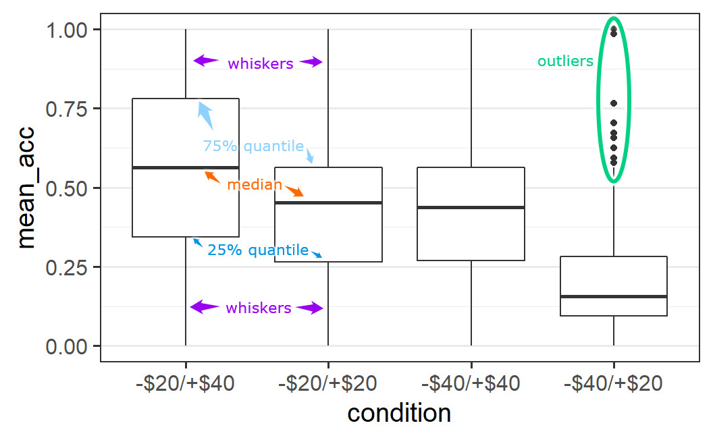
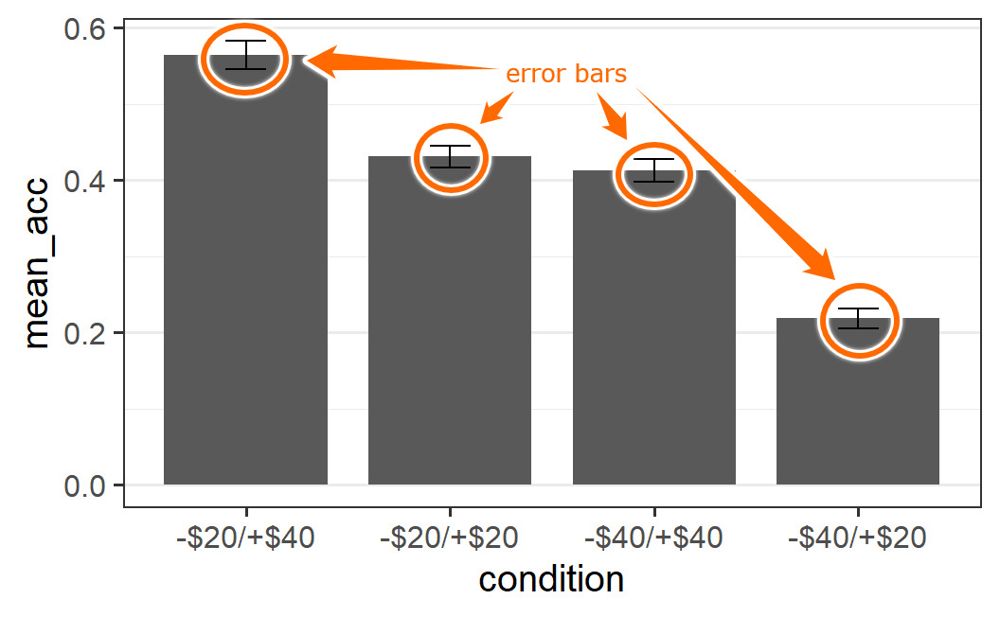

# Data Visualisation with `ggplot2` {#ggplot2-intro}

So far we have only considered data analysis that exclusively happens in the `R` console. That is, we put numbers and text into the console and get numbers and text out. However, this is only one part of a comprehensive data analysis. Another part of data analysis is the transformation of numbers into pictures -- *data visualisation*.

One way to create data visualisation in `R` is through the base `R` graphics engine primarily using the `plot()` function. For `plot()`, creating a plot is done by drawing individual graphical elements, such as `points()` or `lines()`. These functions generally only accept individual data points or vectors as arguments.

Instead of introducing base `R` plotting, we introduce the `tidyverse` approach for data visualisation, [`ggplot2`](https://ggplot2.tidyverse.org/). [`ggplot2`](https://ggplot2.tidyverse.org/) is a system for declaratively creating graphics, based on the book "The Grammar of Graphics" [@wilkinsonGrammarGraphics1999].[^ggplot-intro-x1] [`ggplot2`](https://ggplot2.tidyverse.org/) is also the perhaps the most prominent member of the `tidyverse`. As its creation pre-dates the term `tidyverse` by several years, it can also be seen as one of the founding packages.

[^ggplot-intro-x1]: The name of the book is also the reason for the name of the package. `ggplot2` is the the second version of "**G**rammar of **G**raphics", where the first version is the book itself. That is why there also is no `ggplot` or `ggplot1` package.

In contrast to the base `R` plot functionality that works with vectors, `ggplot2` requires that the data is passed either as a `data.frame` or `tibble`. With this in hand, "you provide the data, tell `ggplot2` how to map variables to aesthetics, what graphical primitives to use, and it takes care of the details." ([quote from the official documentation](https://ggplot2.tidyverse.org/)).

## First `ggplot2` Example

What this means in practice is that the first question you need to answer when plotting with `ggplot2` is which variables in your data you want to show on which of the two axes. Once you have decided on this, you have to consider which graphical elements (called `geom`s in `ggplot2` terminology), you want to use to show the data. Let's exemplify this with a first example from the @walasekHowMakeLoss2015 data we have also used in Chapter \@ref(tidyverse-intro) and before. Let's begin by loading the data as done there (we suppress some status messages in the output here):

```{r, message=FALSE}
library("tidyverse")
ws1a <- read_csv("data/ws2015_exp1a.csv")
ws1b <- read_csv("data/ws2015_exp1b.csv")
ws1a <- ws1a %>%
  mutate(subno = factor(paste0("e1a_", subno)))
ws1b <- ws1b %>%
  mutate(subno = factor(paste0("e1b_", subno)))
ws1 <- bind_rows(ws1a, ws1b)
ws1 <- ws1 %>% 
  mutate(
    response = factor(response, levels = c("reject", "accept")),
    condition = factor(
      condition, 
      levels = c(40.2, 20.2, 40.4, 20.4), 
      labels = c("-$20/+$40", "-$20/+$20", "-$40/+$40", "-$40/+$20")
    )
  )
glimpse(ws1)
```

One intuition we could have is that the probability that a lottery is accepted is related to the size of the potential gain, if we average over all other independent variables (i.e., potential loss and condition). To investigate this, we first need to calculate the average acceptance probability for each possible gain. Then, we can create a plot with the average accept probability on the y-axis against each possible gain on the x-axis. As we want to plot average acceptance probabilities and not the *raw* data (i.e., the individual observations), we need to summarise the raw data first. For this, we use the now well-known combination of `group_by()` and `summarise()`.

```{r}
lot_sum <- ws1 %>% 
  group_by(gain) %>% 
  summarise(mean_acceptance = mean(resp))
lot_sum
```

Looking at the first few rows of the returned `tibble` suggests that our intuition is probably not too far off as the mean acceptance rates appear to increase with gain. To understand the pattern better, let us plot this data. For this, we pass the newly created `tibble` to the `ggplot()` function as shown next. We will first interpret what we see in the plot before describing the call that created it in detail.

```{r first-fig}
ggplot(lot_sum, aes(x = gain, y = mean_acceptance)) +
  geom_point()
```

This plot shows a clear relationship between the mean acceptance rate of a lottery and its potential gain. On average it holds that the larger the gain the larger the mean acceptance probability.

Let us now describe the call that produces the plot in detail:

-   To create a plot with `ggplot2` we usually call the `ggplot()` function. The first argument to `ggplot()` is the data we want to plot. Because the data is the first argument, we can also directly pipe a `tibble` into the `ggplot()` function, which we will see later.
-   The second argument is the `aes()` function, which is used to map variables in the data onto *aesthetics*. Aesthetics in `ggplot2` terminology means any graphical element or feature of the plot that can change as a function of a variable. Here, we only consider two aesthetics, the `x` and `y` axes, with `gain` being mapped onto the `x` axis and `mean_acceptance` being mapped onto the `y` axis. In other words, a data point with larger potential gain has a larger value on the x-axis (i.e., appears further on the right) than a data point with lower potential gain. Likewise, a data point with a larger `mean_acceptance` has a larger value on the y-axis than a data point with a lower `mean_acceptance`. Whereas the `x` and `y` axes are probably the most important aesthetics, we can also use others such as the colour, shape, or size of graphical elements. If we map a variable to any of those aesthetics, then graphical elements in the plot will vary as a function of that variable on the corresponding aesthetic. For example, if we map a variable onto the size aesthetics, then data points for which the value of the variable are larger will be plotted as larger data points than data points for which the value of the variable is smaller (we will see an example of this below). From my experience, understanding how to use the `aes()` function is the conceptually most difficult part of learning `ggplot2`, so do not be discouraged if this is not immediately fully clear. Your understanding will develop throughout the chapter and the examples.  The problem seems to be that "aesthetics" represent a rather abstract way of thinking about creating plots that is best learned through examples. For now, remember that `aes()` allows you to specify aesthetics in your plot that should change as a function of a variable in your data. For example, `x = gain` means that the position of a data point on the x-axis depends on its value of `gain`, and that `y = mean_acceptance` means that  the position of a data point on the y-axis depends on its value of `mean_acceptance`
-   After passing the data and specifying the aesthetics, we close the `ggplot()` call (i.e., close the opening parenthesis) and then add further arguments, which are passed as function calls, to the plot using `+`.
-   The most important set of arguments to pass are `geom`s (or geometric objects). Here we pass `geom_point()` to indicate that we want to plot all points of the data.

Another important aspect of `ggplot2` is that we need not only use one `geom`, but can specify multiple ones. For example, we could add a line on top connecting all the data points:[^ggplot-intro-1]

[^ggplot-intro-1]: One thing of note is that usually `geom_line()` requires the use of the `groups` aesthetic to work properly. For example, if all data points should be connected, as in the present case, `group` should be 1, that is, `geom_line(aes(group = 1))`. Try it out yourself by replacing the `geom_line()` call in the example with the one that includes the `aes(group = 1)` to see that they are equivalent. Given that this is a bit of an unusual way of using `aes()`, it is good to know it exists. This also shows that you can have multiple `aes()` calls in one `ggplot2` call.

```{r}
ggplot(lot_sum, aes(x = gain, y = mean_acceptance)) +
  geom_point() +
  geom_line()
```

## Two Continuous Variables {#ggplot-2-continuous}

The examples above show a simple case of plotting two continuous variables, with the dependent variable on the y-axis and the independent variable on the x-axis. This ordering, the dependent variable on the y-axis and the independent variable on the x-axis, is a common convention for scientific plots that we will generally follow. 

Let's now consider a few more cases of plotting two continuous variables. These plots will show more data than the first plot. In the plots above, we have averaged over all possible potential losses and then considered the effect of the size of a potential gain on average acceptance rates. We will now plot the case in which we consider each individual lottery -- that is, each unique combination of potential gain and loss -- as one data point (i.e., not averaging over all potential losses for one potential gain). To simplify matters, we will only consider the two symmetric conditions in which the range for losses is equal to the range for gains. Let's begin the analysis by preparing the corresponding data.

```{r}
lot_sum2 <- ws1 %>% 
  filter(condition %in% c("-$20/+$20", "-$40/+$40")) %>% 
  group_by(loss, gain) %>% 
  summarise(mean_acceptance = mean(resp))
lot_sum2
```

For our first plot, we begin with the same call as above and only change the data set that is passed to the `ggplot()` function.

```{r}
ggplot(lot_sum2, aes(x = gain, y = mean_acceptance)) +
  geom_point()
```

This plot is difficult to interpret. We see that there are some lotteries with very low acceptance rates (between 0 and around 0.2) as well as another group with acceptance rates that are much higher (between around 0.3 and 0.85). Overall, it does not look as if a larger potential gain is clearly associated with a larger mean acceptance rate.

One possibility for these differing visual impressions might be that there is some overlap of data points that are near 0; that is, there is evidence for *over-plotting*. That means that in the current plot, we cannot differentiate between one or multiple data points that share the same or approximately same x and y coordinates. Over-plotting is a common problem for plots that show more than a few data points.

### Addressing Over-Plotting

One way to address and diagnose over-plotting is through alpha blending. Alpha blending is a computer graphics effect that creates the visual impression of semi-transparency. What this means is that with alpha blending, overlapping points appear darker whereas non-overlapping points do not. Thus, alpha blending is a helpful technique for investigating if there is over-plotting and for judging the degree of over-plotting. For example, we can set `alpha = 0.25` for `geom_point()` as shown below.

Maybe you are wondering why set `alpha = 0.25` and not any other value? The answer is trial-and-error. I just tried some different values until I saw a plot that looked good to me (alpha must lie between 0 and 1, and I usually start with a value below 0.5) .

```{r}
ggplot(lot_sum2, aes(x = gain, y = mean_acceptance)) +
  geom_point(alpha = 0.25)
```

This plot provides some evidence for over-plotting. Especially for mean acceptance rates near 0 (and especially for low values of potential gains), we see several points clearly darker than the rest of the data points. This darkness means that several points are at exactly the same position -- over-plotting. However, the plot is still not very clear. For example, it is still difficult to judge how many points there are for the points that appear clearly darker.

One possibility to further improve on this figure is by introducing some random jitter for the plotted points using `geom_jitter()`. Given that the points are all on discrete x-axis positions -- the even whole numbers that act as potentially gains -- it makes sense to add a small amount of jitter on the x-axis. This is done by specifying the `width` argument to `geom_jitter()`. Specifically, `width` requires a number that specifies the amount of horizontal jitter in units of the x-axis. Trial-and-error led me to conclude that `width = 0.4` produces an appealing result.[^ggplot-intro-2] With jitter only on the x-axis, the points retain their exact y-axis positions but are still shown near their original x-axis position.

[^ggplot-intro-2]: Note that the jitter width determines the horizontal amount of jitter in each direction. That means that the total area reserved for jittered points is 2 \* `width` (= 0.8 in the present case). Given that the distance between adjacent x-axis positions is 2 (i.e., potential gain values are always at least 2 apart) a jitter width of 0.4 here means that the area occupied for points with the same potential gain is slightly smaller than the empty area between adjacent potential gain values (which occupies 1.2 units of the x-axis).

```{r}
ggplot(lot_sum2, aes(x = gain, y = mean_acceptance)) +
  geom_jitter(width = 0.4, alpha = 0.25)
```

An important thing to know about using `geom_jitter()` is that due to the randomness that is used to add the jitter, this plot will look slightly different every time it is created (i.e., every time the code above is executed). Try it out by running the code above a few times in RStudio to see what I mean. And while you are at it, feel free to try out a few different values for the amount of jitter or what happens if you remove `width = 0.4` from the `geom_jitter()` call. You can also try and see what happens if you add some value for `height` (e.g., `height = 0.05`).

The plot above, combining jitter and alpha blending, makes it easier to see why the very first plot showed such a clear relationship between potential gain and mean acceptance rates when averaging over losses. There are many more data points with very low mean acceptance rates on the left side of the plot and many more data points with medium to high acceptance rates on the right side of the plot. If we imagine taking the mean of the point on each x-axis position we can imagine an essentially monotonically increasing mean acceptance rate. (A curve that is monotonically increasing is one in which the line can only go up, or remain at the same value, as you move from left to right -- it cannot go down.)

### Adding a Third Variable

One question that this plot leaves open is the question of why we see this qualitatively different pattern for mean acceptance rates of lotteries. Why are some mean acceptance rates so low and others larger? To provide an answer to this question we are going to create a new factor, `ev` (for *expected value*), which separates the expected value of the lottery into three bins: expected value = 0 (i.e., symmetric lotteries), negative expected value (i.e., potential loss larger than potential gain), and positive expected value (potential loss smaller than potential gain).

As *expected value* is not a term we have introduced so far, let's do it now. For a lottery, the expected value is the expected long term payout per lottery. That is, if we play a lottery over and over, the expected value is the average gain or loss on each play. It is calculated by multiplying each potential outcome with its probability and then taking the sum of it. For example, for a 50-50 lottery with potential outcomes -/$18 and +\$20, the expected value is $0.5 \times -18 + 0.5 \times 20 = 1$. As all lotteries in  @walasekHowMakeLoss2015 are 50-50 lotteries (each potential outcome has a probability of 50\%), we can check whether the expected value is positive or negative directly by comparing the size of the potential outcome to the size of the potential loss.

To create the `ev` variable, we use another `dplyr` function, `case_when()`. `case_when()` is a vectorised variant of multiple branching (i.e., if-else). This allows us to create a new variable based on multiple logical conditions in a convenient way. Each argument to `case_when()` consists of a logical statement, the `~` operator (which I call the *tilde-operator*), and a return value that is returned in case the logical condition is true. Here, we have three logical cases which are each mapped onto one label describing the sign of the expected value. We then convert the `ev` variable into a `factor` using `factor()`. In the call to `factor()` we also specify the order of factor `levels`.

```{r}
lot_sum2 <- lot_sum2 %>% 
  mutate(ev = case_when(
    gain == loss ~ "EV = 0",
    gain < loss ~ "EV negative",
    gain > loss ~ "EV positive"
  )) %>% 
  mutate(
    ev = factor(ev, levels = c("EV negative", "EV = 0", "EV positive"))
  )
lot_sum2
```

We can then use the new `ev` variable to print points in a different colour depending on the value of `ev`. For this we just need to map the `ev` variable to the `colour` aesthetic in the `aes()` call, to get this very interesting plot.

```{r}
ggplot(lot_sum2, aes(x = gain, y = mean_acceptance, colour = ev)) +
  geom_jitter(width = 0.25, alpha = 0.5)
```

While clearly informative, this plot uses both green and red colours which can be difficult to distinguish for individuals with colour blindness (such as myself). Therefore, we can make this plot better in two regards: (1) by using a somewhat nicer `ggplot2` *theme* which removes the grey background (my favourite is `theme_bw()`, more on this below) and (2) we can use a colour-blind-friendly colour palette. For this we use `ggthemes::scale_colour_colorblind()` (here `ggthemes::` just means we can use a function from the `ggthemes` package without loading the package explicitly beforehand). This gives us an informative, but also visually appealing and clear plot. 

```{r}
ggplot(lot_sum2, aes(x = gain, y = mean_acceptance, colour = ev)) +
  geom_jitter(width = 0.25, alpha = 0.5) +
  ggthemes::scale_colour_colorblind() +
  theme_bw()
```

To be clear, this plot shows exactly the same data as the previous one, but just uses a different theme and different colours. At least to my eyes, this plot is a lot more visually appealing and clearer than the previous one. Before describing what a theme is in more detail, let us first discuss what we see in the plot.

The plot shows that if the expected value is negative, participants are rather unlikely to accept a lottery (with mean acceptance rates below 0.2). If the expected value is 0 (i.e., for symmetric lotteries), the acceptance rates start out at around 0.5 for small potential losses and gains and generally decreases a bit with increasing loss/gain (just as predicted by loss aversion, see Section \@ref(evidence-for-loss-aversion-lotteries)). Finally, for lotteries with positive expected value (where on average we should gain money), acceptance rates are at or above 0.5. Overall, the plot shows results one would expect to see, and which make a lot of sense. After all, anyone should be more willing to accept a bet when they expect to win money compared to when they expect to lose money.

Before moving to the next plot, let us quickly discuss what a "theme" is. In `ggplot2`, a theme is a setting (or function call) that determines all non-data display elements of a plot such as fonts, font size, background and foreground colours, and so forth. The default `ggplot2` theme uses a grey background, which I personally do not like much. This is why I prefer `theme_bw()` which has a white background. `ggplot2` comes with a few more themes which you can see in the [online documentation](https://ggplot2.tidyverse.org/reference/ggtheme.html) (scroll to [examples](https://ggplot2.tidyverse.org/reference/ggtheme.html#examples) to see them all).

The call above shows a first example of how powerful the `ggplot2` idea of mapping variables to aesthetics using the `aes()` function is. We wanted to improve the plot by distinguishing different types of data points. So we just need a variable in our data that represents this distinction -- here, we created the `ev` variable for that. We then can just map this variable to an appropriate aesthetic. Here, we use the `colour` aesthetic which allows us to distinguish different data points by their colour. However, we could also use a different aesthetic to distinguish different data points. Can you think of one? Take a few seconds to think about it before clicking on the solution below.

`r hide("Another aesthetic to distinguish different points")`

Another way to distinguish different points is through their shape. In all examples we have seen so far, we only used circles to show data points. However, we could also use other shapes to display data points such as squares or triangles.

The `ggplot2` aesthetic to distinguish data points belonging to different categories using different shapes is called (surprise!) `shape`. Thus, we can easily can change the plot by changing the corresponding argument in the `aes()` call:

```{r}
ggplot(lot_sum2, aes(x = gain, y = mean_acceptance, shape = ev)) +
  geom_jitter(width = 0.25, alpha = 0.5) +
  ggthemes::scale_colour_colorblind() +
  theme_bw()
```

`ggplot2` also allows us to combine different aesthetics, such as shape and colour. In other words, you can map one variable to multiple aesthetics:

```{r}
ggplot(lot_sum2, aes(x = gain, y = mean_acceptance, 
                     shape = ev, colour = ev)) +
  geom_jitter(width = 0.25, alpha = 0.5) +
  ggthemes::scale_colour_colorblind() +
  theme_bw()
```

`r unhide()`

### Adding a Fourth Variable

Are we done with this data set? Not yet. There is one more trick we can use to make the plot even more informative. We can map the `loss` variable onto the size of the data points. Again, we need to change the `aes()` part of the call. Specifically, we add `size = loss` to the `aes()` call. This allows us to further understand the pattern shown in the data.

```{r}
ggplot(lot_sum2, aes(x = gain, y = mean_acceptance, 
                     colour = ev, size = loss)) +
  geom_jitter(width = 0.25, alpha = 0.5) +
  ggthemes::scale_colour_colorblind() +
  theme_bw()
```

Admittedly, adding loss as a fourth variable leads to a comparatively complicated plot. Let's discuss what this addition adds to see that it really helps in understanding the data. We can now see something that, in hindsight, should not be too surprising. If the potential loss is small, which is now indicated by a small data point, the average acceptance rate is comparatively high.

More specifically, we can see an interesting pattern if we only focus on one potential gain (i.e., one x-axis position) for which we have data. For example, focus on the 8 data points with a potential gain of 32 (i.e., just above the x-axis tick at 30). If we look at the data this way, we can nicely see a size-based ordering: The small losses have the largest mean acceptance rates and the large losses the smallest.[^ggplot-intro-e1] 

[^ggplot-intro-e1]: Another somewhat subtle pattern is that the larger the potential gain for one specific potential loss, the larger the mean acceptance rate (i.e., if we focus on one point size across different potential gains). For example, if you look at the very small data points beginning with the orange one on the very left around .5, we see that with increasing gain the average acceptance rate for this potential loss increases almost continuously.

In sum, the plot above provides a very comprehensive summary of the data of @walasekHowMakeLoss2015 (at least for the two symmetric conditions that are displayed here). The plot now not only allows us to see what is happening in the data across different lotteries, it also shows a number of patterns we would expect to see in the data (such as participants' sensitivity to the size of gains and losses). This combination allows the plot to serve two functions:

(1) It allows us to gain new and interesting insights from the data. For example, we can see that participants on average decrease their willingness to accept symmetric lotteries with increasing gain/loss, just as predicted by loss aversion. So this plot allows us to address our research question.
(2) The fact that we see many patterns we *would expect to see* provides us with a kind of 'confidence check' that there are no obvious problems with the data. As we have discussed before, many things can go wrong during study design, data collection, or analysis. Therefore, the fact that the data shows several patterns that intuitively make a lot of sense (such as the difference in whether the expected values are negative, neutral, or positive) increases our confidence that not too much went wrong.

In other words, this plot not only shows us new insights about our research question, it also allows us to judge the quality of the evidence provided. We learn that in addition to the theoretically interesting pattern, the data looks reasonable and trustworthy (because it passes our intuitive confidence checks). This means the evidence this data provides for our research question is stronger than evidence from data that does not permit such confidence checks or data in which some aspects contradict our expectations.

One recommendation that follows from this discussion is that we should always explore our data using graphical means -- that is, try out various different ways of plotting the data --  before moving to a statistical analysis. This process, also known as *exploratory data analysis*, should really be the first step in any proper data analysis.[^ggplot-intro-e2] 

[^ggplot-intro-e2]: The phrase [exploratory data analysis](https://en.wikipedia.org/wiki/Exploratory_data_analysis){target="_blank"}  was coined in the 1970s by the statistician [John Tukey](https://en.wikipedia.org/wiki/John_Tukey){target="_blank"}. A modern perspective on this focussing on `R` can be found in the corresponding [book by Roger Peng](https://bookdown.org/rdpeng/exdata/) or in a chapter in ["R for Data Science"](https://r4ds.had.co.nz/exploratory-data-analysis.html){target="_blank"}.

As we have seen in the example above, such an exploratory data analysis is generally an *iterative process*. We usually start with one simple plot based on an initial idea, often focusing on only a part of the data. Based on this plot, we gradually develop it further (e.g., adding additional elements) or incorporating additional parts of the data. Immediately starting with the most complex plot that comes to mind can frequently be a bit overwhelming. 

Graphical exploratory data analysis can also involve quite a bit of  trial-and-error, not to mention creativity. Sometimes, especially in simple studies, it is really clear from the very start what the best way to plot the data is. More often, we need to try out a few different things before we can see what is happening. 

Taken together, the graphical exploration of data is one of the most important ways for increasing the confidence in the quality of the data. Through graphical exploration, we can perform visual confidence checks that assure us that there are no obvious problems or errors in the data. Especially if the data set is large, it is difficult to see such problems by just looking at a spreadsheet of the data. In contrast, graphical data exploration is a versatile and helpful tool for really figuring out what the data is trying to tell us.  

## Faceting: Creating Sub-Plots Across a Variable {#faceting-intro}

The plots above focussed on the two symmetric conditions. However, we might also be interested in the extent to which the pattern we saw above happens in all four different conditions (i.e., for the two asymmetric loss/gain-range conditions as well). For this, it might make sense to create one plot for each condition. One naive way to create sub plots would be to split the data into different data sets and create one plot for each sub data set. A better way is provided through the `ggplot2` technique of *faceting*.

 Faceting is the easy way to get  `ggplot2` to create sub-plots (often called *panels*) based on one categorical variable. To show this for the present data, we need to prepare a new `tibble` that is similar to the one above. However, now we aggregate the data such that we have one average mean acceptance value for each lottery (i.e., a unique combination of loss and gain) in each of the four conditions. We also need the `ev` variable in this `tibble`.

```{r}
lot_sum_all <- ws1 %>% 
  group_by(condition, loss, gain) %>% 
  summarise(mean_acceptance = mean(resp)) %>% 
  mutate(ev = case_when(
    gain == loss ~ "EV = 0",
    gain < loss ~ "EV negative",
    gain > loss ~ "EV positive"
  )) %>% 
  mutate(
    ev = factor(ev, levels = c("EV negative", "EV = 0", "EV positive"))
  )
lot_sum_all
```

To create a faceted plot, we need to use yet another `ggplot2` function, `facet_wrap()`, to which we pass the variable the plot should be faceted on. We specify the variables to facet on in the call to `facet_wrap()` using the `vars()` function. To create the faceted plot, we need to use the correct data set, in the tibble `lot_sum_all`, and then simply add `facet_wrap(vars(condition))` to the previous call (to simplify the plot, we remove the mapping of `loss` to `size`).

```{r, fig.asp = 0.8}
ggplot(lot_sum_all, aes(x = gain, y = mean_acceptance, 
                        colour = ev)) +
  geom_jitter(width = 0.25, alpha = 0.5) +
  ggthemes::scale_colour_colorblind() +
  theme_bw() +
  facet_wrap(vars(condition)) 
```

This plot is a bit busy and not all the details are very clear. One problem is that the legend takes up a rather large space on the right-hand side. We can change the position of the legend using a call to the `theme()` function specifying the `legend.position` argument to `"bottom"`.

```{r, fig.asp = 0.9}
ggplot(lot_sum_all, aes(x = gain, y = mean_acceptance, 
                        colour = ev)) +
  geom_jitter(width = 0.25, alpha = 0.5) +
  ggthemes::scale_colour_colorblind() +
  theme_bw() +
  facet_wrap(vars(condition)) + 
  theme(legend.position = "bottom")
```

This looks a little better, although the legend isn't completely visible. For now, this will have to do. 

The plot shows quite noticeable differences across conditions, with the largest differences for the two asymmetric conditions. As discussed before, we can now clearly see that when there are many lotteries with positive expected value (as in the -\$20/+\$40 condition), participants dislike the symmetric lotteries with their expected value of 0. In contrast, when there are many lotteries with negative expected value (as in the -\$40/+\$20 condition), the symmetric lotteries are relatively attractive and participants tend to like them nearly as much as the few lotteries with positive expected value. These results are not compatible with the original notion of loss aversion that only the values of the lotteries matter, but not the context in which they appear.

## Changing `ggplot2` Theme for `R` Session

In the last few plots we have always changed the plot theme from the default theme to `theme_bw()` by passing it explicitly to the plot. Although we could continue to do that for each plot, it is more efficient to change the theme once and for all for the rest of the `R` session. For this we have to call the `theme_set()` function with `theme_bw()` as an argument. In this call, we also make a few more changes to the theme which I feel makes such plots generally look better -- using larger axis labels, removing unnecessary grid lines, and changing the default position of the legend.

```{r}
theme_set(theme_bw(base_size = 15) + 
            theme(legend.position="bottom", 
                  panel.grid.major.x = element_blank()))
```

Note, this is a *global* option that will affect all `ggplot2` plots created after executing this command within an `R` session. To reset to the default theme, you would have to restart your `R` session or run a different `theme_set()` command.

## One Continuous and one Categorical Variable {#ggplot-cat-cont}

So far, we have looked at two continuous variables and seen how to create appealing figures by mapping different variables to different aesthetics. Now, we are trying to do the same for a situation that is potentially more common for experimental data -- a situation with one continuous dependent variable and one categorical independent variable.

Before creating such a plot, we need to create an appropriate data set. In the plots above, we compared lotteries by aggregating the data of @walasekHowMakeLoss2015 on the level of the individual lotteries (i.e., unique combinations of potential losses and gains). Whereas this made sense for the purposes above, we ignored differences across *participants*.

Remember, our general goal is to find the signal among the noise in the responses to the dependent variable. For data from human participants, the participants are usually considered a major source of noise. As we have discussed before, different people do what they do for a number of reasons that may or not be related to our research question. When producing data visualisations, this  means that it usually is a good idea to show the distribution of responses over participants. This provides a visual impression of the level of noise produced by one of the main sources of noise in the data. Such a plot thus provides us with a visual opportunity to compare signal and noise.

Therefore, instead of aggregating across participants as before, we will create a new data set for which we calculate one score per participant and condition. Then, we will plot the distribution across participants for each condition. We begin by creating this data set for all lotteries. Whereas this might not be the most informative plot with respect to our research question (e.g., compared to only plotting the shared symmetric lotteries), it is more instructive when our goal is to learn about different ways to make plots. In a later section, we will produce a plot of only the shared lotteries that will be more interesting for the research question of loss aversion.

```{r}
part_sum <- ws1 %>%
  group_by(condition, subno) %>%   # aggregate for both, condition and subno
  summarise(mean_acc = mean(resp)) 
part_sum
```

It is already clear from the output that the individual mean acceptance rates even for the first few participants in one condition are quite variable. It also shows that the returned `tibble` is still grouped (See message and `Groups ...`):. If we were to perform other operations with it, instead of just plotting, it might be necessary to add an `ungroup()` call to the pipe to remove the grouping. However, as we are just passing it to the `ggplot()` function, this is not necessary here.

### Displaying All Data Points

As in the plots above and following convention, we plot the dependent variable, the average acceptance rate per participant, on the y-axis and the independent variable, experimental condition, on the x-axis. As above, we begin by plotting the individual data values as points using the point geom (i.e., `geom_point()`).

```{r}
ggplot(part_sum, aes(x = condition, y = mean_acc)) +
  geom_point()
```

The resulting plot is a bit difficult to interpret. We can see that there seems to be some differences between conditions (e.g., fewer large mean acceptance rates in the two rightmost conditions), but it is difficult to judge if points are on top of each other -- that is, whether there is over-plotting or not. Because of this, it is difficult to get a good impression of the distribution of points per condition.

As we've done before, let's add jitter to the points using `geom_jitter()` as well as use alpha blending (i.e., `alpha = 0.25`). Differently to what we did before, let's not specify any particular amount of horizontal (i.e., `width`) or vertical (i.e., `height`) jitter. In this case, `geom_jitter()` automatically adds both horizontal and vertical jitter.

```{r}
ggplot(part_sum, aes(x = condition, y = mean_acc)) +
  geom_jitter(alpha = 0.25)
```

The resulting plot is a lot clearer, but not very visually appealing. The amount of horizontal jitter is too large, making it difficult to see to which x-axis position (i.e., experimental condition) a point belongs to. To improve the visual impression, it is better to choose the amount of jitter by hand (as we have done before), by passing a specific value to the `width` argument.

The difficulty in choosing the amount of horizontal jitter is that the x-axis shows a *categorical variable*, which does not have an easily identifiable unit. In fact, for a categorical variable, each x-axis position is shown at one whole number, starting at 1, with a difference of 1 between levels of the categorical variable. Thus, in the plot above, the actual x-axis positions of the four factor levels are 1, 2, 3, and 4 and the factor labels are just that -- labels. Let's try to improve the plot by specifying an amount of horizontal jitter, such as `width = 0.2` ( again found by trial-and-error) and no `height` argument (which means `height = 0` when `width` is specified).

```{r}
ggplot(part_sum, aes(x = condition, y = mean_acc)) +
  geom_jitter(width = 0.2, alpha = 0.25)
```

This plot provides a better overview of the distributions. We can, for example, clearly see that only for the right-most condition of -\$40/+\$20  are the majority of data points below 0.25.

### The `Bee Swarm` and Related Plots

Alternatives to `geom_jitter()` that provide more structure to how the individual data points are displayed are offered by the two geoms in the [`ggbeeswarm`](https://cran.r-project.org/package=ggbeeswarm) package, `geom_beeswarm()` and `geom_quasirandom()`. To use both geoms, we first need to load the `ggbeeswarm` package (installing it first via `install.packages()` if necessary).

```{r}
library("ggbeeswarm")
```

We then can replace the call to `geom_jitter()` with a call to one of the two other geoms.

```{r}
ggplot(part_sum, aes(x = condition, y = mean_acc)) +
  geom_beeswarm()
```

```{r}
ggplot(part_sum, aes(x = condition, y = mean_acc)) +
  geom_quasirandom()
```

As you can see, both geoms provide a lot more structure tohow the overlapping data points are distributed. `geom_beeswarm()` produces a so-called *bee swarm* plot; that is, a plot in which over-plotted points are displaced so they are shown adjacent or next to each other (in this case on the x-axis). `geom_quasirandom()` uses a similar approach but adds some random noise between points to also provide a good visual representation of the shape of the distribution.

To me, the choice between both `ggbeeswarm` geoms usually depends on the amount of data and the degree of overlap among data points. In the present case, the number of data points is so large that I prefer the visual impression of `geom_quasirandom()`. In situations with fewer data points, `geom_beeswarm()` can be preferred.

Both plots allow some interesting conclusions about the data. For example, for the -\$20/+\$40 condition, the distribution is rather wide with data points along the whole range of mean accuracies. That is, there is no clear visual peak in the shape or cluster of data. The most noticeable pattern is that there are somewhat fewer data points with low average acceptance rates (i.e., below 0.25). In contrast, the other conditions have a more or less clearly identifiable centre with a cluster of data points (around 0.5 for the two symmetric distributions and near the bottom for the -\$40/+\$20 condition).

### Box Plot

Alternatives for visualising the distribution of data points are geoms that do not plot each data point, but a summary of the distribution. The most popular of these are the *box plot* and the *violin plot*, `geom_boxplot()` and `geom_violin()`.

Box plots, also known as box and whiskers plots, visualise a distribution through several summary statistics, plus potential "outliers". This provides a compact summary of the data that can also be used in case of many data points. Let's show what this  looks like for our data, before explaining the visual elements in detail.

```{r}
ggplot(part_sum, aes(x = condition, y = mean_acc)) +
  geom_boxplot()
```

We can see several graphical elements in this plot. To explain these, the following image is an annotated variant of the box plot that gives the names of the different elements. 

```{r annotated-boxplot, fig.cap='Annotated variant of box plot.', echo=FALSE}

```

We can see that each box plot consists of a box, with a thicker line somewhere inside, as well as two whiskers. In some cases, we see additional data points outside the whiskers, known as  "outliers" (the reason this word is in quotes is because it is questionable that this is an appropriate term -- see discussion below).

The thick line inside the box is a measure of the central tendency of the data values (i.e., a measure of the centre of the distribution). We most typically use a *mean* as a summary value for the central tendency, but box plots generally use the [median](https://en.wikipedia.org/wiki/Median) (sometimes box plots show the mean in addition to the median). The median is the value that separates or cuts the distribution of points into a lower and upper half. Technically, this means the median is the 50% [quantile](https://en.wikipedia.org/wiki/Quantile), the data point for which 50% of data points are smaller and 50% of data points are larger.[^ggplot-intro-3]

[^ggplot-intro-3]: One way to understand (and calculate) quantiles is to think about the data as ordered from smallest to largest value. Then, the 50% quantile (the median) is the data point right in the middle, cutting the data into half (for an even number of data points, there is no single centre data point that cuts the data in half; in this case the 50% quantile is the average of the two data points in the centre). Any other quantile cuts the ordered data at another point. For example, the 25% quantile is the data point that cuts the data into the lower 25% and larger 75%.

The upper and lower bound of the box, the two *hinges*, show the 25% and 75% quantiles of the data. That is, the data points for which either 25% or 75% of the data points are smaller. As a consequence, the box encompasses 50% of all data points. This allows one to judge where most of the data is. For example, in line with the earlier visual impression that the -\$20/+\$40 distribution is the widest, the box encompassing 50% of the data is also the largest. For the other conditions with a more clearly defined centre, the box is noticeably smaller.

The two whiskers on both ends of the box, or hinges, extend from the hinges to the largest value no further than 1.5 times the size of the box. The size of the box is given by the 75% quantile minus the 25% quantile, which is also known as the [interquartile range](https://en.wikipedia.org/wiki/Interquartile_range). The idea of the whiskers is that they represent, in some sense, the *typical* range of a distribution. Therefore, data points that are outside this typical range can be considered untypical. Such untypical data points are often called "outliers'', but it is unclear in what sense this terminology is appropriate. For example, here we have quite a few data points per condition (between 190 and 200) so it does not seem unlikely to observe some cases that look somewhat different to the other cases (i.e., are untypical).

The issue of what to do with "outliers", such as those identified by a box plot, is not trivial. If the "outlier" is a genuine response of a participant, then simply removing it does not seem appropriate. More specifically, omitting data because it does not fit with our idea of the data can be seen as an instance of data fabrication. On the other hand, if a single response has an unusually large influence on the results (e.g., a single data point is so far away from all the others that it is solely responsible for an observed effect), this is also problematic. We usually want our results to represent the data overall and not just a single observation. Thus, as with many issues that can happen in a statistical analysis, how to deal with "outliers" depends on the specific context and situation. A generally reasonable strategy is to see if the qualitative pattern of results changes when extreme or untypical data points are included or not. If not, this shows that our results are robust and the "outliers" do not have an unusually large influence on the results. In any case, a truthful reporting of which measures were taken to address extreme data points is essential.

### Violin Plots

Another possibility for visualising a distribution puts less emphasis on its summary statistics, but more on its *shape*. One popular way of doing so is through a *violin* plot, so-called because the shapes that result sometimes look like a violin. To create a violin plot with `ggplot2`, we simply need to change the geom to `geom_violin()`.

```{r}
ggplot(part_sum, aes(x = condition, y = mean_acc)) +
  geom_violin()
```

As is clear from the plot, a violin plot makes it easy to see whether a distribution is relatively flat, like for the -\$20/+\$40 condition, or has one or multiple *peaks*, which we would call *modes* in statistical terminology.[^ggplot-intro-4] In the absence of a clear mode, we could call a distribution *uniform*. In the present case, we might say *relatively uniform*, because of the fewer data points at lower values of mean acceptance (i.e., the distribution is not completely uniform).

[^ggplot-intro-4]: In statistics, the [*mode*](https://en.wikipedia.org/wiki/Mode_(statistics)) is generally defined as the most common value. However, when speaking about the shape of a distribution, any clearly visible peak can be labeled as a mode. 

The distributions for the other three conditions, which all have a clear single mode, could be called unimodal (meaning they have *one* mode). For these conditions, the modes are located where we would expect them to be, given the previous plots. For the symmetric conditions the modes are around 0.5 and for the -\$40/+\$20 condition the mode is near the bottom, around 0.13. If a distribution had two clear modes or peaks, we would call it *bimodal*, but this does not appear to be justified for any of the distributions shown here.

We can also see a commonality between the `geom_quasirandom()` plot and the violin plot. The shape in which the data points are distributed "quasi randomly" in `geom_quasirandom()`, is the shape of the violin plot.

One way to increase the amount of information shown in a violin plot is by adding lines that correspond to different quantiles of the distribution. For example, to add the 25%, the 50% (i.e., median), and 75% quantile as in the box plot, we could do as follows:

```{r}
ggplot(part_sum, aes(x = condition, y = mean_acc)) +
  geom_violin(draw_quantiles = c(0.25, 0.5, 0.75))
```

### Plotting The Mean

The section above has discussed plots of one continuous dependent variable and one categorical independent variable. Given that this is one of the most basic structures used in experiments, this is probably the most common type of data visualisation in the scientific literature. If you already have some experience with this literature, you might have noticed that the plots we have created so far diverge quite considerably from the plots you have seen before. In particular, many published plots do not show all data points or a visualisation of the full distribution of the data, as we have done above. Instead, most published plots focus on one particular summary statistic of the data, the condition means.

For example, one common plot type is the so-called [dynamite plot](https://simplystatistics.org/2019/02/21/dynamite-plots-must-die/){target="_blank"} in which the means are shown in terms of a bar graph. In addition, an error bar is added to the mean as a measure of its uncertainty (we will provide a more thorough explanation of error bars in later chapters). An example using the present data set looks like this.

```{r dynamite-plot, echo=FALSE, fig.cap="Example of a dynamite plot. This plot type is never really recommended."}
ggplot(part_sum) +
  aes(x = condition, y = mean_acc) +
  stat_summary(geom = "bar", fun = "mean", width = 0.8) +
  stat_summary(geom = "errorbar", fun.data = "mean_se", width = 0.2)
```

`r hide("Error bars?")`

```{r annotated-errorbars, echo=FALSE}

```

`r unhide()`

As can be seen, the bar graph together with the error bar looks like a [cartoon dynamite plunger](https://www.popularmechanics.com/technology/a27085/how-a-looney-tunes-style-tnt-detonator-works/){target="_blank"}, which is how the plot got its name. Even though this plot can be created in `R`, I am hiding the code here so you do *not* learn how to create it! As you can probably tell, I am not a big fan of this type of plot and neither are many other people interested in statistics (e.g., [the Vanderbilt biostatistics department](https://biostat.app.vumc.org/wiki/Main/DynamitePlots){target="_blank"}).

So what is the problem with dynamite plots? Clearly the issue is not that the plot shows the means. If you remember the discussion of specific results (e.g., in Chapter \@ref(role-of-statistics-in-the-research-process)), it always focussed on the condition means (e.g., the mean acceptance rate of symmetric lotteries was 21% in the -\$20/+\$40 condition, but 71% in the -\$40/+\$20 condition). Clearly, the means *are* very important. As we will see in the coming chapters, there is a statistical reason for that. We could even go so far to say that the mean is generally the most important summary statistic of the data.

The problem with the dynamite plot is not that it shows the mean, but that it *only* shows the mean.[^ggplot-intro-5] The mean only tells a partial story, because the same mean can result from many different underlying sets of data.  To fully understand the data, we need to see the full distribution, either by showing all the data points or in a visualisation of the distribution as discussed above.

[^ggplot-intro-5]: Another problem that is particular to the dynamite plot is that it gives the visual impression that there are data points below the mean (because this area is shaded), but not above the mean (because this area is unshaded). This is misleading as the mean is usually somewhere in the middle of the data, being a measure of central tendency. Furthermore, the dynamite plot visually highlights the distance of the mean from 0, which is not always important For example, 0 may have no meaning, such as for a rating scale that goes from 1 to 5.

The best illustration of how means and other summary statistics hide the distribution of the data is shown in the "datasaurus plot" below [@matejkaSameStatsDifferent2017]. Note that this plot shows two continuous variables plotted against one another (a *scatter* plot) and not one continuous and one categorical variable, but it nicely illustrates the point. Here you can see that the  data can dramatically change its shape -- cycling through 13 qualitatively different patterns, one of which is a dinosaur -- while maintaining its means plus other summary statistics (up to two decimal points) on both x-axis and y-axis.

```{r datasaurus}
#| fig.cap= 'The *datasaurus dozen*. Two variables that maintain their summary statistics while dramatically changing the shape of the data points. From Justin Matejka and George Fitzmaurice: https://www.autodesk.com/research/publications/same-stats-different-graphs',
#| echo=FALSE
knitr::include_graphics("figures/DinoSequentialSmaller.gif")
```

In short, if one just focuses on the means or other summary statistics, there is a good chance of missing important features in the data. Consequently, a good approach for plotting one's data is by combining a visualisation of the full distribution of the data with the mean. This is the approach we will be using throughout this book.

Another benefit of showing a visualisation of the full distribution of the data instead of just the means, is that it provides a more realistic picture of the noise in the data. Remember that we said that one goal of statistics is to help us distinguish what is signal from what is noise. If we only focus on the means, even when including a measure of their uncertainty through error bars, we can readily forget the actual level of noise in the data. We may thus be inclined to draw overly optimistic conclusions from our data, ones less likely to be correct than conclusions that consider the actual level of noise.

Combining a visualisation of the full data distribution with the mean can be achieved by adding a call to the `stat_summary()` function to the plot. `stat_summary()` allows us to add any summary function to the plot. But if it is called without additional arguments, it adds the mean of the data plus an error bar (its default behaviour). Let's add this call to our quasi-random data cloud plot from above and see what happens.

```{r}
ggplot(part_sum, aes(x = condition, y = mean_acc)) +
  geom_quasirandom() +
  stat_summary()
```

However, it's pretty difficult to see anything much different in these plots, except perhaps the larger black circle in the middle of the left-most distribution. The most noticeable difference is the status message telling us that the default summary function, `mean_se()`, was used. As we want to add the mean and are fine with the error bars (which show the *standard error*, hence `se`), we can generally ignore this message. The problem with this plot is that we added black summary points on top of the black data points. One way to improve this plot is by plotting the data points in the background in a semi-transparent manner using `alpha = 0.2`.

```{r}
ggplot(part_sum, aes(x = condition, y = mean_acc)) +
  geom_quasirandom(alpha = 0.2) +
  stat_summary()
```

This plot now makes it easy to see both the full distribution of the data as well as the mean. In principle, we should also see error bars, but they might be too small to be actually visible (meaning the error bars are smaller than the diameter of the point for the mean). As mentioned above, we'll leave the technical definition of the error bars until later and for now accept that they represent the uncertainty we have in the means.

An alternative would be to not change the `geom_quasirandom()` plot, but the `stat_summary()` plot (e.g., by passing `colour = "red"`). This is left as an exercise for the reader. Likewise, you might want to see what happens if you change the order of the two calls (i.e., `stat_summary()` first and `geom_quasirandom()` second). As said before, an important part of learning `R` is trying out different things and seeing what happens. If your code is in an `R` script, there is literally nothing that can go wrong by trying out things. You cannot break `R` by goofing around with it! You can always restart `R` and start again from the beginning of your script to get where you are now. So, please do play around with the code provided here.

The plot above allows us an interesting conclusion with regards to the distributions and the means: For the three conditions that have a clearly visible mode or peak (all but the -\$20/+\$40 condition), the mode differs noticeably from the mean. This happens because the distributions are asymmetric around the mode, with a long tail towards one end of the distribution. Such a long tail pushes the mean away from the mode towards the long tail, which is exactly the pattern seen here. More generally, any statistical analysis that only focuses on the mean (as will all statistical analyses discussed in this book) provides in some sense an imperfect picture of the data. Whereas the mean, by definition, represents the average of all values, it might not always represent the most *typical* value of a distribution (if we understand a typical value as one being near the mode).[^ggplot-intro-e3] This provides another reason why we want to show the distribution of the data in addition to the mean. It allows us to judge how well the mean actually does summarise the data.

[^ggplot-intro-e3]: The reason why the box plot generally shows the median instead of the mean is that the median is often more robust than the mean. For example, for highly asymmetric distributions -- such as the distribution of incomes (for which most people have small to medium incomes, but a few people have extremely large incomes) -- the median is a better summary of the central tendency than the mean.

Let me be clear: The message from the previous paragraph is not that focussing on the mean as a summary statistic in a case with a rather asymmetric distribution is necessarily wrong. The message is something else: If we only focus on the mean, and do not show the actual data, we miss out on the nuances that real data usually have. Of course it's interesting to see what happens to the mean as the most important summary statistic. And in the absence of additional information, the mean is the best prediction for a new observation from the same distribution, even if it is an asymmetric distribution. However, if the mean is *not* very typical for the distribution because of an asymmetric shape, this is an important result in addition to whatever happens to the mean. To fully understand the evidence provided by a data set, we have to understand the data fully, including its level of noise, peculiarities, and nuances. Therefore, always plot the full distribution when plotting the mean.

```{r, include=FALSE, eval=FALSE}
## not included because probably too complicated here
ggplot(part_sum, aes(x = condition, y = mean_acc)) +
  geom_quasirandom(alpha = 0.2) +
  stat_summary() +
  stat_summary(aes(group = 1), geom = "line", fun = "mean")
```

## One Continuous Variable: Histograms {#intro-histograms}

So far, we have always created plots involving two variables. However, sometimes we only want to see the distribution of *one* variable, and not one that is conditional on another variable, as discussed above. The most important type of plot for this task is a *histogram*.

For example, instead of considering the distribution of the mean acceptability ratings for each participant across conditions, as done before, we could also look at this distribution across all conditions. The call to do so in `ggplot2` is:

```{r}
ggplot(part_sum, aes(mean_acc)) +
  geom_histogram()
```

What this plot shows is a number of adjacent bars showing the frequency (or "count") with which an individual participants' mean acceptability value is within a specific range or *bin* in the data. The width of each bar indicates the range of the bin, and the height of the bar determines the count of values within this range. In other words, the higher the bar at a specific x-axis range, the more values there are within that range.

It is also helpful to clearly distinguish the histogram from a bar graph or dynamite plot used for displaying means (Figure \@ref(fig:dynamite-plot)). In the histogram, the height of the bar corresponds to the frequency of a value, so has a clear interpretation. That means we can use the shaded area as a visual cue that allows us to infer how much data there is for a given range of values. This is not the case for a bar graph showing the mean. For a bar graph, we have data both above and below the mean, so the shaded area does not provide a good visual representation of the data.

How can we interpret a histogram? In the absence of a clear research question, the usual way is by describing the visual impression of the distribution. Here, we see that there is one clear mode (or peak) around 0.6 as well as another mode somewhere around 0.15. Both of these modes are surrounded by observations in a *bell shape* -- the amount of observations decreases the further we move away from the peaks. However, only around the second peak at (around 0.15) the distribution is symmetrical bell shaped. Around the main peak, the distribution is asymmetric with more observations for lower values than larger values (i.e., there is almost no "shoulder" on the right side of the main peak). Finally, the distribution is rather flat with overall not too much data above values of around 0.7.

### Choosing the Number of Bins

One important issue to consider when interpreting histograms is whether the visual impression is affected much by the width of the bins. As stated in the status message that appears when calling `geom_histogram()` without additional arguments, the default setting is to use 30 bins. The width of the bins is a function of the number of bins because the bins are equally wide and need to extend across the full range of the values in the data set.

One way to change the width of the bins is to change the number of bins using the `bins` argument. For example, if we change the number of bins to 50 we get the following plot.

```{r}
ggplot(part_sum, aes(mean_acc)) +
  geom_histogram(bins = 50)
```

In contrast to the first histogram, the mode around 0.6 is now clearly dominating the distribution and also looks more "peaky" than before (i.e., there is no more bell shape; the bins directly adjacent to the peak are not similarly high, but more like the rest of the distribution). Furthermore, the second mode around 0.15 is much less clear and it appears as if there might be another mode around 0.4. However, we can still clearly see the asymmetric distribution with more data to the left than to the right of the main mode.

Yet another visual impression is achieved by using only 20 bins. The plot below clearly shows the main mode but the distribution looks comparatively flat on both sides of it. It also maintains the asymmetric impression.

```{r}
ggplot(part_sum, aes(mean_acc)) +
  geom_histogram(bins = 20)
```

Instead of letting the number of bins determine the width of the bins, we could also directly specify width using the `binwidth` argument. When doing so, it also often makes sense to either specify the `center` or `boundary` argument. As the names of the arguments suggest, these allow specifying either the centre or boundary of the bins (only one of both arguments can be specified). Here it makes sense to specify the `boundary` as 0 -- this means the first bin should have a lower bound of 0 (compare this with the histograms above for which the first bin had a lower bound below 0). As `binwidth` we could use 0.0333... (i.e., `0.1 / 3`) which will result in three bins per 0.1 interval. This produces a plot with 30 bins, as shown below.

```{r}
ggplot(part_sum, aes(mean_acc)) +
  geom_histogram(binwidth = 0.1 / 3, boundary = 0)
```

This plot complements the one above and clearly shows the main mode, the asymmetry, as well as relatively flat distributions on both sides of the main mode. We can also see a trough (or valley, the opposite of a mode) at 0.475.

What this exploration of different bin numbers and bin widths shows is that it is generally not obvious what bin width to choose. The best approach is to use an iterative process, as we have done here: Try out a few different values in a more or less systematic fashion and see how the visual impression changes. The goal is to figure out what the important and robust patterns in our data are. Or as summarised in the `geom_histogram` documentation when discussing how to choose the bin width (see `?geom_histogram`) : "You may need to look at a few options to uncover the full story behind your data."

### Proportion Instead of Frequency Plots

All histograms so far have shown the frequency with which a value falls within each bin. Whereas this makes it easy to interpret the results, it can be difficult for comparing histograms across different groups that markedly differ in their total number of observations. The problem in such a case is that the same frequency with which an observation appears in a specific bin can mean very different things depending on how many cases there are in the data. In other words, the problem with frequencies is that they are not *normalised*. Here, we will consider alternative variants of the histogram that do not have this problem.

As an example, suppose we wanted to plot the distribution of mean acceptability values separately across conditions using a histogram. To lead to a situation with markedly different numbers of observations, let us pool the two conditions with symmetric ranges of gains and losses into one. Let's call this new variable `condition2`. Let's also transform this variable into a factor.

```{r}
part_sum <- part_sum %>% 
  mutate(
    condition2 = if_else(condition %in% c("-$20/+$20", "-$40/+$40"), 
                         "symmetric", as.character(condition))
  ) %>% 
  mutate(condition2 = factor(
    condition2, 
    levels = c("-$20/+$40", "symmetric", "-$40/+$20"))
  )
```

Let's see what the resulting histogram looks like if we produce the same histogram as above (using `binwidth = 0.1 / 3, boundary = 0`), but now facet the plot into three panels using our new condition variable, `condition2`. Note, we explicitly use `aes(x = mean_acc)` here to make it clear that `mean_acc` is mapped onto the x-axis (until now we have done so implicitly).

```{r}
ggplot(part_sum, aes(x = mean_acc)) +
  geom_histogram(binwidth = 0.1 / 3, boundary = 0) +
  facet_wrap(vars(condition2))
```

This plot shows clear differences between conditions, but it is difficult to compare the symmetric condition with the other two. More specifically, for the symmetric condition most of the bars are larger than all individual bars for the -\$20/+\$40 condition. This is of course not really possible if both conditions have similar amounts of data. Thus, this plot is more misleading than informative.

One alternative is to plot the *density* instead of the frequency. The density is a measure that is normalised within each panel. More specifically, density is defined such that the total area within each panel is equal to 1.[^ggplot-intro-6] To get this plot, we need to map the density (instead of the count) to the y-axis, which can be done with `y = after_stat(density)`. To be perfectly honest, you do not need to understand fully what `y = after_stat(density)` does. This is one of those less intuitive `ggplot2` options that one just needs to remember (or know where to look up), but not necessarily to understand fully.

[^ggplot-intro-6]: To calculate the area in a panel, you first need to calculate the area of each bin. The area of each bin is given by the height of the bin (in y-axis units) times its width (in x-axis units). The y-axis of a density histogram is then scaled such that the total area of all bins is equal to 1.

```{r}
ggplot(part_sum, aes(x = mean_acc, y = after_stat(density))) +
  geom_histogram(binwidth = 0.1 / 3, boundary = 0) +
  facet_wrap(vars(condition2))
```

If we look at this plot, we can see that the pattern within each panel looks the same as in the previous plot, but now the scale in the non-symmetric conditions is comparable to the symmetric ones. This happens because each panel is normalised to a density of 1. In other words, the heights of the bars in each panel are relative to the total number of observations within each panel. As stressed before, this permits a comparison across panels, even though the panels have markedly different numbers of observations. 

One problem with the density histogram is that density is not a quantity that is particularly intuitive to interpret. So what might be better than density? One alternative is to display the *proportion* of the data in each bin. This can also be achieved in `ggplot2` using a variant of the code from above. Here, we need to map the density times the width of the plot to the y-axis. Using the same approach as above this can be achieved via `y = after_stat(density * width)`:

```{r}
ggplot(part_sum, aes(x = mean_acc, y = after_stat(density * width))) +
  geom_histogram(binwidth = 0.1 / 3, boundary = 0) +
  facet_wrap(vars(condition2))
```

This plot is exactly identical to the previous one, except that the scale of the y-axis has changed and now shows the proportion of data being in each bin. To reflect this better in the plot, we can change the y-axis label by adding `label(y = "proportion")` to the plot.

```{r}
ggplot(part_sum, aes(x = mean_acc, y = after_stat(density * width))) +
  geom_histogram(binwidth = 0.1 / 3, boundary = 0) +
  facet_wrap(vars(condition2)) +
  labs(y = "proportion")
```

Note that the trick of passing `y = after_stat(density * width)` works to convert any histogram from frequency to proportion. As far as I know, this is not mentioned in the official documentation. But as already discussed, whenever one wants to plot multiple histograms across conditions that differ in their number of observations, the count (i.e., frequency) can be hard to interpret. Therefore, the trick shown here is something I use quite regularly.

As the final paragraph in this section, let's quickly sum up what we can see in the histograms across conditions. For the symmetric conditions, we see one large mode (or one large and one slightly smaller mode) at around 0.5, with more data to the left than the right of the peak. For the -\$40/+\$20 condition, we have one large mode near the left end of the scale with not much data above 0.5. Finally, for the -\$20/+\$40 condition the data does not have a clear shape. It can be interpreted as multiple modes, but also as a rather uniform distribution above values of around 0.25.

```{r, include=FALSE, eval=FALSE}
## just to check
part_sum %>% 
  filter(condition == "-$20/+$40") %>% 
  ggplot(aes(x = mean_acc, y = after_stat(count/sum(count)))) +
  geom_histogram(binwidth = 0.1 / 3, boundary = 0)  +
  coord_cartesian(ylim = c(0, 0.15))
```

## Summary

In this chapter we have provided a brief introduction to data visualisation with `ggplot2` but also squeezed in a crucial theoretical point --  any serious data analysis should begin with an *exploratory data analysis* using a variety of different plots of the data. The goal of producing these plots is twofold: On the one hand, a graphical data exploration can tell us whether the data looks okay through *confidence checks*. One of the easiest ways to spot obvious errors and ensure the data is coherent and matches our assumptions, is to produce a series of plots. For example, if we have relatively clear expectations of what a specific plot should show, finding something else is usually extremely informative. On the other hand, data often contains important information going beyond its implications for the explicit empirical hypothesis we are interested in. Graphical data exploration is probably the best approach for getting at the full story the data wants to tell.  

We have also discussed that exploratory data analysis and plot creation is generally an iterative process involving trial and error. It is often a good strategy to begin with a subset of the data, focus on a simple pattern, and create a comparatively simple plot. The idea is that this plot should be relatively easy to understand. If it is and shows the expected pattern, it then makes sense to make it more complex by gradually adding additional graphical elements or expanding the data that is shown. 

In terms of the practical introduction to `ggplot2`, we have covered data visualisation for three common cases: one continuous variable on its own, one continuous and one categorical variable (as in an experiment), and two continuous variables. For pedagogical reasons, the order in which the three cases were presented in this chapter was the other way round, beginning with two continuous variables.

For plots with only *one continuous variable*, we have introduced different variants of histograms. A histogram shows the distribution of one variable by displaying the count across different bins (subranges) of the variable. This provides an easy to interpret visual representation of the distribution of the variable. One problem when applying histograms to data is that an appropriate choice of bin width is often not obvious. This means one usually needs to try out different values. We have also shown how to create histograms with a normalised variant of the count -- using either the density or the probability/proportion -- which can be used when comparing histograms across conditions with different numbers of observations.

For plots with *one continuous and one categorical variable* -- the typical situation for experimental data -- we have considered two different levels of data. We can plot all observations, that is the full distribution, or just the mean.

Firstly, we have considered how to plot all observations conditional on the categorical variable. We have shown that when plotting all individual observations,a common problem is over-plotting, when observations appear on top of each other. To address over-plotting, we can draw points semi-transparently (using `alpha` \< 1) or add random jitter using `geom_jitter()`. A more principled approach for avoiding over-plotting are the two geoms provided by the `ggbeeswarm` package: `geom_beeswarm()` creates a 'bee swarm' plotting overlapping points adjacent to each other and is preferable for situations with lower numbers of observations; `geom_quasirandom()` plots the points in the shape of the distribution adding quasi-random white space between the points and is preferable for situations with more observations. Instead of plotting all observations, we can also plot graphical summaries of the distribution, either using a box plot, or through a violin plot which also shows the shape of the distribution, the same shape as used by `geom_quasirandom()`.

Secondly, We have considered how to plot the mean from a distribution of observations across conditions and shown that this can be done using `stat_summary()` without the need to aggregate the data beforehand. We have also discussed that only plotting the mean, and not also a visualisation of the full distribution of the data, can hide important information and should be avoided. Thus, we should ideally always combine a plot of the mean with the full distribution (either all observations or through some graphical summaries, depending on the number of observations). Ideally, the mean is made visually more salient, for example by making it larger or in a different colour, compared to the visualisation of the distribution of all observations.

For plots with *two continuous variables*, we have only shown how to plot all observations using either `geom_point()` or `geom_jitter()`. In addition, we introduced a number of `ggplot2` basic functionalities. Specifically, we have shown how to map variables to aesthetics using the `aes()` function and how to use this to distinguish data points in different ways.

In addition to the graphical options specific to certain combinations of variable, we have introduced a few more general `ggplot2` functionalities: *themes* as a means to change the overall look of a plot and *faceting* to create sub-plots or panels that split the plot along a categorical variable.

To sum up, `ggplot2` is a powerful tool for creating visually appealing data visualisations. The basic functionality is to pass the data to the `ggplot()` function and then specify the mapping of variables to aesthetics using the `aes()` function (e.g., `aes(x = indepdenent_variable, y = dependent_variable)`). We then add elements to this plot using `+`.[^ggplot-intro-7] The most important element to add to a plot are *geoms*, geometric objects that produce some visualisation of the observations. We have mainly looked at `geom_point()`, `geom_jitter()`, `geom_beeswarm()`, `geom_quasirandom()` (the last two are both from package `ggbeeswarm`), `geom_boxplot()`, `geom_violin()`, and `geom_histogram()`. We can also add a summary statistic of the data to our plot using `stat_summary()`.

[^ggplot-intro-7]: As you will see in the following, using `+` makes `ggplot2` calls different from other types of chained calls that use the pipe (`%>%`). The reason for this is that `ggplot2` pre-dates the pipe by several years. `ggplot2` author Hadley Wickham now thinks that it would be more consistent to also chain `ggplot2` calls using the pipe, but given the already large popularity of `ggplot2` feels that it is too late for this change now.

In addition to these basic graphical elements, we have seen we can also change the plot in other ways. For example, to create a faceted plot with panels we add a call to function `facet_wrap()`. To change the look of graphical elements we can use pre-specified themes, such as add a call to `theme_bw()` or change individual elements through the `theme()` function. To change the text of axis labels, we can add a call to the `labs()` function.

As `ggplot2` is an extremely comprehensive tool, remembering all the details immediately is a bit much to ask. Therefore, as for the other `tidyverse` packages, `RStudio` provides a [`ggplot2` cheat sheet](https://github.com/rstudio/cheatsheets/raw/master/data-visualization.pdf). I highly encourage you to take a look at this cheat sheet before moving to the next page.
