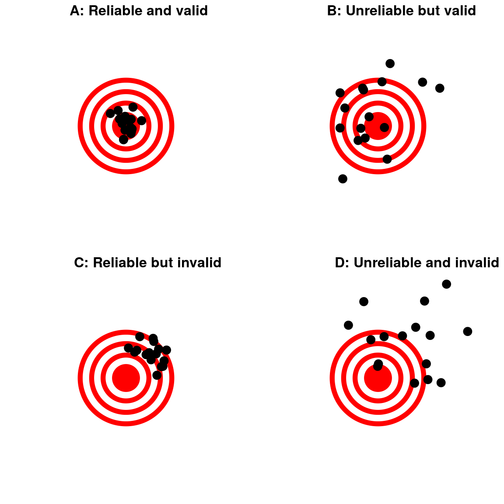

# Data and Research Designs

In the previous chapter (Chapter \@ref(role-of-statistics-in-the-research-process)) we have provided an overview of the research process in psychology and related disciplines. The goal of this overview was to show that statistics is just one part of the full research endeavour and usually not the end goal. We also highlighted that an answer to our research questions requires not only the results from the statistical analysis, but the context in which this result was generated. More specifically, we argued that the most important part of the research process is usually the operationalisation of the research question: What are our measures? What is the task participants have to do? What is our study design? The goal of this chapter is to provide us with the necessary conceptual knowledge and the right terminology to answer these questions for our research.

## Empirical Evidence and Data

In this book we are concerned with *empirical research*. What this means is that we are generally not interested in research questions for which an answer or proof can be found purely through thinking hard, such as in mathematics or philosophy. Instead, we are only interested in research question for which the evidence comes in the form of observations or experiences, *empirical evidence* for short. As we have discussed in the previous chapter, that does not mean that our theories cannot include unobservable entities such as mental states (e.g., fear, enjoyment, attention). However, if our theories include such unobservable entities, these must be causally responsible for something that is observable (e.g., behaviour). This way, we can still test the theories (e.g., if our theory predicts that fear should lead to aggression, but we can induce fear without it leading to aggression, we learn that our theory must be wrong).

The fact that we are interested in empirical research means that the ultimate arbiter of whether or not we should believe in a theory is empirical evidence. It does not matter how elegant or intuitive a theory is. If the observed behaviour of people disagrees with a theory, it is wrong. It also means that theories that are so vague that there is no possible empirical evidence that would disprove them are not part of the empirical sciences (i.e., they are not empirical theories). This criterion is also known as [*falsifiability*](https://en.wikipedia.org/wiki/Falsifiability) and was introduced by the philosopher Karl Popper in the 1930s. For example, there is a never ending discussion of whether Freudian psychoanalysis is in principle falsifiable or not. Whereas Karl Popper was very strong in his belief that it is not (which would render psychoanalysis non-scientific), proponents of Freudian psychoanalysis naturally see this rather differently.[^research_designs-1]

[^research_designs-1]: I think it is fair to say that nowadays most researchers believe that many parts of Freudian psychoanalysis are not falsifiable. Consequently, psychoanalysis is not considered an empirical theory and therefore largely no part of (scientific) psychology (it is of course a part of the history of psychology). For a somewhat recent discussion see: @grunbaumFreudianPsychoanalyticTheory1986

Empirical evidence comes in at least two different forms, either as *anecdotes* or as *data*. Whereas an anecdote typically refers to a single person, data usually contains information about multiple persons. However, anecdotes and data differ on more dimensions than just the number of observations, as summarised in the following aphorism: The plural of anecdote is not data.

Anecdotes are unsystematic observation, typically in the form of stories (e.g., "the friend of a friend"), that somehow address our research questions. The problem with anecdotes is that they are generally difficult to verify and to investigate further. This makes it impossible to rule out possible alternative explanations for the relationship between the anecdote and the research question. And as we have seen in the previous chapter, one of the main criteria for deciding whether an observation provides evidence for a theoretical claim is whether we can rule out plausible alternative explanations. In sum, anecdotes surely matter when coming up with good hypotheses or ideas what to study, but for mature sciences anecdotes should only play a minor evidentiary role in deciding which claims to believe.

Data are systematic observations that are collected for a specific purpose, such as answering a research question or bookkeeping. Data generally consists of *observations* on multiple *variables*. Each variable corresponds to a specific set of possible outcomes or states of affair, where each possible outcome corresponds to one value of the variable. An observation is the smallest unit of data corresponding to one set of values on at least one of the variables.

As an example of data, consider again the study by @walasekHowMakeLoss2015 discussed in the previous chapter (\@ref(role-of-statistics-in-the-research-process)). The task of participants was to accept or reject 50-50 lotteries (for an example, see Figure \@ref(fig:lottery-example)) and each participant had to do this for 64 trials. Table \@ref(tab:walasek-data) below shows six observations each from two different participants from this study. Observations are shown in rows and variables are shown as columns. This tabular representation of the data with observations in rows and variables in columns is common and will be used throughout the book. The way the data is shown here is exactly the format in which the data was kindly provided by Lukasz Walasek (i.e., no variables added or removed). So presumably, this is exactly the format that he used to analyse the data (of course, this table omits several thousand observations, but the format of the data is the same for the not shown observations).

```{r walasek-data, echo=FALSE}
d1a <- readxl::read_xlsx("data_original/walasek_2015/Experiment1_Raw.xlsx") %>% 
  mutate(#subno = factor(paste0("e1a_", subno)),
         #response = factor(response),  #levels = c("reject", "accept")
         #condition = round(condition, 2)
         ) %>% 
  # separate("condition", c("gain_c", "loss_c"), remove = FALSE) %>% 
  # mutate(gain_c = factor(gain_c), 
  #        loss_c = factor(loss_c, labels = c("20", "40"))) %>% 
  mutate(condition = factor(condition), 
         subno = as.character(subno))
tt1 <- d1a %>% 
  filter(subno %in% c(8)) %>% 
  slice(1:6)

tt2 <- d1a %>% 
  filter(subno %in% c(369)) %>% 
  slice(1:6)
ttb <- d1a %>% 
  slice(0) 

ttb[1, "response"] <- "[...]"

op <- options()
options(knitr.kable.NA = '')
knitr::kable(bind_rows(tt1, ttb, tt2), booktabs = TRUE,
  caption = 'Selected observations of the data from Walasek & Stewart (2015, Exp. 1a). The "[...]" indicates that this is only part of the whole data set and some observations are not shown.', )
options(op)
```

In total we can see six different variables in this data set. Let us discuss these in turn. The first variable, `subno` (we generally use a `monospace` font to refer to variable names as they appear in a data set), is the participant identifier or "subject number" (because actual individuals take part in research and not passive subjects, the term "participant" is now preferred to "subject"). This variable should be part of any data set to uniquely identify to which participant (or more generally *unit of observation*) a specific observation belongs. Here, we see that it only takes numbers. It is not uncommon to only use numbers for the participant identifier variable, but it can also be a combination of numbers and letters, or a (ideally anonymous) name.

The second and third variables, `loss` and `gain`, specify the possible outcomes of the lotteries for each trial. For example, the second observation/row shows a lottery in which the potential loss was \$6 and the potential gain was \$8. Based on these two columns, we can see that the observations are ordered by the combination of loss and gain. This means the order of observations in the data does not reflect the actual order of trials in which participants saw them (as this order was random). All values of the two variables are numbers with the lowest possible loss/gain being 6 and the largest possible loss/gain being 40, depending on the condition a participant is in.

Column four shows the `response` of the participant to the lottery, either `accept` or `reject`. The sixth variable, `resp`, is a numeric version of the response. Here, an accept decision is represented by a 1 and a reject decision by a 0. So these two variables carry the same information, but in different formats that have different benefits. The `response` variable makes it easy to understand what participants' response was (i.e., it is clear which value corresponds to which possible response, accept or reject, in the study). The `resp` variable makes it easy to perform calculation on the results given it uses a numerical code to represent the same information. For example, because reject is mapped onto 0 and accept is mapped onto 1, we could take the mean over all observations to get the overall acceptance rate across all gambles (the mean of the whole data is 0.38 which corresponds to an acceptance rate of 38%).[^research_designs-2] However, if we only had the `resp` variable, we would additionally need the information what actual response 0 and 1 correspond to.

[^research_designs-2]: In this book, we will use the term "mean" to refer to the average of a set of numbers as this is the preferred terminology in statistics. In general, "mean" and "average" can be understood interchangeably.

Finally, variable five informs us in which `condition` each participant is in. Remember from the previous chapter that the experiment varied the range of gains and losses across participants resulting in four conditions in total: a condition with loss and gains ranging up to -\$20/+\$40, a -\$20/+\$20 condition, a -\$40/+\$40 condition, and a -\$40/+\$20. This information is here provided in form of a decimal number with the values before the decimal point referring to the range of gains and the values after the decimal to the range of losses without the trailing 0 (i.e., in the opposite order to how we have referred to the conditions so far). Thus, participant with `subno` 8 is in the -\$20/+\$20 condition and participant 369 in the -\$20/+\$40 condition (if we were showing a participant in the -\$40 loss condition, there lowest possible loss outcome would be 12 and not 6 as for the two participants shown here).

The example from @walasekHowMakeLoss2015 hopefully clarifies the abstract definition of a variable that was provided above. For each variable, we have a set of possible outcomes that is defined by our research design. For example, for the participant identifier `subno`, this set encompasses all possible participants that can take part in the study. For `loss` and `gain`, this set contains all potential losses and potential gains that occur in the lotteries. For `response` there are the two possible outcomes, to accept or to reject a lottery. We then define values for each possible outcome. In the case of `subno` we assign a different number to every participant from which we collect data. For `loss` and `gain`, the values correspond to the magnitude of the potential loss and gain in US dollars (the currency that was used in the experiment). For `response`, we do not use a numeric code but use a word to represent the two outcomes.

There are a few things of note in the example data shown in Table \@ref(tab:walasek-data).

(1) Every observation in this data is complete; for each observation we have values on each variable and no missing data. Whereas this is common in experimental research, it is not always the case for other types of research. Whereas missing data is not something we will discuss in detail in this book, it is important to be aware that it can happen and to think about what to do in this case (sadly, there is no general solution).

(2) We have multiple observations per participant, 64 to be precise. These 64 observations are given in different rows. We call this data format -- in which the data from each participant potentially spans multiple rows, one row per observation (i.e., 64 rows per participant in the present case) -- the *long format*. This long format contrasts with a *wide format* that is also commonly found in the social sciences. In the wide format, the data of one participant only spans a single row. In case a participant has multiple observations, these are given in different columns. For the procedures introduced in this book, we generally want the data to be in the long format. (If each participant provides only one observation, there is no difference between the long and the wide format.)

(3) The variables differ in whether they contain numbers (all variables but `response`) or no numbers (only `response`).

## Data Types

Let us discuss the last point from above in more detail. A common intuition is to think about numbers when thinking about data. As we have seen in the example data, this is not necessary. Data does not have to be numbers. The `response` variable shows that we can use other values, such as words or phrases, to represent values of variables. However, the conception of data primarily as numbers is also not completely false. For example, the statistical analyses introduced in this book need to represent all variables in terms of numbers. Fortunately for us, the tools we will be using will generally convert data not using numbers into numeric data when necessary. This means we will use the type of data representation that makes it easiest to understand what the data stands for.

### Numerical Versus Categorical Variables

An important issue that arises when thinking about data as numbers is that numbers can mean different things. One possibility is that numbers represent *numerical information*; that is, they represent a measurement, magnitude, or count of something. However, we can also use number in a broader sense in which they only serve as a label (e.g., numbers on football jerseys or telephone numbers). In this case, numbers only represent *categorical information*; each observation falls into one of a set of mutually exclusive categories. The meaning of the numbers has important consequences of how we use them. If numbers do not represent numerical information most mathematical operations do not make sense. For example, it does not make much sense to calculate the average of two telephone numbers. Let us exemplify this with some variables from the example data.

Let us begin with the `loss`/`gain` variable pair (we can consider them together, because the type of information is the same, the only difference is whether the number refers to a potential loss or a potential gain). For these variables, the meaning of numbers corresponds to the common understanding of numbers as a magnitude of something. In particular, the magnitude of a potential loss and potential gain. We could understand these variables as *measuring* the magnitude of the potential loss and potential gain of a lottery. The larger the number the larger potential loss and gain. In fact, the number exactly represents the potential loss and potential gain (i.e., the measurement of the potential loss and gain is perfectly accurate). Because the numbers of the variables represent numeric information we can treat the variable as a numeric variable in a statistical analysis. More specifically, because performing mathematical operations, such as addition or calculating the average of the numbers, is meaningful for this variable we can treat it as a numerical variable. For example, we could calculate the average potential loss/gain for a participant and it would be useful information (i.e., we could interpret the average in a meaningful way, for example by comparing with the average loss/gain in a different condition).

As a second example, let us consider the `subno` variable. Here, the numbers do not really measure the magnitude of something. Participant number 16 is not twice participant 8. From just looking at the variable, we also do not know what it means. As described above, one just needs to assign numbers somehow to each participant. For example, one could assign number 1 to the first participant that participates in the experiment, number 2 to the second one that participates, and so forth. Alternatively, one could also assign number 1 to the first participant invited, number 2 to the second one invited, and so forth. Another possibility is to specify the maximum number of participants one can collect, say 500 participants, and then just assign a unique random number from 1 to 500 to every participant that participates (e.g., by drawing them from a pool of all numbers without replacement). Importantly, we do not need to know which of these procedures was used. The only reason we have the `subno` variables is so we know to which participant a particular observation belongs to. The numbers in `subno` only serve the purpose as a *label* identifying the participant. Instead of numbers, we could also use non-numeric labels, such as random strings of letters, as the participant variable. Consequently, it does not make much sense to perform any mathematical operation on the `subno` variable. For example, the average participant number does not provide any useful information.

For the purposes of this book, this distinction between these two data types is central: Can we treat a variable as a *numerical variable* or a *categorical variable*? The statistical methods introduced in the following chapters can only deal with these two types of variables (and categorical variables can generally also only serve the role of an explanatory variable and not as an outcome variable). So how can we identify whether a variable is numerical or categorical?

Usually it is easy to identify categorical variables among the variables that have numbers. Whenever the numbers represent a label, a variable is usually a categorical variable. For example, in addition to the `subno` variable, the numbers in the `condition` variable only serve as a label to identify the condition. We cannot interpret the numbers of the `condition` variable shown in Table \@ref(tab:walasek-data) as actually representing a numerical value of either 20.2 or 40.2. Instead, each of the four possible values of the variable, 20.2, 20.4, 40.2 and 40.4, refers to one of their four conditions of the experiment, with loss and gains ranging up to either -\$20/+\$20, -\$40/+\$20, -\$20/+\$40, and -\$40/+\$40 (note again that the value after the decimal point is the range of the potential loss and the value before the decimal point the range of the potential gains). And non-numeric variables in which the values are labels, such as for the `response` variable, are also clearly categorical variables.

More difficult is the decision for the `resp` variable. Clearly, the two possible values of the response variable, the accept or reject decision, are response categories or labels. However, when transforming it into a variable with numbers 1 and 0, we can perform meaningful mathematical operations on it. As discussed above, the mean of the variable can be interpreted as the average accept proportion. More generally, any *binary categorical variable* (i.e., a categorical variable of two categories) can be seen as a special case where treating it as a numerical variable can in certain situations be meaningful. However, whether or not it is meaningful depends on the situation. In general it is best to explicitly treat a variable as categorical unless one is sure treating it as numerical is meaningful.

To sum this up, for the statistical purposes of this book we distinguish **numerical variables** and **categorical variables**. Numerical variables hold numerical information such as magnitudes of something or the degree with which something holds. For categorical variables the values of the variable serve as labels designating membership in one of a number of mutually exclusive categories. When categorical variables are part of an experimental design, we will later also call them *factors*.

### Assumptions of Numerical Variables

What the case of the `resp` variable, the numerical representation of a binary categorical variable, shows is that the decision of whether something is a numerical or categorical variable can depend on the situation. To help with this decision, it is helpful to know what exactly is entailed by treating a variable as numerical. For the statistical methods used here, when we treat a variable as numerical we assume it represents *continuous numerical information*. What this means is that we assume that:

(1) A certain difference or interval has the same meaning anywhere on the scale. For example, a difference of 1 unit of the variable means the same whether we add it to 10 or 20. We can see that this holds for the `loss`/`gain` variable pair but we will later discuss examples where this is a questionable assumption. A corollary to this assumption is that calculating the mean for our variable must be meaningful in itself. If we cannot interpret the mean, a variable cannot be treated as numeric.

(2) Our variable can in principle take on any real-valued (i.e., decimal) number. That is, even though we might have only used *discrete values* for our variables, such as for the `loss`/`gain` variable pair only a subset of the whole numbers between 6 and 40 (see Table \@ref(tab:gainloss)), our statistical method assumes the in-between values are possible and in principle meaningful.

Let us consider a few example variables to see how well they fulfil the two assumptions for a numerical variable. For the `loss`/`gain` variable pair, the two assumptions are fully satisfied. However, the `loss`/`gain` variable pair is not actually an outcome that was measured in an experiment. Instead, this variable pair was part of the design of an experiment. So maybe it is not the most relevant variable for this question. The numerical outcome variable in this data set is `resp`. Clearly, `resp` does not fulfil the assumptions as it only has two discrete outcomes, the values 0 and 1. However, we can calculate and interpret the mean (as the average proportion accepted). We could also assume that a specific difference, say a 0.1 (or 10%) difference, means the same whether it happens at an acceptance rate of 50% or an acceptance rate of 85%.[^research_designs-3] So whereas the assumptions are violated they are also partially fulfilled. So whether we can interpret the results from an analysis depends on the exact context and circumstances. For example, if our statistical analysis would lead to results or predictions beyond the probability range of 0 to 1, this would be clearly problematic as the results would not be meaningful. In other words, we would have learned very little meaningful about our data from such a statistical analysis.

[^research_designs-3]: The assumption that a specific difference on the probability scale, say 0.1, has the same meaning across the whole probability range is everything but uncontroversial. In fact, most methods specifically for dealing with binary variables make the opposite assumption that a difference of 0.1 represents a larger effect if it occurs near the edges (say at 0.9 or 0.1) than when it occurs in the centre of the scale (i.e., near 0.5). However, these methods are beyond the scope of the current book. For introductions see @baguleySeriousStatsGuide2012 (Chapter. 17), @dixonModelsAccuracyRepeatedmeasures2008, or @jaegerCategoricalDataAnalysis2008.

A very popular variable in psychology and related sciences is subjective rating scales (also known as "Likert scales"). For example, we have discussed the study of @mcgrawComparingGainsLosses2010 where participants in one condition where asked to rate the intensity of their emotional reaction to a potential loss or potential gain on a response scale ranging from 1 = "no Effect" to 5 = "Very Large Effect" (see Figure \@ref(fig:loss-feeling-scales), unipolar intensity scale). Does this variable represent a numerical variable? Clearly, a value of 5 represents an emotional reaction that is larger than a value of 1. What this means is that the variable does represent a magnitude, but does it fulfil the assumptions spelled out above? We can also take the average of the scale and interpret it in a meaningful way. Specifically, in the loss condition participants reported an on average stronger feeling with an average value of around 3.6 compared to the gain condition, where the average value was around 3.1. However, it is questionable whether a difference of 1 means the same everywhere across the scale. More specifically, is the difference between "No Effect" and "Small Effect" (i.e., the difference between 1 and 2) the same as the difference between "Moderate Effect" and "Substantial Effect" (i.e., the difference between 3 and 4)? Numerically it is, but whether this also holds psychologically is a question that is difficult to answer. Like most researchers @mcgrawComparingGainsLosses2010 have treated this variable as a numerical variable so have made this assumption (which is also implicit in the process of calculating the average). The validity of their conclusions rests to some degree on whether or not we believe making this assumption makes sense.

Let us generalise the conclusion of the previous paragraph and answer the question what it means that the two points above represent the *assumptions* for treating a variable as a numerical variable. Can we only treat a variable as a numeric variable in a statistical model if it perfectly meets the assumptions? In an ideal statistical world the answer would be yes, but the reality of data analysis always differs from the ideal. Many of the variables that we regularly encounter in our research (e.g., rating scales) violate the two assumptions to some degree and we still need to include them as numerical variables in our model (because treating them as categorical does not help us in answering our research questions). Whenever the assumptions are to some degree violated this can be interpreted as another instance of an epistemic gap (or as an instance of the first epistemic desk, Section \@ref(epistemic-gap-1-underdetermination-of-theory-by-data)). The fact that the assumptions are violated opens the possibility for an alternative explanation of the results that differs from our hypothesis. In other words, if the assumptions are perfectly met the evidence provided by our statistical analysis is stronger than when the assumptions are only partially met.

The problem is that once we have numbers and treat them as a numerical variable, the computer treats all the numbers the same way (i.e., assuming they are a continuous numerical variable), "the numbers don't remember where they came from" [@lordStatisticalTreatmentFootball1953][^research_designs-4]. Only we -- the researchers -- know where the numbers came from and need to take this into account when interpreting statistics. We can also interpret this insight in terms of the concepts introduced in the previous chapter. The numbers are part of the operationalisation; we establish a procedure that maps real world entities (above we have called these possible outcomes or states of affairs) onto values of the variables (which are in many cases numbers). The numbers that emerge from this procedure are related to our research question, but they are not identical with our research question. Any inference from the statistical results based on these numbers requires many auxiliary assumptions, one which is that we assume that numerical variables are continuous. And as we can never be sure if all the auxiliary assumptions are true, we have to be careful and humble with the conclusions we draw from our research.

[^research_designs-4]: This quote is taken from @lordStatisticalTreatmentFootball1953, a short and humorous paper addressing the question of what mathematical operations can be performed with categorical variables, in particular with football jersey numbers. The author, Frederic M. Lord, is one of the most important researchers in the history of psychometrics, the scientific field concerned with psychological measurement. And even though this quote encapsulates an important message, the fact that we have to distinguish the numbers and what they stand for when doing statistics, the overall message of his paper is not without problems. For a modern discussion and perspective see @zandscholtenReanalysisLordStatistical2009.

## Measurement

So far we have categorized different variables as they appear in a data sets and how we can integrate them into a statistical analysis. Here, we take a step back and consider in a principled manner how the variables are created. The question we are considering is what does the measurement process by which we assign values to events allow us to infer from the variable.

### Measurement Scales

The discussion above is about variables consisting of numbers and the meaning of the numbers. One way to interpret this discussion is in terms of the first epistemic gap introduced in the previous chapter, the difference between our research question and the operationalisation of the research question (Section \@ref(epistemic-gap-1-underdetermination-of-theory-by-data)). If we apply this distinction to the issue of this section, the meaning of variables, we can understand this as the distinction between the magnitude of a latent construct, which is called an *attribute* in this context, a variable is supposed to represent (e.g., strength of an emotional intensity or personal risk preference) and the *measurement* of that attribute through the operationalisation (i.e., the application of a procedure that assigns a number for that attribute to an observation). An important theoretical contribution to this distinction within the context of psychology comes from @stevensTheoryScalesMeasurement1946. He assumed that we can distinguish four different types of measurement operationalisation, which he called *measurement scales*, with respect to which type of relationship between attributes they reveal. These four different measurement scales are, nominal, ordinal, interval, and ratio scale.

If a scale is constructed by assigning labels to different attribute values, it is called a *nominal scale* and can be understood as equivalent to what we have termed a categorical variable. For a nominal scale, the values of the attributes do not exhibit any quantitative relationship among each other. In addition to the examples discussed above, many demographic variables can be understood to be on a nominal scale such as gender (e.g., male, female, non-binary, or other) or handedness (right-handed, left-handed, or ambidextrous).

If a scale is constructed through rank orderings of attributes it is called an *ordinal scale.* As a consequence, we can order attributes along a dimension but cannot make any further quantitative distinctions. A common example of an ordinal scale is the final result of a sports competition with first place, second place, and so on. The important aspect of an ordinal scale is that differences between values on the ordinal scale do not need to correspond to the same difference in the attributes that is measured with the ordinal scale. If we stay within the sports competition example, the difference between the first and the second place in terms of performance does not need to be the same as the difference between the second and the third place. For example, in the 2020 Olympics 100 m women sprints final the difference between the first place (Elaine Thompson-Herah) and the second place (Shelly-Ann Fraser-Pryce) was 0.13 seconds, whereas the difference between the second and third place (Shericka Jackson) was only 0.02 seconds. In this case the same difference on the ordinal rank scale (i.e., one rank difference), does not correspond to the same difference in the underlying attribute (i.e., performance, time needed for sprinting 100 m). We can also understand some demographic characteristics can be understood to be on an ordinal scale, such as education levels (e.g., some primary or secondary school education, compulsory education up to age 16, college, or higher education or professional & vocational equivalents).

An *interval scale* results from an operationalisation that also maintains that differences, or intervals, between the values of the attributes on the scale need to have the same meaning across the scale. Thus, an interval scale can also be understood as fulfilling the requirements of a numerical variable. The typical example of an interval scale is temperature measured in either degrees Celsius (°C) or Fahrenheit (°F). Within each temperature scale, a 1 degree difference has the same meaning independent of the current temperature. Furthermore, both scales can be transformed into each other. For interval scales it also makes sense to calculate the mean (e.g., the mean temperature), but calculating ratios does not make sense. For example, saying the 40 °C is double the temperature of 20 °C is not a really meaningful statement (e.g., because 20 °C = 68 °F and 40 °C = 104 °F and $2 \times 68 \neq 104$).

The final scale type, *ratio scale*, results from an operationalisation that in addition to maintaining the meaning of differences across the scale also contains a true zero point of the attribute. To stay within the typical example of temperature scale, whereas the zero point of degrees Celsius and Fahrenheit is arbitrary and they represent only interval scales, the zero point of the Kelvin scale, 0 K, is the lowest possible temperature making the Kelvin scale a ratio scale. Many physical scales are on a ratio scale such as length or time. For example, it makes sense to say that a sprinter who took 20 seconds for the 100 m sprint took twice the time as a sprinter who only took 10 seconds because 0 seconds is the true zero point of no time.

Whereas Stevens' four measurement scale widely popular in psychology and related disciplines thanks to their prominence in most introductions and textbooks, their actual scientific contribution needs to be considered critically [following @michellQuantitativeScienceDefinition1997; @michellStevensTheoryScales2002; @michellMeasurementPsychologyCritical1999]. What Stevens proposes attempts to bridge the epistemic gap between the attribute and its measurement. According to this position, if we have established an interval or ratio scale, we have learned that the underlying attribute exhibits an interval or ratio structure. Unfortunately, because of the problem of underdetermination discussed before, learning about the actual structure of a theoretical construct or attribute is not that easy. Only because the numbers look like a numerical variable, this does not mean that the underlying attribute behaves like a numerical variable.

Discussing the problem in detail is beyond the scope of the present chapter, but the crux of the matter is the issue we have already highlighted in the previous chapter. The operationalisation used to measure a certain latent construct does not represent the latent construct. More technically, the definition of what constitutes measurement that allows to infer the structure of an attribute from its operationalisation differs from the definition given by Stevens (i.e., the application of a procedure that assigns a number of an attribute to an observation). Instead, a proper quantitative measurement that is analogous to the measurement of physical quantities (e.g., length) needs to fulfils a number of assumption, such as expressed in the [theory of conjoint measurement](https://en.wikipedia.org/wiki/Theory_of_conjoint_measurement), that very few psychological or behavioural measures have been shown to fulfil. Put more bluntly, Stevens' attempt to bridge the epistemic gap is logically incorrect, to establish what he wants to establish we need stronger theories that define the theoretical constructs more rigorously [@michellMeasurementPsychologyCritical1999].

Even though Stevens' idea that we can measure latent constructs through interval or even ratio scales is incorrect, his distinction is nevertheless helpful as it again allows us to understand the limits of what we can learn from data. What we can take away from the present discussion is that the common measurement approach that is taken in psychology and related fields is generally only able to establish ordinal relationships. For example, subjective ratings scales, but also choices among lotteries, only represent ordinal relationships in terms of the underlying latent attributes. Nevertheless, we generally treat data from such variables as numerical variables in statistical analyses. This again reinforces the point made before that we cannot interpret the results from statistical analyses as directly answering our research questions. Our statistical analysis generally makes assumptions about the nature of the underlying attribute or construct that we cannot verify. However, this does not mean that all hope is lost. As @stevensTheoryScalesMeasurement1946 already mentioned when introducing ordinal scales, treating them as numeric is not always pointless (p. 679): "In numerous instances it leads to fruitful results." We just have to be mindful that measurement in psychology is generally not the same as measurement in physics when interpreting the results. We primarily learn something about our operationalisations and not directly about our research questions.

### Reliability and Validity

The main message of the previous section is that measurement of mind and behaviour is not as straightforward as measuring physical attributes such as length. Nevertheless, we should aim to use *measures* (i.e., operationalisations that provide measurements) that are of high quality. Two concepts that are important for judging the quality of measurement are reliability and validity, which we will introduce now.

*Reliability* refers to the consistency of a measure. One intuitive way to understand reliability is as the consistency of a measure across different measurement occasions under consistent conditions. Reliability is also inversely related to noise in the measurement process. A measure has a high reliability if repeated applications to the same conditions lead to very similar outcomes (i.e., the level of noise in the measurement process is low). A measure has low reliability if repeated applications to the same conditions lead to widely different outcomes (i.e., the level of noise in the measurement process is high). For example, consider a regular bathroom scale. We expect such a scale to have a very high reliability; we should get pretty much the exact same results if we step on it several times in a row, as long as we do not change our weight in between (e.g., by drinking something).

*Validity* refers to the ability of a measure to measure what it is supposed to measure. Within the concepts introduced within this book, validity thus refers to the ability of a measure to bridge the epistemic gap between the operationalisation of a construct and the actual (i.e., "true") value of the construct. Thus, validity can be seen as one way to conceptualise the question of how strongly a measurement operationalisation corresponds to the measurement of a physical quantity. Given the difficulties in defining or even establishing the constructs researchers are interested in, establishing whether or not a measure has a high or low validity is generally difficult.

One way to visualise both reliability and validity is given in Figure \@ref(fig:reliability-validity-figure) below. Here, each panel represents one operationalisation or measure and each shot on the target represents one measurement with that measure. We can see that reliable measures have low levels of noise (i.e., low level of dispersion of the shots) around one mean value. In this figure, validity is visualised as a bias with respect to the centre of the target. Valid measures are centred on the target whereas invalid measures are centred around an off-target value. What this figure highlights is that reliability and validity are in principle distinct qualities. Only because a measure is reliable, it does not mean it is valid. And likewise, a valid measure does not have to be reliable.

```{r reliability-validity-figure, fig.cap='Visualisation of reliability and validity as shots on a target. Figure is taken from ["Statistical Thinking for the 21st Century" by Russell A. Poldrack](https://statsthinking21.github.io/statsthinking21-core-site/) ([Figure 2.1](https://statsthinking21.github.io/statsthinking21-core-site/working-with-data.html#reliability)).', echo=FALSE}


```

Whereas the visualisation in Figure \@ref(fig:reliability-validity-figure) should provide a good first intuition about reliability and validity, the conceptualisation of validity as a bias is not the only way to think about it. To stay within the metaphor provided by the figure, an invalid measurement could also be one that aims for the floor instead of the target. Or even something completely missing the task such as shooting darts when the goal is to shoot bullets. The problem with validity is that sometimes we don't know how to better define or measure what we are measuring so determining validity is not always easy.

The previous paragraph already points to an important distinction between reliability and validity. Usually there is a way to quantify reliability, but quantifying validity is only possible for specific interpretations of validity.

The most common ways to quantify the reliability of a measure are:

-   *Split-half reliability* or *internal consistency* refer to the reliability estimate that results from splitting a measure into sub-measures and comparing the scores across sub-measures (e.g., by calculating a score for all odd items and comparing them with the score of all even items).

-   *Test-retest reliability* refers to the consistency of applying the same measure at different time points. When using a measure such as a questionnaire, the difficulty in calculating the test-retest reliability is the possibility of memory consistency effects or temporal instability. Memory consistency effects refer to the observation that participants often prefer to be self consistent with their previous answers if they remember them thus potentially artificially increasing the reliability. Temporal instability on the other hand can result in artificially lower reliabilities if the measured construct is temporally unstable (such as mood).

-   *Inter-rater reliability* refers to the agreement of different raters for the same event or situation. Inter-rater reliability can usually only be calculated for measures that are not self assessments or subjective scores. Prominent examples of situations in which one can calculate inter-rater reliabilities are medical diagnoses (i.e., by comparing the diagnosis across multiple doctors) or essay marks (when marked by multiple independent markers).

To quantify validity we need to have an external criterion that also measures the construct of interest. When we have such a criterion, we can compare the value on the criterion with the value on our measure which gives us an estimate of the *criterion validity* of the measure. For example, in the previous chapter we had discussed that there exist different tasks or questionnaires for measuring an individuals' risk preferences. Consider we also had access to a persons' financial history showing to what degree they invest their money into relatively high risk (e.g., stock options), medium risk (e.g., individual stocks), or lower risk (e.g., index funds) financial instruments. A risk preference measure with high criterion validity would be one for which participants that have a high score on the measure invest more of their actual money in high risk investments.

Other types of validity are non quantifiable. *Construct validity* is usually considered the most important type of validity as it refers to all empirical and theoretical support that provides evidence that a measure measures what it is supposed to measure. *Face validity* refers to the degree with which a test appears to measure what it is supposed to measure.

Considerations of both reliability and validity should be incorporated into the overall assessment of the results when judging the empirical evidence provided by a given study.

## Independent and Dependent Variables

In addition to distinguishing the type of information variables can contain, we can also distinguish the different roles variables can play in the research process. Remember, when discussing the operationalisation step of the research process we specified that we need to identify relevant variables that we hope can address the research question as well as specify an empirical hypothesis involving at least two variables. As we will see here, we can assign two different roles to these at least two different variables.

Usually exactly one variable is the variable for which we are interested in the results, in psychology we call this variable the *dependent variable*. Synonyms for "dependent variable" that are common in the statistical literature are *response variable*, *outcome variable*, or *criterion* and we can see that their meaning points in the same direction as "dependent variable". The dependent variable is the main outcome of our study, the variable which we are primarily interested in measuring.

The other variable(s) are called *independent variable(s)* in psychology, because we believe the values of the dependent variable depend on the values of the independent variable(s). A popular synonym for "independent variables" in the statistical literature is *covariates*, as the dependent variable is assumed to covary with the independent variables.[^research_designs-5] Above we have also used the term *explanatory variable* to describe independent variables. Loosely speaking we can describe the distinction such that a study is about the effect of the independent variable on the dependent variable.[^research_designs-6]

[^research_designs-5]: There exist good arguments why the statistical synonyms, response variable for the dependent variable and covariates for the independent variables, are more descriptive and easier to understand. Nevertheless, we will use the terms dependent and independent variable throughout because of how ubiquitous they are in psychology and related fields.

[^research_designs-6]: The terminology of independent and dependent variable can be found in other mathematical disciplines such as analysis [e.g., @oberguggenbergerAnalysisComputerScientists2018]. One way to remember which of the two variables refers to which is to see that both dependent variable, which is the variable holding the results or data from a study, and data start with a "d".

Let us show this distinction in the loss aversion study of @walasekHowMakeLoss2015 the data of which is shown in Table \@ref(tab:walasek-data) above. Their research question was that what matters for people's preference for symmetric 50-50 lotteries is not the absolute value of the potential loss and gain but the relative rank of the lotteries compared to other lotteries. The operationalisation of this research question involved the manipulation of the range of lotteries in one variable, `condition`, and measuring participants' responses to symmetric lotteries in the `response`\\`resp` variable pair. Here the distinction between both variable types is relatively straight forward. We are interested in the effect of `condition` on `response`, which makes `condition` the independent variable and `response` variable the dependent variable.

In general, the distinction between independent and dependent variable is easy to understand in an experiment, such as the study by @walasekHowMakeLoss2015. In an experiment, independent variables are manipulated, such as the case for `condition`. “Manipulated” means we assign participants to the different conditions (compared to measuring in which condition a participant is).

Not all studies are or can be experiments in which the independent variable is manipulated. For example, a common research question is the effect of a demographic variable on an outcome. However, demographic variables cannot really be manipulated or assigned to participants. For example, we might be interested in studying the effect of parental wealth on children's educational attainment. Whereas manipulating parental wealth is in principle possible, a more common approach is to measure this variable as well as children's educational attainment. Nevertheless, we can still make the distinction between the independent variable, parental wealth, and dependent variable, educational attainment.

Not all variables in an experiment neatly fall within the distinction of independent and dependent variables. For example, let us go back to the six variables shown in Table \@ref(tab:walasek-data) that make up the full data collected in the study by @walasekHowMakeLoss2015. As discussed above, the `response`\\`resp` variable pair is the dependent variable and `condition` the independent variable. This leaves us with three further variables that need to be classified.

Let us begin with the `loss`/`gain` variable pair that determines the possible outcomes of a lottery shown to participants. Clearly these are also manipulated. More specifically, the `condition` determines exactly which lotteries and therefore which values of the `loss`/`gain` variable pair a participant works on. Thus, the `loss`/`gain` variable pair are also independent variables that jointly determine the independent variable `condition` (i.e., if we did not have the `condition` variable in this data set we could determine it from the `loss`/`gain` variable pair). This means that determining *the* independent variables in this study depends on the perspective one takes. If we only focus on the main research question and symmetric lotteries then `condition` is the independent variable. However, if we also look at the lotteries individually, then `condition` and the `loss`/`gain` variable pair are the independent variables.

Table \@ref(tab:walasek-data) contains one more variable, `subno`, the participant identifier variable. It might seem a bit surprising to think about this variable in terms of independent and dependent variable, but we should be able to classify this variable somehow. Clearly, `subno` is not a dependent variable. We are not interested in the values or results of the `subno` variable. However, it also seems not clearly an independent variable. We do not have any specific expectations or ideas of how different subjects affect the response variable. To help us with the classification let us consider again why we have the `subno` variable in the data in the first place; because we collect data from multiple participants and need to identify to which participant an observation belongs. The follow-up question to this is why do we collect data from multiple participants? As discussed in the previous chapter (Section \@ref(epistemic-gap-2-signal-versus-noise)), participants are a source of noise in our experiment as different participants can do what they do for a multitude of reasons. If we only had the data from one participant, we could not distinguish between the idiosyncratic noise of that participant and the signal we are interested in. By collecting data from multiple participants, we try to control for the noise by averaging over it with the hope that what remains is the signal. The overarching idea is that noise has an unsystematic effect on the results; some participants may be more likely to show a particular behaviour whereas other participants may be less likely to show that behaviour, but on average the noise cancels out. In sum, we collect data from multiple participants to control for noise that is inevitable when dealing with real people. Thus, we could say `subno` is a *control variable*. We could even be more specific and say it is a *control variable* and an *independent variable*, because we use it to control noise at the level of the design. In other situations we might measure a variable for control purposes in which case we could call it a *control variable* and a *dependent variable*.

To sum this section up: Jointly, the dependent and independent variables are the key components of the operationalisation of a research question. They are the central concepts that make up the study design and link the practical reality of the research (i.e., how the research actually takes place and what is measured) with the research question. It is not wrong to say that a study is defined primarily by its dependent and independent variables. When designing one's own study, making it clear what the dependent and independent variables are is maybe the most important decision after having decided on a research question. Likewise, when reading a scientific article describing a study, understanding clearly what the independent and dependent variables are is central to understanding the study. Therefore, whenever thinking and talking about any research, make sure to be clear what the dependent and independent variables are. In experimental research this often boils down to asking: What was the task of the participants? Other variables that are part of a study usually serve some control purpose and can be denoted control variables.

## Experimental versus Observational Variables

As we have seen when discussing the distinction between independent and dependent variables, we can distinguish different types of independent variables or research designs, namely *experimental and non-experimental independent variables*. Here we will adopt the common terminology and use *observational variable* to describe non-experimental independent variables. If a study solely consists of experimental variables (we drop the "independent" part from now on because experimental or observational variables are always independent variables), we can call it an *experimental study* or *experiment* for short. If a study solely consists of observational variables, we can call it an *observational study*. If a study contains both experimental and observational variables, there is no agreed upon name and depending on which variable is more relevant to the research question, researchers tend to use either experimental or observational study. However, as experimental variables provide a number of evidential benefits that will be discussed here, there is a tendency to call a study an experiment even if it also contains observational variables. Depending on the actual situation and the inferences drawn this can be seen as a stretch.

An *experimental variable* is one that is in control of and can be manipulated by the researcher. What this means is that the values of the variables can be *assigned* to participants by the researcher.

For example, in the study of @walasekHowMakeLoss2015 the researchers assigned each participant to be in one of the four conditions corresponding to a different range of potential losses and gains. Likewise, in the previous chapter we briefly introduced a study of @hinzeTestingLimitsTesting2011 on the generality of the testing effect. After an initial reading of a piece of text, participants were assigned to one of three experimental conditions: a control condition in which they could re-read the materials, a testing condition using open-ended questions, and a testing condition using a fill-in-the blank text. In both of these cases, the researchers decided which condition a participant was part of.

The important part of an experiment variable is not only that participants can be assigned to different conditions, but how they are assigned. More specifically, **for an experimental variable the assignment needs to be performed randomly**; we say participants are *randomised* to the available conditions. One way to understand random assignment is that before the experiment takes place, the probability to be in any of the experimental conditions needs to be the same for every participant.[^research_designs-7]

[^research_designs-7]: Whereas in most cases this also means that the probability to end up in each condition is the same for each condition (i.e., equal probability to be in each condition), this does not have to be the case. In some cases there are randomisation schemes with unequal condition assignment probabilities (e.g., 67% participants in condition 1 and 33% in condition 2).

For example, random assignment means that for every participant in the study of @walasekHowMakeLoss2015, the probability to be in any of the four conditions is 0.25 (i.e., 1/4). For every participant in the study of @hinzeTestingLimitsTesting2011, the probability to be in any of the three conditions is approximately 0.33 (i.e., 1/3).

You can imagine randomisation as an actual physical process that produces a random outcome, such as the toss of a coin or throw of a dice. For example, for the study of @hinzeTestingLimitsTesting2011 we could imagine that for every participant that takes part in the experiment, the researcher (or research assistant) throws a regular six-sided dice. If the dice lands on 1 or 2 the participant is assigned to the re-reading condition, if the dice lands on 3 or 4 the participant is assigned to the open-ended question condition, and if the dice lands on 5 or 6 the participant is assigned to the fill-in-the-blank condition. Alternatively, if we pre-specify the sample size and want to ensure that every group is of approximately the same size, we could use a different approach. We could prepare as many sheets of paper as the number of participants we want to collect. On each sheet we write one condition so that among all sheets, each condition appears equally often. Then, we shuffle all sheets in a bowl to randomise their order. When performing the experiment, we take one sheet out of the bowl (without putting it back) for every participant and assign the participant to the condition written on the sheet. Nowadays randomisation is mostly done through a computer using so-called random number generators.

An *observational variable* is a variable that is not in control of the researcher and we cannot randomly assign participants to condition. In other words, whenever randomisation is impossible an independent variable is an *observational variable*.

Above we talked about demographic characteristics, in particular parental wealth, as an independent variable. As already described there, demographic variables generally cannot be randomly assigned but are a mostly immutable part of a person. Consequently, demographic characteristics (e.g., age, gender) are generally observational variables. The same is true for many other psychological characteristics of a person such as personality traits (e.g., extraversion) or abilities (e.g., intelligence quotient). In the vast majority of cases such variables are observational variables.

At this point you might wonder why an experiment necessarily entails randomisation of the independent variable. What is the benefit of an experimental over an observational variable? The reason for this is that **only randomisation allows drawing causal inferences from a study**. Only with an experimental -- that is randomised -- independent variable can we say that the independent variable is *the cause* of the dependent variable. Without randomisation (i.e., when dealing with an observational independent variable) such an inference is not permitted.

Remember that above we said one way to think about the distinction between dependent and independent variables is that in a study we want to learn about the effect of the independent variable on the dependent variable. We did not specify what we mean with "effect", but we said this way to think about dependent and independent variable only holds loosely. With "effect" we meant a causal relationship, the independent variable is the cause of the dependent variable. In the absence of such a cause-effect relationship, it seems wrong to speak of an "effect of the independent variable". And we can now see the reason why we said this only holds loosely, it only holds if the independent variable is an experimental variable, but not if it is an observational variable.

### Epistemic Gap 3: Causal Inference and Confounding Variables

The reason only an experimental variable allows a causal inference is due to another epistemic gap, the possible influence of *confounding variables* when dealing with observational data. A causal inference means we learn that the independent variable and nothing else is responsible for the effect observed on the dependent variable. A causal inference is only possible if plausible alternative explanations for the observed effect on the dependent variable that do not involve the independent variable can be ruled out. In the context of a causal inference, such an alternative explanation is known as a *confounding variable* or *confounder* for short. If we randomly assign participants to conditions we can theoretically rule out confounders as an alternative explanation. However, in the case of an observational variable we cannot; there may be other reasons, the confounders, that are related to the observational variable that are responsible for the observed effect. Similar to the first epistemic gap, the inference that the independent variable is the cause of the effect in the dependent variable is underdetermined for an observational variable, but not underdetermined for an experimental variable.[^research_designs-8]

[^research_designs-8]: It might make sense to highlight where the difference between the first epistemic gap, underdetermination of theory by data, and the third epistemic gap, the effect of confounders on causal inference, is. The former deals with the inference from the operationalisation to theory whereas the latter is about inferences within the operationalisation. The problem of confounders is solely focussed on the operationalisation. Given the specific independent variable of our study, can we conclude that this independent variable is responsible for the effect on the dependent variable or is there maybe an alternative explanation for this relationship? If we have established such a relationship, this does not yet entail that we can conclude our operationalisation addresses our research question (which is what the first epistemic gap is about).

Let us exemplify this problem with a new example. Imagine you want to investigate the effectiveness of a novel drug against a control treatment (i.e., old drug) for the treatment of a viral infection in a hospital setting. The independent variable is the treatment (control treatment versus novel drug) and the dependent variable is viral load (i.e., whether or not the virus can still be detected in the system). Let us imagine that the results show that the new drug is more effective than the control treatment. That is, participants show a lower viral load (i.e., are less sick) after the novel treatment than the control treatment. The question we are trying to answer now is whether it matters for the inference we can draw from this study if the assignment to treatment condition is random or not.

Let us begin by considering a non-random assignment of the independent variable. For example, one way to implement non-random random assignment could be to use the novel drug in one hospital and the control treatment in another hospital. If we were to run such a study, would this allow us to conclude that a difference in the dependent variable is due to the differences in treatment? This inference would only be allowed if the two hospitals were identical. If there were any systematic differences between the hospitals, say patients in the hospital with the control treatment are on average older than patients in the hospital with the new treatment (e.g., because they are in different areas with different population characteristics), then this difference could be responsible for the difference in the dependent variable.

The systematic difference in age between the hospitals plays the role of a confounder. Age is responsible for the choice of hospital patients go to, because patients near the hospital in which the control treatment is administered are on average older than patients near the hospital in which the new treatment is administered. Age is also responsible for the difference on the dependent variable, because older patients are less likely to recover and thus have a higher viral load at the end of the study than young patients. In a situation in which a confounder is present, we cannot infer that the treatment is the cause of the observed effect. We again have the logical structure indicative of an underdetermination: The two conditions differ in terms of two characteristics, treatment status and age, so either of them (or both) can be responsible for the differences in the dependent variable. We cannot be sure which one of the two possible causes it is.

Let us now consider a situation in which participants are randomly assigned to the two treatment conditions. Here, we again have data from two hospitals but participants in each hospital are randomly assigned to the treatment conditions. For example, for each new patient that shows the relevant symptoms the doctor administering the treatment takes a pre-randomised envelope that contains either the old drug or the novel drug.[^research_designs-9] Because the assignments to conditions is random we would expect that confounders such as age are balanced across the two condition. Every participant that comes to any of the two hospitals has the same chance to either get the control treatment or the novel drug, independent of their age or other characteristics. Consequently, as long as randomness did not introduce an accidental confounding (see Section \@ref(epistemic-gap-2-signal-versus-noise)) we can attribute the effect on the dependent variable to the independent variable.

[^research_designs-9]: One way such clinical studies are commonly done is using a *double-blind design*. This means neither the patient nor the person administering the drug knows in which condition a patient is. In the present case that could be done by making the pills containing old and novel drug look the same.

In summary, the difference between an experimental and an observational variable is the degree with which you can rule out possible alternative explanations. For an experimental variable for which participants are randomly assigned to conditions we know that in theory all confounding variables should be balanced. So as long as the randomisation did proceed as planned, one can be certain that the only alternative explanation for the effect of the independent variable on the dependent variable is random chance. We always might get unlucky and a confounding variable just happens to be unbalanced in our data set. However, with larger sample sizes and larger effects the chance alternative explanation becomes increasingly unlikely. So for experimental variables the only epistemic gap when wanting to judge whether the independent variable is responsible for the effect of the independent variable on the dependent variable is the effect of random chance or noise (see Section \@ref(epistemic-gap-2-signal-versus-noise)).

For example, in the main study that lead to the approval of the Biontech Covid-19 vaccine [@polackSafetyEfficacyBNT162b22020], over 40,000 participants were randomly assigned (i.e., more than 20,000 participants per condition) to either receive the real vaccine or a placebo (i.e., a saline injection without active ingredients). Among the participants that received the vaccine only 8 participants developed Covid-19 and among the participants that received the placebo 162 participants developed Covid-19. Whereas from these results we cannot definitely rule out that there is some confounding variable that explains the difference in contracting Covid-19 it seems extremely unlikely. Participants for this trial were recruited from six different countries (e.g., USA, Turkey, Brasil) and were diverse in their demographic characteristics (e.g., sex, ethnicity, age, weight), but these characteristics were extreme similar for both conditions [@polackSafetyEfficacyBNT162b22020, Table 1].

For an observational variable for which participants are not randomly assigned to condition we do not know whether there is a potential confounding variable. One way to address this problem is to measure known confounding variables and show that they are not responsible for the difference in the dependent variable. But even when we are able to control or measure a large number of possible confounding variables, we can never be certain that there is not another unobserved confounding variable that is responsible for the effect. So for observational variables we always have to deal with the two epistemic gaps when wanting to judge whether the independent variable is responsible for the effect of the independent variable on the dependent variable, the problem of possible confounders plus random chance or noise.

To end this section, let us come back to the example of our trial testing a new drug in a hospital setting. After the lengthy discussion on observational versus experimental variables you can hopefully see that the idea of only administering the new drug in one hospital and the control treatment in another hospital is a bad idea. Without proper randomisation of participants to treatments the inference that the drug is responsible for the effect on the viral load seems very weak thanks to the possible influence of confounders. You might even go so far to wonder who would ever run such a study without proper randomisation or believe the corresponding results.

Sadly, a study that pretty much did exactly what we have sketched above -- administering the novel drug only in one hospital and the control treatment in another hospital, with patients systematically differing between hospitals -- played a very unfortunate role during the Covid-19 pandemic. In particular, the first study to suggest that Hydroxychloroquine was effective against Covid-19, the study by @gautretHydroxychloroquineAzithromycinTreatment2020, had exactly this problem.[^research_designs-10] Whereas critics where quick to point out this and other problems with the study [@bikThoughtsGautretPaper2020; @rosendaalReviewHydroxychloroquineAzithromycin2020; @sayareHeWasScience2020], the damage was done. The then current US president Donald Trump praised Hydroxychloroquine as a wonder cure of Covid-19. It required much scientific effort and follow-up studies, using resources that could have potentially been used more productively elsewhere, to show that it is not [for a full timeline of events see @sattuiSwingingPendulumLessons2020].

[^research_designs-10]: It should be noted that in this study the control group was *actually younger* than the group treated with Hydroxychloroquine. However, as described by @rosendaalReviewHydroxychloroquineAzithromycin2020, this can still be a confounder as "young people who need hospital admission may have a particular risk profile that makes them different from older people" (p. 2). See @rosendaalReviewHydroxychloroquineAzithromycin2020 for more details.

### Is Causal Inference from Observational Data Possible at All?

What the previous section argues is that causal inference is generally only possible from experimental independent variables. With observational variables there can always be a confounder that is responsible for the effect instead of the independent variable. However, many interesting research questions cannot be investigated with experiments but only through observational variables. As we have discussed above, demographic variables or other immutable features of individuals, such as personality traits, are observational variables by definition. Likewise, many variables relating to lifestyle choices, such as dietary or exercise habits, might in principle be amenable to experimental manipulations, but in reality it seems difficult to impossible or completely unethical to run corresponding experiments. Does this mean we cannot draw causal inferences for such research questions? I believe the honest and realistic answer is that in the vast majority of cases we cannot. In my eyes a fair assessment of the situation is that, **causal inference from observational data is literally the most difficult problem in the empirical sciences**.

Importantly, causal inference from observational data is not primarily a statistical problem. We have introduced the problem that confounders pose as an epistemic gap. And as for the other epistemic gaps, overcoming this epistemic gap requires diverse and conceptually strong evidence. There are statistical methods that can assist in providing such evidence, but they cannot provide the type of compelling evidence that is needed. The problem is that even if the observational data strongly suggests something, there always is the possibility that a confounder was missed or not adeauately taken into account.

As an example of the problem, let us consider the case of vitamin supplements, specifically vitamin C and E supplements [@lawlorThoseConfoundedVitamins2004; @woodsideMicronutrientsDietaryIntake2005; @mozaffarianHistoryModernNutrition2018]. Early evidence from large observational studies in the 90s with tens of thousands of participants suggested that taking vitamin C and E supplements reduces the chance of getting cancer and cardiovascular diseases to a considerable degree. Based on these positive results, large scale experiments followed in which participants were randomly assigned to either take vitamin supplements or a placebo (i.e., sugar pill without vitamins). By and large, these experiments could not replicate the positive effects found in the observational studies. Unless an individual is susceptible to a vitamin deficiency, vitamin supplements do not appear to have a measurable health benefit. The probable reason for the difference between the observational studies and the experiments is likely due to an insufficient adjustment of socioeconomic status as a confounder. As often found, participants that came from a better socioeconomic background where more healthy (i.e., less likely to develop cancer and cardiovascular diseases) but they were also more likely to take vitamin pills (because they believed them to be helpful). Whereas the observational studies measured and tried to account for differences in socioeconomic status between participants who already take vitamin supplements and who do not, they only did so partially [e.g., they did not account for differences in the socioeconomic status of the parents which led to developmental differences that also affected the probability of developing cancer and cardiovascular diseases as well as the probability of taking vitamin pills; \@lawlorThoseConfoundedVitamins2004].

What this example shows is that even in a situation in which the confounder is in principle known (i.e., socioeconomic status) and the observational data sets were extremely large (> 10K participants), causal inference from observational data was not possible. Even after attempting to account for confounding, the observational data suggested a relationship that turned out to be spurious. Accurately measuring the influence of the confounder was not possible. Only an experiment was able to reveal that there was no effect of vitamin supplements. This example suggests that for many research questions and data sets common in psychology and related disciplines causal inference from observational data is equally difficult or even impossible. Especially as often data sets are considerably smaller and less is known about the causal relationship existing in a domain.   

As a consequence of the problem with observational data, the current book primarily focuses on experimental data sets, and where non-experimental variables are considered, their limitations will be discussed. Whereas focussing on experimental data restricts the type of research questions that can be investigated, it at least eliminates one of the three epistemic gaps introduced here. This also means that applying the methods introduced here to observational data sets will require additional care when trying to draw justified conclusions and is not recommended. For researchers interested in analysing observational data, some good introductory literature that attempt to approach the problem of confounders in a principled manner are @rohrerThinkingClearlyCorrelations2018, @mcelreathStatisticalRethinkingBayesian2020, and @hernanCausalInference2021. Note that, given the additional epistemic gap that needs to be bridged, these methods are more advanced than the methods introduced here (i.e., require technical and mathematical knowledge going beyond what is required here). After all, drawing causal inferences from observational data is literally the most difficult problem in the empirical sciences.

## Summary

In this chapter we have introduced a number of important concepts that allow us to describe studies and research designs. We have begun by highlighting that as empirical scientists the ultimate arbiter for whether or not to believe in a theoretical position or hypothesis is empirical evidence. This evidence should come from systematically collected data sets and not anecdotes.

Data sets that can be used to address our research questions consist of independent variable(s) and usually one dependent variable. The distinction between both is that we assume the dependent variable depends on the independent variable. If the independent variable is an experimental variable for which participants are randomised onto conditions we can even infer that the independent variable is causally responsible for the effect of the dependent variable. If the independent variable is solely an observational variable, we generally cannot make such a causal judgement.

The reason for why observational variables do not allow causal inferences lies in the third epistemic gap introduced here. For an observational variable, there can always be a different confounding variable that is responsible for both the effect on the independent variable and the dependent variable.

Together the three epistemic gaps put clear limits on what we can learn from empirical data in psychology and related disciplines. The first epistemic gap, underdetermination of theory by data, is the difference between the research question and the operationalisation of the research question. Whereas the operationalisation attempts to address the research question they are usually not the same. The second epistemic gap, signal versus noise, concerns the relationship between the operationalisation and the statistical analysis. Even if the statistical analysis appears to provide support for the empirical hypothesis, we cannot be 100% sure of that. There always is the chance that the observed outcome just occurred by chance -- that is noise -- and does not represent a genuine signal in the data. Finally, the third epistemic gap, confounding variables, is always present when dealing with observational independent variables. As just summarised, in the absence of randomisation we can never really be sure if the independent variable and not a confounding variable is the reason for the observed effect. Thus, we can reiterate the message with which we ended the previous chapter. If we interpret statistical results, we need to be careful and humble with the conclusions we draw.

We have also introduced the different data types we can deal with in a statistical analysis. Independent variables can be both numerical and categorical variables. If an independent variable is categorical, we generally call it an experimental factor, or just factor. Dependent variables can generally only be numerical variables, unless it is a binary numerical variable that we are treating as numerical.

We have also argued that most genuine psychological variables we collect, such as responses on rating scales, are only on an ordinal scale and do not satisfy the assumptions of being a numerical variable. However, in our analyses we nevertheless treat them as numerical. This violation of a statistical assumption places further limits on the inferences that are permitted from our study. In line with this, we have argued that measurement in psychology is a generally difficult problem and simply assuming our measures provide more information than they actually provide is another inferential problem we have to deal with.
