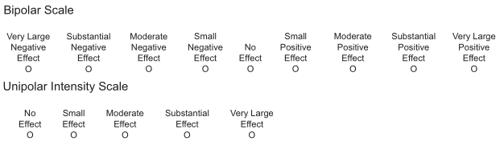
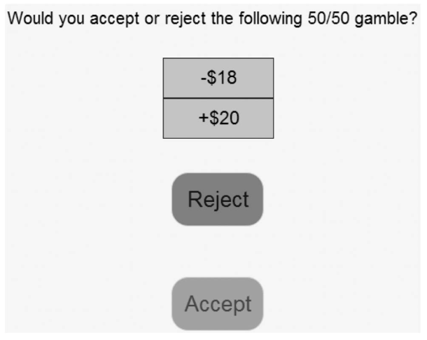

# Role of Statistics in the Research Process

In this book we are concerned with experimental psychology, in particular the statistical analysis of experiments in psychology and related disciplines such as language science, behavioural science, cognitive science, or neuroscience. The order expressed in the previous sentence -- science first and statistical analysis second -- is one of the overarching principles with which we will think about statistics. Whereas the goal here is to introduce the concepts and techniques required to perform a statistical analysis of (mostly experimental) data, the perspective taken here is that a statistical analysis can only be performed or understood within the scientific context it takes place in.

One consequence of this perspective is that the start point of any statistical analysis needs to be a specific and clear research question. In the case in which both data collection and analysis is guided by such a research question, a statistical analysis is generally an indispensable part of the research process. As we will describe in more detail in this and the coming chapters, statistics is the tool that allows us to draw inferences that go beyond the data we have observed. In more technical terms that will be explained more in the next chapters, statistics is the one tool in the research tool kit that allows us to generalise from the current *sample* to a *population* from which this sample is drawn (with a number of caveats we will also discuss). This ability to generalise is what allows us to connect experimental results with the research questions and underlying theories. In sum, the statistical techniques introduced in this book can provide meaningful and scientifically helpful answers when the data is collected and analysed with a clear research question in mind.

## The Research Process

One way to describe the research process in psychology and related sciences is in terms of four interrelated steps: the research question, the operationalisation of the research question and the data collection, the statistical analysis of the data, and finally the communication of the results. Let us explain these steps in more detail.

Any research should begin with a **research question**. For the disciplines considered here this is often be a theory or hypothesis about human behaviour or the human mind. For example, a widely accepted idea in decision making and behavioural science is that people exhibit *loss aversion* -- the displeasure resulting from losing £10 is stronger than the pleasure derived from winning £10. We will look at this example in more detail in this chapter but will also consider other examples. What the example of loss aversion shows is something that is common for research questions, it contains a general statement that involves not directly observable quantities (such as pleasure or displeasure). However, research questions can also be less general or more applied. For example, sometimes we may want to find an answer to a specific issue that had come up in a previous study or to an open methodological issue.

The next step in the research process is the transformation of the research question into an empirical and statistical hypothesis, we can call this step **operationalisation**. As the example of loss aversion shows, research questions are often general. Consequently, there are a multitude of possible studies that can be performed to investigate one research question. However, for any specific study a researchers needs to decide on one specific study design. What exactly are the tasks and measures we are using to investigate the question we are interested in?

The traditional view of the research process -- known as the *hypothetico-deductive method* -- is that during the operationalisation step researchers derive an *empirical prediction* that tests their theory. That means, the theory coupled with the operationalisation predicts a specific outcome, the empirical prediction, that needs to occur if the theory is true. If this outcome were not to occur, we would learn that the theory is false. However, as we will see (below)[\@ref(epistemic-gap-1-underdetermination-of-theory-by-data)], if the predicted outcome were to occur, this would not entail that the theory is necessarily true, it would only support the theory.

Research practice often diverges from this idealised view of the research process [e.g., @haigInvestigatingPsychologicalWorld2014]. Not in all cases there is one clear prediction or specific theory that is tested. Researchers might compare multiple theories with diverging predictions, only have a vague hypothesis instead of a fully fledged theory from which more than a single prediction follows, or they might simply be curious what happens in a specific situation. Therefore, it does not seem appropriate to say operationalisation always involves making a specific empirical predictions. However, even in the absence of a specific empirical prediction, the operationalisation must result in an *empirical hypothesis* relating two or more of the *variables* that are part of the research design to the research question.[^role_of_stats-1] The final step of the operationalisation is the data collection.

[^role_of_stats-1]: What this means is that we can also employ the statistical approach introduced here even if our research question does not make one specific empirical prediction such as there *is* loss aversion. For example, we could also imagine a situation in which our research question is less specific and solely whether or not there is any relationship between the magnitude of a gain or loss and the resulting psychological pleasure or displeasure. The operationalisation could involve finding a measure for pleasure/displeasure and collecting data that contains both the magnitude of gains and losses as well the resulting value on our pleasure/displeasure measure. In this case, our empirical hypothesis would be there is *some* relationship between the magnitude of the gain and loss and the resulting value on the pleasure/displeasure measure. (Of course, in reality everything but the expectation that a gain/loss of larger magnitude is associated with a larger psychological pleasure/displeasure would be somewhat implausible.)

Once the research question has been operationalised and the corresponding data is collected it is time for the **statistical analysis**. Generally, the statistical analysis answers one specific question: Does the data provide evidence for the empirical hypothesis derived from the research question? The remainder of the book will show in detail how to perform statistical analyses for common study designs and how to interpret the results in light of the research question and operationalisation.

Once the data is sufficiently analysed, we have reached the final step of the research process, we need to **communicate the results**. There are different forms of results communication depending on your goal and audience (e.g., scientific journal article, dissertation report, conference presentation, or a press release). Whereas the different forms differ in the amount of detail and background that that is provided, they all need to provide a truthful and comprehensive account of the whole research process: What is the research question? How was it investigated? What are the results? What does this mean for the research question? Often, the difficult problem to solve during this step is to provide a comprehensive and truthful account but in a succinct manner. One important tool for doing so is through graphical means -- results figures. Consequently, in this book we will discuss both how to present statistical results in a text and how to create appropriate results figures.

Whereas this abstract overview leaves out some important things that are also part of research -- such as where research questions come from -- it shows three important things.

(1) The primacy of the research question. The research question determines the operationalisation and thus which data is collected. The research question also determines the statistical analysis, but indirectly; the research question determines the empirical hypothesis which is then tested in the analysis.

(2) The statistically analysis is not directly connected to the research question. The statistical analysis is performed on the operationalisation of the research question, but not on the research question itself. What this means is that the statical analysis itself cannot directly inform us about the research question, or in other words, we cannot statistically test the research question. Instead, statistics can only tell us something about a specific operationalisation. Whether or not this allows strong inferences about the research question depends on the operationalisation. And as shown in the following examples, an important part of the scientific discourse is to argue whether certain operationalisations allow one to address specific research questions. However, this is generally not a statistical question.

(3) Statistics is not the end goal of the research. Instead, the end goal is usually a written communication of the research. In most cases, the statistical analysis is an indispensable part of this communication that can provide evidence for or against a specific empirical hypothesis. However, to understand the full meaning and implications of a particular statistical result, it is important to know its context -- the research question and its operationalisation. It is the task of the research to communicate this context when communicating the research. Without the context, the impact and meaning of a statistical result is severely limited.

## Example I: Testing a New Therapy

To get a better understanding of the research process and the problems that can arise in it, let us consider a first example research question and how it can be investigated empirically. In many clinical domains, a frequent research question is whether a new therapeutical intervention works better than an existing one. The basic study design for this type of research question is quite clear, a *randomized controlled trial*. We want to compare the new treatment with a control treatment in an experimental setting -- eligible participants are randomly assigned to receive either the new or the existing treatment. Whereas the general design of this study is fixed, important questions in the operationalisation step are how to measure the outcome intervention and how to implement the control treatment.

For example, if we are testing a new therapy against a mental health disorder, are we interested if the new treatment reduces symptom as measured by one of the many available questionnaires (and then which questionnaire), reduces the number of sick days, or the number of recurring episodes? Depending on the differences between the new and old treatment it is possible that one treatment does better on one of this measures whereas the other is better for another measure. When performing the research we need to consider these different possibilities before we can collect any data. And if we collect multiple measures, we should determine what our primary outcome is and how we deal with the additional outcomes.

A further problem when comparing therapeutical interventions is how exactly to set up the control condition. If every therapists involved in the study is a proponent of the new treatment -- which commonly happens as tests of new treatments are often done by those developing the new treatment -- they are unlikely to invest the same amount of effort in the control treatment than in the new treatment. This difference in effort, also known as [*allegiance effects*](https://en.wikipedia.org/wiki/Allegiance_bias), can affect the results independent of whether or not the new therapy is actually more effective.

Consider a trial in which we have decided on one outcome measure, but therapists are more invested in the new treatment than in the old treatment. After we have collected the data, we run the statistical analysis which provides evidence that the new treatment performs better than the control treatment on the selected outcome measure. What would this mean for the research question? The researchers performing such a study would probably conclude that the new treatment is better than the old treatment. However, given the difference in allegiance to the two treatments, such a conclusion seems premature. It is also plausible that the therapists, because of their stronger investment with the new treatment, invested more effort into the patients treated with the new treatment. This provides an *alternative explanation* for the results: This difference in effort could be responsible for the difference in the outcome instead of the difference in the two treatments. To provide compelling evidence that the new treatment is indeed better than the old treatment, the researchers would need to test their new treatment in a setting in which this alternative explanation would not work. For example, by showing that the new treatment is also better than the old treatment for a therapist with an allegiance to the old treatment.

## Example II: The Psychology of Loss Aversion

For our second concrete example, let us consider a less applied research question. *Loss aversion* is one of the assumptions underlying *prospect theory* [@kahnemanProspectTheoryAnalysis1979], a mathematically formalised theory combining cognitive psychology with economic theory.[^role_of_stats-2] The concise description of loss aversion is that "losses loom larger than gains" [@kahnemanProspectTheoryAnalysis1979, p. 279]. Less literary, loss aversion means that the negative feeling associated with a loss of a certain amount is larger than the positive feeling associated with a gain of the same amount. For example, loss aversion predicts that the displeasure or pain from losing £10 is larger than the pleasure or joy from winning £10.

[^role_of_stats-2]: Even though prospect theory is over 40 years old, it is still very relevant today with many papers appearing every year building on it or using it. Prospect theory was also one of the contributions for which Daniel Kahneman received the Nobel prize in Economics in 2002. Amos Tverksy, the other developer of prospect theory, died of cancer in 1996 (at the age of 59) and therefore could not receive the Nobel prize (as it is only awarded to living recipients).

We can see that loss aversion is a theoretical statement involving *latent* - that is, unobservable - quantities such as negative or positive feelings (i.e., displeasure versus pleasure). We can ask people how they feel, but we cannot easily observe feelings without asking people. So how can we test whether people indeed show loss aversion if we cannot directly observe the theoretical constructs that form the core of it?

One possibility for testing the hypothesis that individual show loss aversion is hinted at above. We could either give people a certain amount, say £10, or take it away form them, and then ask them how they feel. This procedure runs into at least two problems. First, it is clearly ethically unacceptable to perform an experiment that consists of taking £10 away from some our participants. Second, even if we were to overcome the ethical problems (e.g., by first giving participants an endowment and only take money away from that endowment) there would still be the problem of how to measure the feelings associated with the two events.

One way to avoid the ethical problem of taking away money from participants is to ask them to imagine how they would feel if they lost or gained a certain amount of money. Even though it is not certain whether this imagined feeling corresponds to the actual feeling the participants would have when actually losing or gaining this amount, this procedure is commonly used. For example, @mcgrawComparingGainsLosses2010 asked their participants to imagine that they would play a single game with a 50% chance of losing \$200 and a 50% chance of winning \$200 (e.g., flipping a coin and if it comes up head you win \$200 otherwise you lose \$200). They then asked participants to imagine how they would feel for either of the two outcomes. However, they identified two different ways to ask this question, both of which are shown in Figure \@ref(fig:loss-feeling-scales) below [@mcgrawComparingGainsLosses2010]. The first possibility, a bipolar scale, is shown in the upper part. On this response scale participants in the loss condition respond on the left side of the scale and participants in the gain condition respond on the right side of the scale. To compare the ratings, they measured participants' responses as the absolute distance of the rating from the neutral point "No Effect" (i.e., "Small Positive Effect" would be treated as the same intensity as "Small Negative Effect"). The second possibility is shown in the lower part of Figure \@ref(fig:loss-feeling-scales) and shows a unipolar intensity scale. On this scale, participants in both conditions provide their response on the same scale and only rate the intensity of their displeasure or pleasure.

```{r loss-feeling-scales, fig.cap='Example of two different scales for measuring feelings after a potential gain and loss. The upper part shows a bipolar scale in which losses receive a rating on the left side (of "No Effect") and gains receive a rating on the right side. The lower part shows a unipolar scale in which the intensity for both losses and gains are given on the same scale. Image adapted from McGraw et al. (2010).', echo=FALSE}


```

Before reading on, take a moment and ask yourself if you believe the two scales shown in Figure \@ref(fig:loss-feeling-scales) make a difference for whether or not participants show loss aversion. Or put differently, can you think of a reason why it matters for loss aversion how we ask for participants feeling after a loss or gain? And if there were a difference, for which scale would you expect it be more likely that loss aversion occurs?

To investigate the question of whether there is loss aversion for both scales, @mcgrawComparingGainsLosses2010 asked half of their participants to use the bipolar scale and the other half of their participants to use the unipolar scale to rate their feelings after the imagined loss and gain of \$200. With this data in hand they then compared the feeling ratings for imagined losses and wins for each of the two conditions. Their results showed that it indeed matters which scale is used. In the bipolar scale there was no evidence for loss aversion. The feeling ratings for gains and losses were approximately equal at around 3.4 (where 0 = No Effect and 5 = Very Large Effect). However, when using the unipolar scale they found evidence for loss aversion. In the loss condition participants reported an on average stronger feelings (at around 3.6) compared to the gain condition (at around 3.1).

@mcgrawComparingGainsLosses2010 explain the results in terms of a relative versus absolute feeling judgements. For the bipolar scale, people first judge the valence of the feeling -- that is, whether it is good or bad -- to determine the side on which they have to provide their response on. Once this is done, they only then judge the intensity of the feeling. However, as the intensity judgement follows the valence judgement, they make this intensity judgement only by comparing against other feelings of the same valence. More specifically, @mcgrawComparingGainsLosses2010 assume that in the loss condition the loss is only compared against other negative events and in the gain condition the gain is only compared with other positive events. In other words, for the bipolar scale participants only make a relative judgement of intensity these cannot compare for loss and gains. Consequently, they argue that the results from bipolar scale are not diagnostic for the question whether or not there is loss aversion.[^role_of_stats-3]

[^role_of_stats-3]: Whereas the explanation of @mcgrawComparingGainsLosses2010 does explain why the results from the bipolar scale are not diagnostic for the question of whether or not there is loss aversion (because people use different contexts to make the judgements after a gain or loss) it does not explain why there is no difference between gain and loss frame in the judged feelings.

For the unipolar scale, @mcgrawComparingGainsLosses2010 argue that the judgement of feeling intensity is not preceded by a valence judgement. Therefore, people use an absolute judgement of feeling comparing it with both negative and positive feelings. Consequently, this data, which shows a pattern in line with loss aversion, is diagnostic for the question of whether or not there is loss aversion. Overall they conclude that there study provides evidence for loss aversion, because it appears when using the unipolar scale.

What the results of @mcgrawComparingGainsLosses2010 show is that seemingly minor differences in the operationalisation of a research question can have a tremendous effect on the results. In line with this, it is perhaps not too surprising that this operationalisation for investigating loss aversion -- asking participants about their feelings -- is not very common. Below we will discuss alternative operationalisations.

And whereas @mcgrawComparingGainsLosses2010 provide an explanation for the results, it is an explanation that might have been difficult to come up with before having seen the data. This inability to be able to predict what the effect of the response scale on the results are, has potential consequences that are further reaching. If we take their results serious and generalise them to other domains, we might conclude that whenever we are interested in participants' feelings it matters whether we use bipolar or unipolar scales. One could even go another step further and say that whenever we use subjective rating scales the type of the scale could have an unitended effect on the results. Because of this, it is often a good idea to try to find operationalisation of research questions that do not only involve subjective rating scales but other types of responses such as choices, response times, or more complex behaviour.

### Evidence for Loss Aversion: Lotteries

A different operationalisation for testing loss aversion is the comparison of choice patterns across different *risky choices, lotteries,* or *gambles* (these terms can be understood interchangeably here), a common experimental paradigm in decision making and behavioural economics. A lottery in this context consists of different options, each of which associated with one or multiple outcomes, from which the participant has to choose one.

The simplest type of lotteries are ones consisting of only option. In this case, participants can only decide whether to accept or reject the lottery. For example, evidence for loss aversion can be found in the lotteries used by @battalioTestingAlternativeModels1990. One of their lotteries (their Question 15) was:

Would you play the following gamble:\
A 50% chance of losing \$20 or a 50% chance of winning \$20.

Participants then had to decide whether to accept the lottery or reject the lottery.[^role_of_stats-4] The results showed that 43% of participants accepted this lottery.

[^role_of_stats-4]: To make the question not only hypothetical, it was tied to the payment participants received for the experiment (i.e., a so-called *incentive compatible choice*). After a participant had made choices to multiple lotteries similar to the one shown above, one of the lotteries was selected at random and played out. That is, for the chosen lottery, a random number was chosen (by pulling a numbered poker chip out of a bag) that determined the outcome (e.g., for the lottery above, a number between 1 and 50 resulted in the participant losing \$10 and a number between 51 and 100 resulted in the participant winning \$10). To avoid the ethical issue of taking money away from participants, they initially received an endowment of \$30.

So how does this result provide evidence for loss aversion? The evidence comes from the fact that participants are more likely to reject the lottery than to accept it (i.e., acceptance rate is below 50%). What is important about this lottery is that it is a symmetric 50-50 lottery. That is, the magnitude of the potential loss was equal to the magnitude of the potential gain and both possible outcome appear with equal probability of 50%.[^role_of_stats-5] Remember that loss aversion means disliking a loss more than liking a gain of the same magnitude. A symmetric lottery is exactly such a situation. The fact that participants generally dislike the symmetric lottery is therefore very much in line with loss aversion.

[^role_of_stats-5]: From a mathematical point of view this structure of the lottery means that the *expected value* of accepting the lottery -- that is, the long running average outcome when playing the lottery over and over -- is equal to zero. The expected value of an option is given by the sum of each possible outcome multiplied by its probability. In the present case this is $0.5 \times -10 + 0.5 \times 10 = 0$. So if participants behaved completely rational and did not show any loss aversion, we could expect that they are indifferent towards this lottery.

One problem with the results of @battalioTestingAlternativeModels1990 is that they only collected data from 35 participants which did not provide statistically compelling evidence for loss aversion. Whereas the data shows a *descriptive* pattern that is in line with loss aversion (i.e., below 50% acceptance of symmetric lotteries) this is not supported by a statistical analysis. More specifically, the statistical analysis does not provide support for the empirical prediction that the observed acceptance rate is below 50%. It does descriptively look like this, but the evidence in the data is not enough to surpass the statistical criterion we use for judging the evidence.

More compelling evidence for loss aversion comes from a study by @brooksLossAverseBehavior2005. In their task, participants were asked to make a decision about more complex lotteries in which participants had to decide between two options. For example, one of the lotteries was the following:

Which option do you prefer?\
*A*: A 25% chance of +£11, a 50% chance of £0, or a 25% chance of -£11.\
*B*: A 25% chance of +£10, a 50% chance of £0, or a 25% chance of -£10.

We see that for each of the two options, we have two symmetric outcomes of the same magnitude. For both options *A* and *B*, there is a 25% chance of a loss and a 25% chance gain of the same magnitude (and with 50% probability participants neither lose nor gain anything). The difference between A and B is that for A, the magnitude of the potential loss and gain is larger by £1.

The notion of loss aversion makes an interesting prediction in this case. Participants should increasingly dislike a symmetric lottery the larger the potential outcomes are. For our lottery this means that if we dislike losing £10 more than liking gaining £10, this difference between dislike and liking should be larger if the potential outcomes are £11. In terms of empirical prediction this means that participants should be more willing to choose option *B* than option *A* in the lottery above.

In the study of @brooksLossAverseBehavior2005, each of 49 participant worked on around 50 lotteries that were all similar in structure to the lottery above. That is, for each of the two options there was a loss and gain of the same magnitude with the same probability (the third potential outcome was always smaller in magnitude than the loss/gain). As in the example lottery above, the difference between both options was always that the loss/gain magnitude for one option was £1 larger than for the other option. In line with the empirical prediction of loss aversion, participants chose the option with smaller magnitude of loss/gain in 63% of cases. And given the larger sample size in this study, the statistical analysis also supported the prediction that this 63% was larger than 50%.

So does this all show that there is such a thing as loss aversion? Results such as those from @brooksLossAverseBehavior2005 certainly appear to support this theoretical idea [see also @camererThreeCheersPsychological2005]. And this also make sense intuitively. Most people (me included) feel that symmetric lotteries are not really attractive and become increasingly unattractive with increasing magnitude (who really thinks flipping a coin for the chance of losing or winning say £100.000 sounds like a good idea?). However, as in the previous example, the evidence for loss aversion discussed here hinges on a particular operationalisation of the theoretical idea. From these results, we have not really learned that the magnitude of a loss or gain is the psychologically relevant factor in the minds of people. The only thing we have learned is that people dislike certain lotteries ort options in lotteries. Can we find an alternative for this data pattern that does not involve loss aversion?

### Alternative Explanation: Loss Aversion or Loss Seeking?

One clever alternative explanation for the why it looks like there is loss aversion was provided by @walasekHowMakeLoss2015. In their study, participants were also presented with 50-50 lotteries. An example of one of their lotteries is shown in Figure \@ref(fig:lottery-example) below. As shown in the figure, each lottery involved mixed outcomes, that is both gains and losses (i.e., -\$18 and +\$20 in the example). Furthermore, each lottery consisted of only one option so participants only had to choose whether to accept and play a lottery or not. Finally, both possible outcome always had a 50% probability of occurring. To make this logic clearer to participants, they were told that accepting the lottery shown in Figure \@ref(fig:lottery-example) was equal to flipping a coin that has -\$18 on one side and +\$20 on the other side. Depending on which outcome comes out on top, their money would change accordingly. If participants rejected a lottery, they neither lost nor won any money.

```{r lottery-example, fig.cap='Screenshot of lottery task used to investigate loss aversion. This screenshot is from Walasek and Stewart (2015, Figure 1).', echo=FALSE}

```

As many experiments that fall within a cognitive domain, the study of @walasekHowMakeLoss2015 consisted of a series of similar trials in which participants had to do the same task (i.e., accept or reject the shown lottery). What differed across trials were the values of the two possible outcomes. For example, in one of the conditions of the experiment losses ranged from -\$6 to -\$20 in increments of -\$2 (resulting in 8 different possible losses) and gains ranged from \$12 to \$40 in increments of \$4 (resulting in 8 different possible gains). Across all trials for one participant in this condition, all possible losses were combined with all possible gains so that in total participants had to decide for $8 \times 8 = 64$ lotteries whether they accepted or rejected it.

When analysing their data, @walasekHowMakeLoss2015 focussed on a mathematical model-based analysis using a variant of prospect theory. Whereas there are clear merits to such an approach, as it it able to provide informative summaries of large amounts of data, it can make it difficult to focus on interesting patterns in subsets of the data. Furthermore, analysis using a mathematical models such as prospect theory requires statistical knowledge that is beyond the scope of the current book. Consequently, we will look at a simple data pattern to see whether the data can tell us something about loss aversion.

The 64 trials each participant of @walasekHowMakeLoss2015 worked on contain a subset from which one can directly investigate this question. Whereas most of the lotteries shown to participants were asymmetric -- that is, the potential loss differed numerically from the potential gain (such as for the example in Figure \@ref(fig:lottery-example)) -- a small subset of lotteries were symmetric, for these lotteries the amounts for the potential loss was equal to the amount of a potential gain. More specifically, the symmetric lotteries were -\$12/+\$12, -\$16/+\$16, and -\$20/+\$20.

For the condition described above in which losses ranged up to -\$20 and gains ranged up to +\$40, the 191 participants accepted the symmetric lotteries only 21% of the time. A statistical analysis supports the hypothesis that this is below 50%. As described above, this result makes sense in light of loss aversion. When losing a certain amount of money is worse than winning the same amount of money, I should reject a symmetric lottery in which I am equally likely to lose or to win a certain amount of money.

The clever manipulation of @walasekHowMakeLoss2015 was that they included three further conditions in which they changed the range of possible outcomes. In addition to the -\$20/+\$40 condition discussed above, the 202 participants in the \$-20/+\$20 condition saw lotteries with losses ranging to -\$20 and gains also ranging to +\$20 only. Another group of 190 participants, the -\$40/+\$40 condition, saw lotteries with losses ranging to -\$40 and gains also ranging to +\$40. Finally, @walasekHowMakeLoss2015 also included a -\$40/+\$20 condition with 198 participants in which the losses ranged to -\$40, but the gains only to +\$20 (i.e., the complement to the -\$20/+\$40 condition). Importantly, in all conditions the number of possible outcomes for losses and gains was 8 (so the step size was either $\pm$\$2 or $\pm$\$4). The table below shows the possible outcome for each condition

| Condition           |       |       |       |       |       |       |       |       |
|---------------------|-------|-------|-------|-------|-------|-------|-------|-------|
| -\$20/+\$40: Gains  | \$12  | \$16  | \$20  | \$24  | \$28  | \$32  | \$36  | \$40  |
| -\$20/+\$40: Losses | -\$6  | -\$8  | -\$10 | -\$12 | -\$14 | -\$16 | -\$18 | -\$20 |
| -\$20/+\$20: Gains  | \$6   | \$8   | \$10  | \$12  | \$14  | \$16  | \$18  | \$20  |
| -\$20/+\$20: Losses | -\$6  | -\$8  | -\$10 | -\$12 | -\$14 | -\$16 | -\$18 | -\$20 |
| -\$40/+\$40: Gains  | \$12  | \$16  | \$20  | \$24  | \$28  | \$32  | \$36  | \$40  |
| -\$40/+\$40: Losses | -\$12 | -\$16 | -\$20 | -\$24 | -\$28 | -\$32 | -\$36 | -\$40 |
| -\$40/+\$20: Gains  | \$6   | \$8   | \$10  | \$12  | \$14  | \$16  | \$18  | \$20  |
| -\$40/+\$20: Losses | -\$12 | -\$16 | -\$20 | -\$24 | -\$28 | -\$32 | -\$36 | -\$40 |

: Possible outcomes for the lotteries in Experiment 1 of @walasekHowMakeLoss2015. In each condition, each participant saw 64 lotteries resulting from combining all possible gains with all possible losses in that condition.

As a consequence of this design, what changed across conditions was whether the symmetric lotteries were *relatively good* or *relatively bad*. To understand this, we need to look at the remaining asymmetric lotteries. In the -\$20/+\$40 condition discussed so far, there were more lotteries in which the possible gain was larger than the possible loss (e.g., a -\$18/+\$20 lottery) than lotteries for which the possible loss was larger than the gain (e.g., a -\$20/+\$18 lottery). Consequently, the symmetric lotteries were relatively bad (i.e., compared to the many lotteries in which the possible gain is larger than the possible loss). In the -\$20/+\$20 and -\$40/+\$40 conditions, the asymmetric lotteries were balanced. In half of the asymmetric lotteries the possible gain was larger than the possible loss, whereas for the other half the possible loss was larger than the possible gain. Consequently, the symmetric lotteries were neither relatively good nor relatively bad. Finally, in the -\$40/+\$20 condition the pattern was flipped with respect to the -\$20/+\$40 condition. There were only few lotteries in which the possible gain was larger than the possible loss compared to the many lotteries for which the possible loss was larger than the gain. Consequently, the symmetric lotteries were relatively good.

So does it matter whether the symmetric lotteries are relatively good or not? Indeed it does. As a reminder, people were unlikely to accept the symmetric lotteries in the -\$20/+\$40 condition in which the symmetric lotteries were relatively bad. Participants in this condition only accepted 21% of the symmetric lotteries. In the -\$20/+\$20 condition in which the symmetric lotteries were neither relatively good nor relatively bad, participants accepted 50% of the symmetric gambles. Similarly, in the -\$40/+\$40 condition participants accepted 42% of the symmetric gambles. Finally, in the -\$40/+\$20 condition in which the symmetric lotteries were relatively good, participants accepted 71% of the symmetric gambles. Importantly, a statistical analysis supported the hypothesis that this 71% is larger than 50%.

What these results show is that the choice pattern for lotteries are not always in line with the idea of loss aversion. Only in a context in which a symmetric lottery is relatively bad do we see evidence in line with the idea of loss aversion. If we are in a context in which a symmetric lottery is relatively good, we see the opposite pattern that one could term *loss seeking*. What does this mean for loss aversion? The original idea of @kahnemanProspectTheoryAnalysis1979 that what matters is the magnitude of a loss or gain surely is not in line with the results of @walasekHowMakeLoss2015. Instead, @walasekHowMakeLoss2015 argue that what is relevant to determine the psychological impact of a gain or loss is the relative magnitude or *rank* of a possible outcome: Compared to other gains or losses I regularly experience, is this a large gain or large loss?

Before moving on and linking this example of the psychology of loss aversion to the general goal of this book, let us answer one last question. If what matters is the rank (as suggested by @walasekHowMakeLoss2015) and not the magnitude of an outcome (as proposed by @kahnemanProspectTheoryAnalysis1979), why do we see evidence for an effect of magnitude in other studies investigating loss aversion [e.g., @brooksLossAverseBehavior2005] that did not manipulate the context of gains and losses? An answer to this question is provided by @stewartDecisionSampling2006. They argue (and also provide empirical evidence) that in our daily lives we experience more small losses (e.g., buying something at the bakery) and more larger gains (e.g., the monthly salary). As a consequence, for a gain and loss with the same magnitude the relative rank of the gain compared to all other gains is lower than the corresponding relative rank of the loss compared to all other losses. From this difference, we should generally observe a pattern consistent with loss aversion but for a different theoretical reason than proposed by @kahnemanProspectTheoryAnalysis1979.

## Epistemic Gaps: The Difference Between What we Want to Know and What we can Know

The goal of this chapter is to provide an introduction to the role of statistics in the research process. Why do we need statistics and what can it tell us about the research questions we are interested in? However, so far we have not talked much about statistics but mostly introduced examples of the research process. The reason for this is that it is important to understand what we generally want to know when we do empirical work in psychology or related disciplines. We need statistics because we have a research question for which we want an answer.

If you do not yet know about statistics in detail, the application of statistical methods can appear like a magical machinery that provides us with an answer to the research question we have. You throw your data in, turn the statistics machinery on, and get an answer to your research question out. Sadly, this image of statistics is false. The reason is that there are at least two *epistemic gaps* in the research process that prevent us from getting a straight answer to our research question. In this chapter we will introduce these gaps to ensure you can get a realistic image of the role of statistics in the research process.

Before explaining what an epistemic gap is, we need to take a step back and think about science in general. There at at least two different parts that constitute a scientific discipline. Firstly, we have the substantive content, what the science is about. For example, psychology is concerned with the human mind and behaviour. So one part of psychology is theories about mind and behaviour (e.g., people exhibit loss aversion). But, just the theories is not enough. The problem is that there are many intuitive and good sounding but ultimately untrue theories [e.g., the idea that there are distinct "learning styles"; see @pashlerLearningStylesConcepts2008]. So the second part constituting a science is *research*; systematic investigations of our research questions that provide us with *evidence*. This evidence allows us to decide which theories to believe and which theories to discard.

This perspective on science allows us some conclusions what this means for us as scientists. Firstly, it is important not to adopt theories too easily and early. As scientists we need to be natural sceptics. Instead of believing in a theory because it sounds compelling, we need to ask for the evidence first. We then need to evaluate the evidence and use this as the basis for the strength or degree of our belief. For example, if there are a few independent studies that support a certain theoretical position (as in the case of loss aversion) it seems appropriate to consider a certain theoretical position as a possibility but also consider alternative accounts as possible [as the rank based account of @walasekHowMakeLoss2015]. If the evidence is weaker, say only studies from the proponents of a theory, we should be even more cautious in the degree of belief we assign to a theory. And only if the scientific evidence is overwhelming should we be willing to treat a theory as approximately true. For psychology, there are not many theories for which the majority of researchers would agree that the latter criterion is reached (e.g., besides maybe operant and classical conditioning). As a consequence, in many cases the best think to do is to be honest and admit that the evidence is not sufficient to hold a strong theoretical position. For us scientists, this perspective also means that we need to be able to evaluate the evidence from the research in our domain of interest. Doing so requires substantive knowledge about our research domain, but also statistical knowledge that we will introduce in this book. Finally, it means that we need to be open to revise our beliefs in light of new evidence [as in the case of loss aversion and the results of @walasekHowMakeLoss2015].

As the last two paragraphs show, science is ultimately about evidence. What evidence do we have to believe in the theories in our field? As scientists we hope that statistics is a tool that helps us answer the question about evidence. And to some degree it does, but not as much as we would hope. We need to be aware of the epistemic gaps. Let us explain now what this means.

*Epistemology* is a branch of philosophy that is concerned with knowledge (e.g., what is knowledge, how de we know that we know) and justification (e.g., what is the reason I believe something) [for a philosophical overview see: @steupEpistemology2020] and "epistemic" is the corresponding adjective. Epistemology therefore is the field that deals with a philosophical questions at the core of science, which theories should I believe based on the available evidence. An epistemic gap describes the difference between what we want to know and what we can actually know.[^role_of_stats-6] Ideally, we want to know whether a theory or hypothesis is true. As we have already seen in the examples above, in many cases even carefully designed experiments cannot unambiguously answer this questions. In the following, we will take a more abstract look at this question and discuss two general problems that further complicate this issue. What we can know is often quite different from what we would like to know. A competent application of statistics requires that one is aware of this problem and avoids over-interpreting the results from ones research.

[^role_of_stats-6]: In some parts of philosophy, the term "epistemic gap" has a different meaning relating to questions of consciusness and feelings.

### Epistemic Gap 1: Underdetermination of Theory by Data

Above we have provided two examples of the research process in psychology, one applied research question (Is a new therapeutical intervention better?) and one theoretical (or *basic*) research question (Is there evidence for loss aversion?). In both cases we have seen that answering the research question requires carefully thinking about the operationalisation. How exactly should we set up a study to test this question? And once we have decided on one operationalisation, we have seen that we can find alternative explanations that can explain the results without making the assumptions of the original research question. In other words, even though the operationalisation was carefully chosen, it could not unambiguously answer our research question.

The fact that we could not compellingly answer the research questions despite employing a carefully chosen operationalisation is not a problem that is unique to our two examples. In contrast, an important insight from philosophy of science is that this is a problem of *any* empirical study. This issue is also known as *underdetermination of theory by data* or the [Duhem-Quine thesis](https://en.wikipedia.org/wiki/Duhem%E2%80%93Quine_thesis) and always occurs if there is a difference between the research question and the corresponding operationalisation. And as we have seen in the examples, there essentially always is.

There are different aspects or different angles with which we can look at and understand underdetermination. The first aspect has to do with the specification of the research question and its operationalisation. Research questions usually involve unobservable *constructs* -- such as emotions (e.g., fear), memory, attention, comprehension, or learning -- or vague phrases, such as "works better" or "improves". An empirical investigation of such questions however requires a precise specification and operationalisation. By going from the research question to the concrete operationalisation, there is no guarantee that the operationalisation captures the intended meaning of the research question.

For example, consider again our first example of the test of a therapeutical intervention. Imagine we found that the new intervention decreased patient scores on a symptom questionnaire more strongly than the old treatment, but did not reduce the number of sick days due to the disorder. Should we interpret this in the way that the new treatment "works better" than the old treatment? In some sense it does, but in another not. The problem is that the nuances that result from operationalising a research question concretely do not always align with the broad way in which we like to think about research questions.

At this point you might think this does not yet sound like such a big problem. We just need to define our research questions precisely enough and then we are able to learn something about our research question. Sadly, this is easier said then done. The first problem is that it is often impossible to precisely define our research question, because we have not yet found a way to precisely define the constructs that are involved in it (this is known as the *problem of coordination*, [@kellenProblemCoordinationPursuit2021]).

For example, if you have they hypothesis that a specific emption, say fear, is related to some behavioral pattern, say aggression, you run into the problem that there is not generally agreed upon definition of either of these constructs. There probably exist questionnaires for measuring fearfulness and aggressive tendencies, but these questionnaires do not represent the corresponding constructs or a definition of them. If you were to ask a sample of participants to fill out these questionnaires and found that the scores of the participants in these two questionnares are related, it would not allow you to conclude that fearfulness and aggression are related. The only conclusion that would be allowed is that fearfulness as measured with the questionnaire is related to aggression as measured with the questionnaire. Of course, as scientists we would like to make the general conclusion that the constructs are related, but such an inference is not logically allowed.

The general problem that we run into is the Duhem-Quine thesis; any empirical hypothesis that is tested in a study contains of two parts: The theoretical prediction as well as a set of *auxiliary assumptions* that link the theoretical prediction with the data. To stay with our example, our theoretical prediction could be that fear and aggression are related. The auxiliary assumption are all additional assumptions that are needed to test this question empirically as decided on as part of the operationalisation: that the questionnaire is a valid measure of the constructs (which is a big assumption), that the data collection took place without any unforeseen problems, that we have tested enough participants to find an effect, that we use appropriate statistical procedures, etc. As can be seen, the list of auxiliary assumption is somewhat limitless and difficult to enumerate fully. It also contains quite mundane assumptions such that we have to assume that the research actually took place and is not just made up by the researcher (for an exception, see [the case of Diederik Stapel](https://scienceintegritydigest.com/2019/07/16/fabrication-the-diederik-stapel-case/)).

The core of the Duhem-Quine thesis is that any empirical result does not pertain solely to the theoretical prediction of interest, but the union (or conjunction) of the theoretical prediction of interest with the auxiliary assumptions. If the results are in line with the empirical hypothesis, that only supports the theoretical prediction if all auxiliary assumptions are true. Likewise, if the results are not in line with the empirical hypothesis, this only provides evidence against the theoretical prediction if all auxiliary assumptions are true. However, testing whether all auxiliary assumptions are true cannot be done in the same study that tests the empirical hypothesis we set out to test (because we can always come up with more and more auxiliary assumptions not specifically tested). Consequently, any individual result on its own cannot provide conclusive evidence for or against a particular theoretical prediction, there can always be an alternative explanation that differs from the theory or hypothesis one has.[^role_of_stats-7] That is what is meant by the underdetermination of theory by data.

[^role_of_stats-7]: A further consequence from the Duhem-Quine thesis is that there can be no such thing as a theory-free observation. Any empirical result that is interpreted in light of some hypothesis or research question comes with more or less explicit auxiliary assumptions.

Whereas this issue might seem like a purely philosophical discussion, it is far from it. Most actual scientific discussions in the literature are about the auxiliary assumptions that are part of the operationalisation of a research question. For example, in the example of the therapeutical intervention, the idea that therapists apply both old and new therapy in exactly the same manner is an auxiliary assumption that is questioned by the concept of therapeutical allegiance. Likewise, the argument for loss aversion as proposed by @kahnemanProspectTheoryAnalysis1979 hinges on the auxiliary assumption that participants interpret the possible outcomes of the lotteries in terms of their magnitude or absolute value. As shown by @walasekHowMakeLoss2015, at least in some cases this auxiliary assumption does not appear to hold and participants instead interpret the relative value of the possible outcomes of the lotteries. It will be easy to find similar examples for the research area you are interested in.

To sum this up, the problem of underdetermination and the first epistemic gap is that any particular results never uniquely supports or challenges one theoretical position or hypothesis. For any result that appears to support a theory there is another theory that makes the same prediction because an auxiliary hypothesis could be false and thus require a different theory. Likewise, for any results that seems to disagree with a theory, the theory can always be protected by claiming one of the auxiliary assumptions is incorrect. And this is also exactly what happens in real scientific discourse. As an example, when John Bargh, a prominent social psychologist from Yale, was confronted with results that disagreed with one of his most prominent findings [@doyenBehavioralPrimingIt2012] he attacked (in a now deleted blog post that still can be found [here](https://replicationindex.com/wp-content/uploads/2020/07/bargh-nothingintheirheads.pdf)) the "incompetent or ill-informed researchers" and claimed their study "had many important differences from our procedure, all of which worked to eliminate the effect​". As this section has section has shown, questioning the methods (i.e., the auxiliary assumptions) is a legitimate defence that protects ones theory. Of course, one can question the auxiliary assumptions of the original results that appeared to support the theory in the same way. In the case of Bargh, it appears that this is exactly what happened. Most other psychologists have stopped believing his original finding [e.g., @harrisTrainWreckAny2021].

### Epistemic Gap 2: Signal and Noise

The first epistemic gap is that there is no strong logical link between the theories underlying our research questions and the operationalisation of the research question. Thus, in terms of the steps in our research process it concerns the relationship between step 1, the research question, and step 2, the operationalisation and data collection. The next epistemic gap concerns the relationship of steps 2 and step 3, the statistical analysis.

As described above (\@ref(the-research-process)), the important task during the operationalisation is to transform the research questions into an empirical hypothesis. Ideally, this hypothesis comes in the form of an empirical prediction, describing which possible outcome would support our theoretical hypothesis (i.e., the outcome predicted by our theory). As part of this we should also clearly designate a possible outcome that, if it were to occur, would speak against our theoretical hypothesis. Once we have decided on this, we collect the data and then run the statistical analysis. The goal is that the statistical analysis provides us with evidence with respect to the empirical hypothesis. Does the data support the empirical hypothesis or does it not?

Before providing an overview of how this is done, let us go back to the second example above, the study of @walasekHowMakeLoss2015. In contrast to the original formulation of loss aversion [@kahnemanProspectTheoryAnalysis1979], which is based on the magnitude or absolute value of a gain or loss, the theoretical prediction of @walasekHowMakeLoss2015 was that what drives people's behaviour is the relative value of a gain or loss. To test this, they presented participants with lotteries in different conditions in which the range of gains and losses differed. In one condition there were small losses and large gains and in another condition there were large losses and small gains (we ignore the other two conditions here). The hypothesis that follows from this design is that the relative attractiveness of the symmetric lotteries (in which magnitude of possible loss = magnitude of possible gain) differs in both conditions. In the small loss/large gains condition the symmetric lottery is relative unattractive and in the large loss/small gains condition it is relatively attractive. The resulting empirical prediction is that participants should be less willing to accept the symmetric lotteries in the small loss/large gains condition than in the large loss/small gains condition. In line with this prediction, participants in the small loss/large gains condition accepted only 21% of the symmetric lotteries whereas participants in the large loss/small gains condition accepted 72% of the symmetric lotteries.

From just looking at the bare numbers, the results appear to support the empirical prediction. Participants are roughly 50% less likely to accept the symmetric lotteries in the small loss/large gains condition than in the large loss/small gains condition. However, how can we be sure this particularly observed difference is not a chance occurrence. Maybe we just got unlucky and the participants in the small loss/large gains condition are for some reasons generally less likely to accept any lotteries than the participants in the large loss/small gains condition. Maybe the former participants all had a horrible night of sleep and are in a really bad mood at the time of testing and therefore reject all gambles whereas this was not the case for the latter. If this were the case, the observed difference would not actually tell us anything about our research questions.

The problem described in the previous paragraph is at the heart of the statistical approach described in this book. The core problem is that the responses we get from participants in experiments are inherently noisy. Human participants can do things for an unlimited number of reasons. Some of these reasons are related to our research question and its operationalisation and other reasons are not. For example, if participants read the lotteries carefully and think before they provide an answer, it is likely that the values of the possible outcome play a role in their answer. In this case, their responses are relevant for our research question. But what if participants are distracted by a message on their phone and do not read the problem fully? Or what if they intend to accept a lottery and accidentally reject it (i.e., press the wrong button)? We can also imagine that it matters if participants are relatively rich or relatively poor. For someone with a million on the bank, it might not really matter if they lose or win \$16 so they might be inherently more likely to gamble on such a lottery than someone for which this is more than the hourly wage. In all these cases, the values of the lotteries have a minor effect and thus the responses are more or less irrelevant for our research question.

For the question of whether or not the results support our empirical hypothesis we therefore would like to distinguish between those responses that are relevant for our research question -- we can call this the *signal* -- and those responses that are generated more or less randomly and are irrelevant for our research question -- we can call this the *noise*. If we had a procedure that could distinguish signal from noise we could then simply see whether the signal supports our empirical prediction. If it did, the data would provide support for the hypothesis and if not the data would not support the empirical hypothesis. Sadly, such a procedure does not and cannot exist (as we would then know why people do what they do, which is the reason we do research in the first place).

In the absence of a procedure that can definitely separate the contribution of signal and noise, the statistical approach introduced here compares an *estimate of the signal* with an *estimate of the noise*. Let us assume for a moment the estimated signal supports our empirical prediction as in our example (i.e., we predict that participants are less likely to accept a lottery in the small loss/large gains condition and this is what the data shows). We then compare this estimated signal against the estimated noise. If the estimated signal is large given the estimated level of noise, we assume that the data supports the empirical prediction. If the estimated signal is not large given the estimated noise, we assume the data does not support our empirical prediction.

So how can we estimate the signal and the noise? Estimating the signal is straight forward. We just use the observed difference between the conditions as our estimate of the signal. So for the example from @walasekHowMakeLoss2015 this would be the observed difference in accepting the symmetric lotteries between the two conditions which was roughly 50%. Estimating the noise is a bit more complicated and will be described in detail in later chapter. For now it is enough to understand that it is affected by two components: (1) The variability in responses within each condition and (2) the overall sample size (i.e., number of participants). If the variability within each condition becomes smaller (i.e., measurement becomes more precise) and the sample size stays the same, the levels of noise decreases. Likewise, if the sample size increases with a constant level of variability, the level of noise decreases.

Another important question is what counts as "large" when comparing the estimated signal to the estimated noise. In the following chapters we will introduce a decision threshold to make this judgement.[^role_of_stats-8] If the signal to noise ratio is above the threshold, we act as if there were a signal and change our believes. If it is not, we cannot make a decision. This decision threshold is chosen such that across many such decisions we control our rate of making false positive decisions. In particular, the decision threshold is chosen such that if we were in a situation in which there was no signal, we only incorrectly assumed that there is a signal in 5% of decisions.

[^role_of_stats-8]: To foreshadow the content of the book, this decision threshold is based on the $p$-value. A sometimes controversial but ubiquitous statistical procedures that you will find in most empirical publications.

Taken together, the statistical procedures we are using attempt to answer the question whether there is a signal that supports the empirical hypothesis given that human data is inherently random and noisy. The problem in this is that the estimated signal -- the observed difference between the conditions -- is also affected by the noise. We never know if the observed difference is due to the signal we are interested in or just based on noise. To overcome this problem we compare the observed signal with the observed level of noise. If the observed level is large relative to the observed noise, we decide the data supports the presence of the signal. In other words, we never really know if the current data *really* supports our prediction or not, we just act as if it does. There always is a non-zero chance that the effect is due to the noise. Because we only have this one data set we are analysing, we cannot be 100% certain our estimate of the signal and the noise is fully accurate. However, as we will describe in detail later, across decisions that use this statistical decision procedure, it controls our rate of making false positive decisions (i.e., assume there is a signal when there is none).

So as in the case for the first epistemic gap, the second epistemic gap also shows that what we cannot really learn what we wanted to know, if the data supports the empirical hypothesis or not. If the signal is large relative to the noise, we have evidence that it does, but this evidence is never fully conclusive. The evidence might be strong, and we will later see how we can identify that, but there always should be some remaining doubt in the back of our head. Maybe we just got unlucky and the participants in our study responded in a way that made it look like there is a signal, but there isn't. With just one data set in hand, this cannot really be ruled out.

## Summary

In this chapter we have provided a conceptual overview of the research process in psychology and related disciplines. In this concept, the research always begins with a research question. What is it that I want to know? Often this research questions stems from a particular theory that we want to test, but it can also be a purely applied hypothesis.

The next important step is the operationalisation of this question followed by the data collection. That means we need to find appropriate tasks or measures and develop a study design with which we can test the empirical hypothesis following from our research question. As we have seen in the discussion of the first epistemic gap, the consequence of the separation of research question and operationalisation is that, strictly speaking, our study only let's us learn more about the tasks and measures we are using. Because of the problem of underdetermination of theory by data, even an apparently positive result does not allow us to infer that it supports our theoretical hypothesis. The core problem is that the empirical hypothesis is a combination of theoretical hypothesis and auxiliary assumptions and we cannot rule out that one of the auxiliary assumptions is false.

With the collected data in hand, the next step is to perform the statistical analysis. Here, we hope to find evidence that informs us about our empirical hypothesis. The procedure we will use in this book attempts to distinguish between the signal in the data, the part of the data relevant to our empirical hypothesis, and the noise, the randomness that is inherent in using human participants.[^role_of_stats-9] However, the second epistemic gap entails that even with such a statistical procedure, we cannot find fully conclusive evidence. The problem is that we cannot estimate the true amount of noise in the data. Research participants have a myriad of potential reasons of why they show a certain behaviour and these reasons need not be related to our research question. With more precise measures and more participants, we can control this level of noise to some degree, but ultimately cannot be sure whether we did not just get unlucky and what we see is due to noise and not because of our hypothesis.

[^role_of_stats-9]: Even though we say human participants here, this also applies to non-human participants (i.e., animals) or other biological organisms.

The final step in the research process is the communication of our results. This step essentially combines all previous step. We need to communicate the research question, the operationalisation, the data collection process and sample, and the results from the statistical analysis. Whereas the communication of the results is ultimately the goal of any research project, it is also the step during which we have to be mindful of the limits of our research. The biggest danger is that we forget the epistemic gaps that are inherent in any empirical research and oversell our results. We of course want that our research allows us to answer our (potentially big and broad) research questions, but we should be honest with ourselves and our audience and stick to the reality that we are primarily learning something about our operationalisation. When we get a statistical result that appears to support our empirical prediction we want treat it as if it is true, but we should be clear that there always is a chance that our result might be a fluke.

### What Shouldn't and What Should we do?

Let us end this chapter with some more concrete examples from the literature that highlight some of the issues discussed here. To motivate ones research question, it is a good idea to start with the big picture. What are the real world issues and theoretical problems we want to address? Whereas this is a good idea, we should not mistake our operationalisation of the research question with this big picture.

For example, in a recent paper on which I was a co-author [@baumannLinearThresholdModel2020], we developed a new task, the "ticket shopping task", to investigate sequential decision making problems (in this section, the details of the tasks are not really relevant so we will only mention the names, but do not describe tasks in detail). Whereas I feel we could make a good case that we could figure out to some degree what people do in this task, this does not mean that this is what people generally do in sequential decision making problem.

Likewise, whereas there might be both a model-free and model-based reinforcement learning system in the brain, the popular "two-step task" [@dawModelBasedInfluencesHumans2011] is unlikely to reveal all its mechanism or even prove its existence.[^role_of_stats-10] In fact, there is good evidence participants in this task show many behaviours that are unrelated to the theoretical question of interest [e.g., @akamSimplePlansSophisticated2015].

[^role_of_stats-10]: I am not suggesting the original authors [@dawModelBasedInfluencesHumans2011] necessarily made these claims. This is just an example of where a particular task is portrayed in the literature as representing the underlying theoretical constructs (i.e., model-based and model-free reinforcement learning). As we have discussed, this is not a logically justifiable position. A particular task cannot represent a construct unless all auxiliary conditions are carefully spelled out and justified.

Another example comes from the domain of moral reasoning. Here, a prominent procedure is the use of the "trolley problem" and similar vignettes [@greeneFMRIInvestigationEmotional2001]. Whereas these vignettes have revealed interesting results, it seems questionable to assume that participants' responses represent the extent of their moral reasoning or that they are particularly predictive of participants real-world behaviour.[^role_of_stats-11] Similar arguments can be made for many other experimental domains but also whenever particular questionnaires are used.

[^role_of_stats-11]: Again, I do not want to accuse the authors cited here [@greeneFMRIInvestigationEmotional2001] of making such claims. However, the literature again seems to treat "moral reasoning" and "responses to trolley-type problems" as near synonyms which seems problematic given the.

It makes sense to look a bit critical at the argument we have made here. Surely, if we use a task such as the "ticket shopping task" or the "two-step task" we learn something about the underlying research question and theory? We surely do, the question that is difficult to answer is exactly what we learn.

As a further example to illustrate this problem, let us consider the research on risk preferences in decision making. The idea of risk preferences is that some people might be more willing to take risks (e.g., when gambling or when choosing an investment) than others. There exist a number of different tasks to investigate risk preferences experimentally, such as the balloon analogue risk task [BART; @lejuezEvaluationBehavioralMeasure2002] or the Columbia card task [@fignerAffectiveDeliberativeProcesses2009], as well as a number of different questionnaires. A large study with around 1500 participants who each performed eight different tasks and filled out twelve different questionnaires designed to measure risk preferences [@pedroniRiskElicitationPuzzle2017; @freyRiskPreferenceShares2017] could show that participants' behaviour across tasks and questionnaires was surprisingly unrelated. Whereas participants who scored high on one questionnaire also scored high on other questionnaires (i.e., the different questionnaires shared a common risk trait), the scores on the questionnaires were largely unrelated to the behaviours in the different tasks. Furthermore, behaviours across the different risk tasks were unrelated to each other (i.e., a participant who was specifically risky in one tasks was not particularly risky in another task). In other words, even though the tasks and questionnaires all appear to measure risk preferences their failure to find a consistent pattern across participants suggests they fail to do so in a coherent manner. One might wonder if the fact that the questionnaires were related among each other represents some sort of silver lining here. I would not share this interpretation and instead attribute this to [common-method variance](https://en.wikipedia.org/wiki/Common-method_variance). The important result is that the questionnaires were also unrelated to the behaviour in the tasks. This tells me that at this point we do not really understand what risk preferences are, how to measure them, or if they exist at all in the way they are conceptualised.

To sum this up, it is important to keep in mind that the thing we learn something about in our research is primarily our operationalisation and measurement. If we want to make a case that we also learn something about the underlying research question, we have to make a good case for this and spell out which alternative explanations we rule out and which auxiliary assumption we can take for granted. This usually requires considering other results than our own study. In short, do not confuse the task or measurement with the theory or research question.

When communicating the statistical results we also need to avoid overselling the results. As a general principle, we should report the results in a humble manner. To this end, we should avoid language that suggests a level of confidence that we cannot provide. This means, statistical results never "prove" or "confirm" our empirical hypothesis. Instead, they may "support" it or "suggest" certain interpretations.
