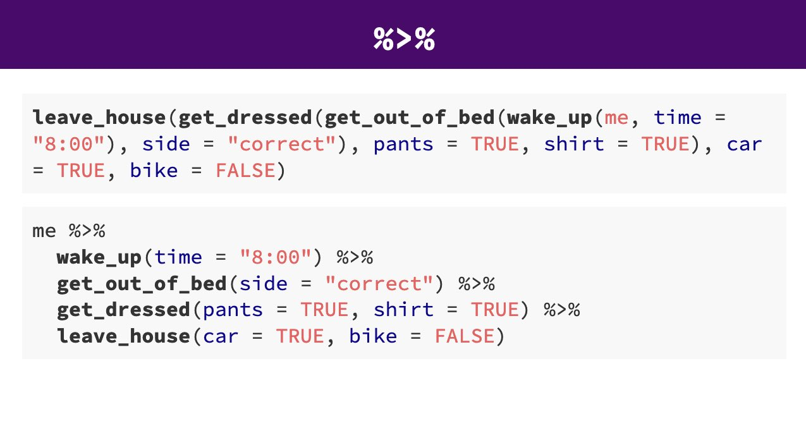

# Short Introduction to `R` and the `tidyverse` {#tidyverse-intro}

The previous two chapters have provided the theoretical and conceptual background we need for performing a statistical analysis. In this chapter we switch focus to the practical side and introduce the basics of the tool that we will use to perform a statistical analysis in practice, the statistical programming language [`R`](https://cran.r-project.org/).

As we have discussed in the previous chapters, the value of a scientific theory or hypotheses depends ultimately on the evidence that supports it. This evidence comes in the form of data. Thus, to be able to judge the strength of the evidence provided by the data, a central task in the research practice is to analyse and then interpret data. `R` is the tool that we will use for this task. It is one of the most comprehensive and popular tools for all aspects of data analysis.

## What is `R`?

`R` is a comprehensive tool that enables the skilled user to perform all steps or tasks of a data analysis with it. For example, with `R` we can:

-   Prepare data for analysis: read data that comes in pretty much any format, manipulate and wrangle data.
-   Explore data using summary statistics and graphical summaries: exploratory data analysis, descriptive statistics, and data visualisation
-   Perform statistical analysis of the data: inferential statistics
-   Communicate the results: publication-ready results graphics, [research reports that combine narrative text and statistical results](https://rmarkdown.rstudio.com/)
-   And much more such as: data simulations and advanced statistical methods, [machine learning](https://www.statlearning.com/), [interactive data visualisations](https://shiny.rstudio.com/), [websites](https://bookdown.org/yihui/blogdown/), [books](https://bookdown.org/home/) (such as the present one)

On top of this incredible list of things that can be done with `R`, `R` is *free software* (sometimes also known as *open source software*). This means, not only is `R` completely free to download, install, and use, you are also free to inspect its source code or make changes to it (as long as you do not make your version of `R` un-free).

Given the flexibility of all the things you can do with `R`, it is not completely surprising that it requires some effort to get started with `R`. Especially if `R` is your first real experience of learning a programming language.

The important thing to know for any new `R` user is that the beginning is hard for almost everyone (including the present author), but using `R` gets a lot easier and smoother after some time and effort dedicated to learning the basics. The most important message is to hang in there and keep on trying. In all likelihood, there will be at least some rather frustrating situations in your first weeks of interacting with `R`, but **it will get better**. I have taught `R` to many users with a great variety of backgrounds and experiences and many of them have struggled in some way in the beginning. But for anyone who kept up their hopes and continued to put in the time and effort, their struggles were not in vain. You can learn `R` if you just believe in yourself and do not give up. Be assured I believe in you. Learning `R` is such an incredibly powerful skill that will surely have a positive effect on whatever comes later in your life, be it a career in Academia (i.e., at a university) or in "the real world" (as we academics like to call everything that is not a university job).

## Getting Started with `R`

With this somewhat scary introduction out of the way, the next important question is probably how do you get going with `R`? Providing a comprehensive answer to this question is beyond the scope of the present work. Instead, we will point you to some freely available resources that we expect you to go through **before** continuing with the rest of the chapter so you get up to speed with `R` first. We begin with a list of minimum requirements you have to work through on your own before continuing. These will probably take some time, but must be done. After that, we provide links to some additional resources that you can also take a look at, either now or at a later time.

### Step 1: Installing `R` and `RStudio`

The basic `R` software that performs the calculations can be installed from [CRAN](https://cran.r-project.org/index.html), the Comprehensive R Archive Network. However, the basic `R` installation is quite bare bones, especially for people used to modern operating systems like Windows or macOS. Therefore, in addition to `R`, I also recommend you install [`RStudio`](https://www.rstudio.com/products/rstudio/). `RStudio` is the most popular IDE -- integrated development environment -- for `R`, and makes using it quite a bit more comfortable.

Note that both `R` and `RStudio` need to be updated independently of each other. Especially `R` should be updated at least once per year from [CRAN](https://cran.r-project.org/index.html). So, if you already have `R` installed on your computer and do not remember the last time you have updated, now is probably a good time to do so. I personally update `R` usually within a few weeks of a new version appearing.

If you need additional help installing `R` and `RStudio`, a good resource is the [RSetGo book](https://psyteachr.github.io/RSetGo/) (Ch. 1 and 2; from the University of Glasgow). Alternatively, Danielle Navarro has created a set of video tutorials on [installing `R`](https://www.youtube.com/playlist?list=PLRPB0ZzEYegOZivdelOuEn-R-XUN-DOjd). The link brings you to a Youtube playlist with specific videos for each major operating system.

### Step 2: Getting Comfortable with `R`

The next step is for you to get going and do your first steps in `R`. The best way to do so is to work through [Part 1, the "core toolkit"](https://psyr.djnavarro.net/index.html#core-toolkit), of [`R` for Psychological Science](https://psyr.djnavarro.net/index.html) also created by Danielle Navarro. Part 1 of this awesome online resource covers `R` installation, variables and data types, scripts, packages, and basic programming concepts, such as loops, branches, and functions. The minimum requirement you have to do before continuing are chapters [1](https://psyr.djnavarro.net/getting-started.html), [2](https://psyr.djnavarro.net/variables.html), [3](https://psyr.djnavarro.net/scripts.html), [4](https://psyr.djnavarro.net/packages.html), [5](https://psyr.djnavarro.net/workspaces.html), [6](https://psyr.djnavarro.net/vectors.html), and [11](https://psyr.djnavarro.net/file-system.html)). However, I highly encourage you to work through the whole of [Part 1](https://psyr.djnavarro.net/index.html#core-toolkit).

In addition to Part 1, I also recommend you go through at least the first few chapters of [Part 2, "working with data"](https://psyr.djnavarro.net/index.html#working-with-data), of [`R` for Psychological Science](https://psyr.djnavarro.net/index.html). It covers more complex data types, most importantly `R`'s central data type, the `data.frame`, and already provides an introduction to the `tidyverse`, which will also be used here. I recommend you at least go through [the prelude](https://psyr.djnavarro.net/prelude-to-data.html) and [data types](https://psyr.djnavarro.net/data-types.html) (pay special attention to data frames). The minimum requirement is the [`data.frame` chapter (Chapter 13)](https://psyr.djnavarro.net/data-types.html#132_Data_frames).

So, at the risk of repeating myself, please go through the resources listed above (i.e., [Part 1](https://psyr.djnavarro.net/index.html#core-toolkit) and [Part 2](https://psyr.djnavarro.net/index.html#working-with-data), of [`R` for Psychological Science](https://psyr.djnavarro.net/index.html)) before reading any further in this chapter. You have to work through at least the minimum requirements to understand what follows.

### Optional Step 3: File System

When working with `R` (or really any programming language) we generally work with files and folders. If you are not yet super comfortable with this, I recommend you also look through Danielle Navarro's videos on [project structure](https://www.youtube.com/playlist?list=PLRPB0ZzEYegPiBteC2dRn95TX9YefYFyy). They provide a great overview and introduction to a topic that is fundamental to working with computers beyond `R`: working with the file system. It covers naming files, file paths, folders, and related technical stuff that is very important when programming, but not often taught explicitly.

### Additional Optional Resources

The sections above list the minimum requirements that you should go through before continuing with this chapter. If these resources are not enough for you, this section provides an overview of additional free resources you can take a look now or later to get deeper into R (i.e., feel free to skip the following bullet points and continue below).

-   [Fundamentals of Quantitative Analysis](https://psyteachr.github.io/quant-fun-v3/) by is a book by James Bartlett and Wil Toivo. This book is aimed at a similar audience to the present book. However, it focuses on a few concepts that we do not use here (e.g., `RMarkdown`, accessing `R` that runs on a server). The book is part of the [psychTeachR](https://psyteachr.github.io/) book plus video series developed by the University of Glasgow that contains a few more interesting books such as [Data Skills: psyTeachR Books](https://psyteachr.github.io/data-skills-v3/) which is very introductory.

-   [Learning Statistics with `R`](https://learningstatisticswithr.com/), also by Danielle Navarro (as you can see, I am a big fan of Danielle's work). This is a completely free introductory book to statistics using `R`, which can be downloaded from its website (the [currently available version is 0.6](https://learningstatisticswithr.com/lsr-0.6.pdf)). Part II (Chapters 3 and 4) provides a gentle and comprehensive introduction to `R` for newcomers. From installing `R` and `RStudio`, navigating the console and `RStudio` windows, basic data types, reading in data and the file system, to the most important data types, `data.frames`, these roughly 70 pages (i.e., pp. 35 - 109) have you covered. Once you have had a look at these two chapters, Chapter 8 is a great next step as it introduces `R` scripts. If you are completely new to statistics, Chapter 5 also provides a great introduction to other important concepts. One downside of this resource is that it comes in the form of a PDF and not a website, so cannot be read comfortably on all devices (but is great for printing). Also note that [`R` for Psychological Science](https://psyr.djnavarro.net/index.html) is an updated version of this book, so I would probably start with that first. Finally, note that the present book has a somewhat different conceptual focus for introducing statistical tests and methods (i.e., especially compared to Part IV).

-   If you prefer an introduction that has a stronger programming focus, I recommend the free book [Hands-On Programming with `R`](https://rstudio-education.github.io/hopr/) by Garrett Grolemund. Chapters 1 to 5 (pp. 1 - 99) also provide an introduction that starts with installing `R` in a gentle manner and then introduces the necessary basic concepts including the different data types and `data.frame`s.

## `RStudio`

After you are comfortable with `R`, let us take a quick look at `RStudio` together. Figure \@ref(fig:rstudio1) shows the basic `RStudio` interface once an empty `R` script is opened. If it does not yet look like that to you, open an empty `R` script through "File" - "New File" - "R script".  

```{r rstudio1, fig.cap='Screenshot of `RStudio` window with empty `R` script and default layout. The script is shown top left, the `R` console bottom left, the Environment pane in the top right, and the Files and Plot viewer in the bottom right.', echo=FALSE}

```

This screenshot shows the four panes in their default location. The `R` script in the top left, the `R` console in the bottom left, the environment and history pane in the top right, and the files and plot pane in the bottom right.

An alternative to the default location is possible by switching the position of the console and environment pane. For this, click on the small button to the left of `Addins` just below the menu bar. The button looks a bit like a version of the windows logo. When clicking this button you can choose between the default "console on the left" and an alternative "console on the right". Especially if you work a lot with `R` scripts, which we will do, it makes sense to put the console on the right, as shown in the Figure \@ref(fig:rstudio2).

```{r rstudio2, fig.cap='Screenshot of `RStudio` window with empty `R` script and alternative layout. In this image, console and environment pane have switched their position which allows both `R` script and console to occupy a larger space.', echo=FALSE}
knitr::include_graphics("figures/rstudio-window2.png")
```

The benefit of using an `R` script is that you can come back to your code and change or rerun it. Even if you do not plan to save the `R` script, development is often easier in the script than directly in the console. Furthermore, one great thing about the `R` scripts and `RStudio` is that you can send commands from the `R` script directly to the `R` console  using a keyboard shortcut: `Ctrl` + `Enter` on Windows/Linux and `CMD` + `Enter` on Mac. From here on in, we will indicate these options like this: `Ctrl`/`CMD` + `Enter`. Try it out yourself by typing something in the R script window (e.g., `7 + 3`) and send it to the console using the shortcut. Let us now do some `R`.

## A Base `R` Example Session

As we have discussed in the previous chapter, the most important format of data representation is a tabular format with each column representing a single variable and typically one row per observation. Such data is represented in base `R` in a `data.frame`, the most important data format for our needs. We use the term "base `R`" here to refer to using `R` without any additional packages. Let's quickly recap what a `data.frame` in base `R` looks like, and do some basic operations with it. This will also set the stage for using `R` scripts.

### Data Files, Scripts, and Working Directory {#files}

In this chapter, we are mainly working with the data from @walasekHowMakeLoss2015,  as introduced in detail in Section \@ref(alternative-explanation-loss-aversion-or-loss-seeking). The data consists of two data files, each representing a separate experiment, but which we have discussed together so far, as they are exact replications of one another. In @walasekHowMakeLoss2015 these are reported as Experiments 1a and 1b. The original data files sent to me by Lukasz Walasek were Excel files (which can be found here: [Experiment 1a](https://github.com/singmann/stats_for_experiments/raw/master/data/ws2015_exp1a.xlsx) and [Experiment 1b](https://github.com/singmann/stats_for_experiments/raw/master/data/ws2015_exp1b.xlsx)).

As base `R` does not allow to read in Excel files, I have opened the original data files of @walasekHowMakeLoss2015 in Excel and saved them as `.csv` files (comma separated value files) which can be downloaded from here: [Experiment 1a](https://github.com/singmann/stats_for_experiments/raw/master/data/ws2015_exp1a.csv) and [Experiment 1b](https://github.com/singmann/stats_for_experiments/raw/master/data/ws2015_exp1b.csv). I recommend you download these files and save them in some folder so you can access them from within `R`. If you have problem downloading these files, try clicking on the links with the right mouse button (on Windows/Linux) or CMD + click (on Mac OS) and select "Save link as..." (or something similar to that) in the menu that appears. Note that if you click on `.csv` files on your computer, they will open in Excel (or an equivalent program), in case you wanted to have a look at them outside `R`.

In particular, I recommend the following steps so you can follow along with the upcoming `R` code:

-   Save the downloaded data files in a folder named `data` that is in your current `R` working directory.
-   Create a new empty [`R` script](https://psyr.djnavarro.net/scripts.html) and save it in the working directory.
-   For example, say you already have created a folder for this book/class, let's assume this folder is called `stats_r_intro-stuff` and in some easy to find location (e.g., depending on your operating system the `My Documents` folder or your home folder `~`). Let's assume you want this folder to be your [working directory](https://psyr.djnavarro.net/file-system.html#112_Working_directory). Then, you create a new folder in this folder, called `data` (i.e., `stats_r_intro-stuff/data`), and download the two data files ([Experiment 1a](https://github.com/singmann/stats_for_experiments/raw/master/data/ws2015_exp1a.csv) and [Experiment 1b](https://github.com/singmann/stats_for_experiments/raw/master/data/ws2015_exp1b.csv)) into this folder. Next you create an empty `R` script in this folder for this chapter, say `tidyverse-intro.R` (i.e., it is now `stats_r_intro-stuff/tidyverse-intro.R`).
-   You can now easily set your current `R` session to this folder as your working directory by opening `tidyverse-intro.R` in `RStudio` (if it is not yet opened) and the using the menu: `Session` - `Set Working Directory` - `To Source File Location`. This sets your working directory to the folder (i.e., location) in which the currently active `R` script is located, which should be your `stats_r_intro-stuff` folder. Note that if RStudio is not open, if you double-click on an R script file, `RStusio` will open and use the folder where your R script file is as the working directory (this only works if `RStudio` is not already running).
-   Note, if you have been using the current `R` session already for some time, now is a good time to restart the session (not necessarily `RStudio`) by using the menu again: `Session` - `Restart R`.

The workflow laid out in the previous bullet points represents my general recommendation for working with `R` at this stage. Have a folder that is your designated project folder. In this folder you have your `R` scripts as well as a sub folder for the data. Then you can open a script in `RStudio` and set the folder to be your working directory through the menu (i.e., `Session` - `Set Working Directory` - `To Source File Location`). You can then access the data files simply by accessing `data/my-data.file.csv`. Importantly, don't forget to restart the `R` session before starting something new through the menu: `Session` - `Restart R`. You do not have to follow these steps if you find a different workflow that works better for you. The important thing is that you know what your working directory is and where your files are.

### Read Data and Inspecting it

With this set-up steps out of the way, we can now load in the data from Experiment 1a using base `R`'s `read.csv()` function:

```{r}
df1a <- read.csv("data/ws2015_exp1a.csv")
```

This should read in the data file without any warnings or problems.[^tidyverse-intro-1] If for some reason you fail to download the file or fail to set the correct working directory, you can also try to read it directly from the internet as in the following code. But please only do that after you have tried downloading and dealing with the actual file. Handling data files and working with directories is an important `R` skill you need to acquire.

[^tidyverse-intro-1]: It can happen that when converting Excel files to `csv` files in Excel that Excel saves them using a non-standard encoding. This will be indicated by  the first column name being preceded by some additional characters. For example, here the first column would be `ï..subno` instead of `subno`. In this case, changing the file encoding in the `read.csv` command might help. For example: `df1a <- read.csv("data/ws2015_exp1a.csv", fileEncoding = "UTF-8-BOM")`.

    Another potential problem can result from the fact that the actual format in which `csv` files will be saved by Excel depends on your [locale](https://en.wikipedia.org/wiki/Locale_(computer_software)) (i.e., the language setting of your operating system). For languages that use the comma as decimal separator (such as German or Polish), Excel will save `csv` files with a semicolon and not a comma as field separator. In this case, instead of using `read.csv()` (or `read_csv()`, which will be introduced below) you need to use `read.csv2()` (or `read_csv2()`). One way to figure out which field and decimal separator a file uses is to open it in a text editor such as [Notepad ++](https://notepad-plus-plus.org/) on Windows or [UltraEdit](https://www.ultraedit.com/products/mac-text-editor/) for Mac. Note that `csv` files are just plain text files, appropriate for such editors.

```{r, eval=FALSE}
df1a <- read.csv("https://github.com/singmann/stats_for_experiments/raw/master/data/ws2015_exp1a.csv")
```

The first thing we usually want to do with a `data.frame` is to inspect its structure using the `str()` function, which lists all the variables, their data types, and the number of observations and variables.

```{r}
str(df1a)
```

In the present case we have over 20 thousand observations on six variables. Most of the variables are `int` which means *integer*; that is, a numeric variable consisting solely of whole numbers (i.e., discrete values). We also have one `num` -- that is, numeric -- variable (i.e., numeric variable with decimal values), `condition`. In general, `int` and `num` variables are treated in the same way, as numeric variables, so there is hardly ever a reason to transform one into the other. Finally, `condition` is a `chr` or character variable.

### Transforming Categorical Variables into Factors

As discussed in Section \@ref(data-types), some of the numeric variables as well as `condition` are actually categorical variables, or `factor`s in `R` parlance. We can transform variables into `factor`s using the aptly named `factor()` function. We generally use `factor()` instead of other functions (e.g., function `as.factor()`) because it allows us to specify the ordering of the factor levels and potentially other labels for the factor levels. Let us do so for three variables now, `subno`, `response`, and `condition`. For this we use the `$` operator to access variables of a `data.frame`. After transforming the variables we take another look at the structure of the `data.frame` using `str()`.

```{r}
df1a$subno <- factor(df1a$subno)
df1a$response <- factor(df1a$response, levels = c("reject", "accept"))
df1a$condition <- factor(
  df1a$condition, 
  levels = c(40.2, 20.2, 40.4, 20.4), 
  labels = c("-$20/+$40", "-$20/+$20", "-$40/+$40", "-$40/+$20")
)
str(df1a)
```

We see that after running these commands, we have as expected three `factor`s in the data. Let us take a look at each of these calls to `factor()` to understand why we call it in a different manner in each case.

-   The call for `subno` only passes the variable (i.e., the `df1a$subno` vector) and no further arguments to `factor()`. As a consequence, the factor levels are ordered in an alpha-numerical increasing manner.

-   The call for `response` specifies the ordering of the factor levels using the `levels` argument to which we have passed a vector of the levels, `c("reject", "accept")` (i.e., remember, `c()` is the function for creating vectors of any kind, such as character vectors here). The reason we do this is that otherwise the factor levels would be alphabetically ordered and then `accept` would be the first level and `reject` the second level (as "a" comes before "r" in the alphabet). This would be inconsistent with `resp`, where 0 = reject and 1 = accept.

-   The call for `condition` specifies both the levels through `levels` as well as new names for the factor levels using `labels`. The labels use the ordering  we have used throughout the book (i.e., potential loss first, potential gain second) and which differs from the ordering of the original `condition` (i.e., it switches the ordering to the format we are used to now). For both arguments a vector is passed, with elements mapped by position (i.e., the new label for the first level, `40.2`, is the first label, `-$20/+$40`). We again specify the ordering of factor levels here through `levels` to maintain the ordering we have used throughout, with the condition that typically shows loss aversion, -\$20/+\$40 as first condition. If we had not done so, the first level would have been the -\$20/+\$20 condition (as `20.2` was the smallest number in the original vector).

An interesting part of the three calls to the `factor()` function is that if you run it again, after you have already run it, it will "break" the `condition` variable. If you try it out, you will see that all values of the `condition` variable change to `NA` if you run this call a second time. The reason for this is that the values passed through the `levels` argument need to be present in the variable. However, because we have replaced the original values with new labels, none of the original levels (i.e., `c(40.2, 20.2, 40.4, 20.4)`) is part of the variable any more. Consequently, all values are replaced by `NA` (i.e., "not available" which means missing data). To get the values back you need to reload the data using the `read.csv()` command from above and then you can run the `factor()` call again with the data in the same state  it was when you ran it for the first time.

What this shows is that you cannot assume that running a piece of code twice gives the same output in all cases. The problem here is that the code changes the data itself (e.g., the values of `condition`). However, the code also assumes certain values for `condition`. Because this assumption only holds the first time you run the code, but not the second time, the second call breaks the results in somewhat unexpected ways. What this means is that randomly re-running code can lead to unexpected results (which are called "bugs" in programming language parlance). Therefore, instead of re-running individually pieces of code, it can often help to re-start at the top of a script and re-run everything in order to ensure all data is in the state you think it is (ideally after restarting the `R` session through `Session` - `Restart R`).

One more tip when transforming variables into factors. It is often a bit annoying to type out the factor levels by hand, especially when it is more than, say, two. In this case, a handy trick to know is that you can get `R` to produce the `c()` call having all factor levels. You just need to make sure you are using the correct ordering. The heart of the trick is the `dput()` function which creates a text representation of an `R` output that can be copied from the console to your script. To use this for factors the basic structure of the call is `dput(unique(df$variable))` which returns the `c()` call for all unique elements of a variable. If you want the elements ordered you can use `dput(sort(unique(df$variable)))`. For example, to create the `levels` argument for the `condition` variable I initially executed `dput(sort(unique(df1a$condition)))` at the console which returns `c(20.2, 20.4, 40.2, 40.4)` for the original `df1a` data (i.e., before turning everything into `factor`s). I then just copied and pasted a bit in this vector to get the ordering right (admittedly, typing might have been faster than copying and pasting, but whatever).

Another thing we often want to do when reading in the data is getting an overview of what it actually looks like. One way to do this that I do *not* recommend for `data.frame`s is just typing the name of the variable into the console (or calling just the name from the script). When you do this, the object is printed in the console window, which, for large `data.frame`s, leads to hundreds or thousands of rows being printed until some printing limit is reached. An alternative is to just look at the first few rows using the `head()` function (which prints the first 6 rows per default):

```{r}
head(df1a)
```

Alternatively, you can click on an object in the `RStudio` "Environment" pane (see Figures \@ref(fig:rstudio1) and \@ref(fig:rstudio2)) which opens the data in a viewer pane. The equivalent `R` call is using `View(df1a)` which opens the same viewer. However, `View()` should only be used interactively at the console and not be in an `R` script as it requires user interaction beyond [script](https://psyr.djnavarro.net/scripts.html) and console. In other words, `View()` is useful during development to get an overview of the data, but not for the final analysis script.

## The `tidyverse`

A popular extension to base `R` is the `tidyverse` [@tidyverse2019], a selection of [packages](https://psyr.djnavarro.net/packages.html) curated and in large parts developed by the [`RStudio` company](https://www.rstudio.com/about/). The mastermind behind the `tidyverse` is Hadley Wickham, the `RStudio` chief scientist and maybe the one person that can be considered an `R` superstar.[^tidyverse-intro-2] Most of the core `tidyverse` packages that will be introduced below, such as `dplyr` and `ggplot2`, are his developments (even though many others have contributed to those packages as well).

[^tidyverse-intro-2]: There are other individuals that are instrumental to the existence of `R` that also deserve a similar stardom. For example, without the tireless work maintaining CRAN by Brian Ripley, Kurt Hornik, and Uwe Ligges, `R` would be in a very different shape. Likewise, John Chambers, the inventor of the language `S`, which is the predecessor of `R`, also deserves some significant credit.

As a reminder, [packages](https://psyr.djnavarro.net/packages.html) are a collection of functions and other `R` objects (e.g., data) that provide additional functionality on top of base `R`. To be able to use a package, it needs to be installed from `CRAN` once before it can be loaded in your `R` session. The easiest way to install a package is using `install.packages()`.  Note that it is a good idea to only run `install.packages()` at the console and not to put it into your `R` script. The reason for this is that you only want to execute `install.packages()` once per `R` installation or after updating `R` and not every time you run a script.


Therefore, we begin by installing the `tidyverse` package from `CRAN` using `install.packages()`. This will automatically install all the individual packages discussed below.  As a reminder, this only needs to be done once and not everytime you run a script.

```{r, eval=FALSE}
install.packages("tidyverse")
```

Then, you can load all `tidyverse` packages at once using the `library()` function. Loading the  `tidyverse` package this way is something we will do at the top of pretty much all scripts we will be creating.

```{r}
library("tidyverse")
```

When loading packages it is common that this produces some status or other messages in the console (some packages do, some don't). For example, `tidyverse` lists the package versions of the loaded (or "attached") packages and lists function conflicts; that is, cases in which a `tidyverse` function masks a previous loaded function with the same name. We include these messages here to show that this is normal and nothing to worry about, but will generally not later in the book, as this would get repetitive. However, note that the exact version numbers of the packages that are shown here may differ from the version numbers you see, simply because some packages might be updated after this book was written.

The core `tidyverse` packages are (with descriptions taken or adapted from the official websites):

-   [`tibble`](https://tibble.tidyverse.org/): A modern version of the `data.frame`

-   [`readr`](https://readr.tidyverse.org/): For reading in data the `RStudio` way.

-   Data wrangling with [`magrittr`](https://magrittr.tidyverse.org/), [`tidyr`](https://tidyr.tidyverse.org/), and [`dplyr`](https://dplyr.tidyverse.org/): A coherent set of functions for tidying, transforming, and working with rectangular (i.e., tabular) data. Supersedes many base `R` functions and makes common data manipulations very easy.

-   [`ggplot2`](https://ggplot2.tidyverse.org/): A system for data visualization, in other words, making graphs. This will be discussed in the next chapter.

-   [`purr`](https://purrr.tidyverse.org/) and [`broom`](https://broom.tidymodels.org/): Advanced modelling with the `tidyverse` and [`tidymodels`](https://broom.tidymodels.org/) which will not be discussed here.

In the following we provide a short introduction to the core components of the `tidyverse` as they are needed for this book. A more comprehensive introduction is provided in the Wickham and Grolemund book "R for Data Science" which is available freely at <http://r4ds.had.co.nz>. To get a good grip on the `tidyverse`, I highly recommend working through chapters 1 to 21, or better still, to chapter 25 (the chapters in "R for Data Science" are a lot shorter than the chapters in the present book).

### `tibble` and `readr`

The back bone of the `tidyverse` is the [`tibble`](https://tibble.tidyverse.org/), or `tbl_df` (it's `class` name in `R`), "a modern reimagining of the `data.frame`, keeping what time has proven to be effective, and throwing out what is not" (quote from [`tibble` documentation](https://tibble.tidyverse.org/)). The main difference between a `data.frame` and `tibble` in daily use is that `tibble`s do not try to print all rows and columns and thus do not overwhelm the console when just entering the name of the data at the console. This feature alone is enough for me to prefer `tibble`s over `data.frame`s. When working on an analysis, one often wants to have a quick look at the data to see what has happened and the easiest way to do that is often to just enter the name of the data into the console. 

To convert a `data.frame` into a `tibble` you can use the `as_tibble()` function. Let's do this for our existing `data.frame` of @walasekHowMakeLoss2015, `df1a`.

```{r}
tbl1a <- as_tibble(df1a)
tbl1a
```

In the output of the `tibble`, we can see two things. First, the output only shows the first 6 rows. Compare this to what happens when typing `df1a` in the console which will print many more rows (so you cannot see the column names anymore). Second, the data type of each column is shown below the column names. This is another feature that makes `tibble`s more convenient in everyday use. We directly see that for example `subno` is a `factor` (`<fct>`) as it should be.

An alternative way to create a `tibble` instead of a standard `data.frame` is by loading the data using the `tidyverse` specific read functions which are in the [`readr`](https://readr.tidyverse.org/) package. Remember that above we used the base `R` read function `read.csv()`, which is one of a handful of base `R` data read functions such as `read.table()` (for reading data separated by spaces) and `read.delim()` (for reading tab separated data). `readr` offers a similar set of functions where the main differences are that instead of using a `.` in the function name they use an `_` and instead of a `data.frame` they return a `tibble`. So in case you have a `csv` file, you could use `read_csv()` instead of `read.csv()`. Note that in this and in the following code chunks, we are going to overwrite the existing `tbl1a` object to not clutter the work space.

```{r}
tbl1a <- read_csv("data/ws2015_exp1a.csv")
tbl1a
```

What we can see from the output is that `read_csv()` not only returns the `tibble`, but also a message showing the column specification (i.e., data type for each column). We could use this to change the column type when reading in the data, but I usually do not find this necessary. In most cases it is sufficient to change the data type once the data is read in, as shown below.

As the status message also shows, you can stop this message from appearing by specifying an additional argument to the `read_csv()` call, `show_col_types = FALSE`. I don't think this is necessary. However, the following shows that it works as expected.

```{r}
tbl1a <- read_csv("data/ws2015_exp1a.csv", show_col_types = FALSE)
tbl1a
```

Another feature of `readr` compared to the corresponding base `R` functions is that it is a bit more restrictive in some cases. That is, in case the data is not as expected by a particular read function, `readr` fails more often than base `R`. Whereas this can appear annoying while programming, it has the benefit that one learns of problems in the data early compared to late. In other words, `readr` functions are more likely than base `R` functions to ensure the data looks like you expect it to. And if your data is more likely to look like you expect it to, your code will be less likely to produce incorrect results.

Therefore, in addition to using `read_csv()` instead of `read.csv()`, it is often better to use `read_table()` instead of `read.table()` for space separated data (or `read_table2()` if the data format is a bit sloppy), `read_tsv()` instead of `read.delim()` for tab separated data, or `read_delim()` if you want to specify the data delimiter.

### The Pipe: `%>%`

One of the coolest, and at the time novel (for `R`), features of the `tidyverse` is the pipe, which is the name of the `%>%` operator.[^tidyverse-intro-3] To understand what it does and why it is so great, it makes sense to begin by taking a step back and thinking a bit about functions and evaluation order in `R`.

[^tidyverse-intro-3]: The pipe operator, `%>%`, is part of the `magrittr` package which pre-dates the `tidyverse` and was not initially written by Hadley Wickham, but by Stefan Milton Bache. The name of the package is a pun on the famous painting ["The Treachery of Images"](https://en.wikipedia.org/wiki/The_Treachery_of_Images) by Belgian surrealist painter René Magritte. However, because loading the `tidyverse` also loads the pipe (through the `dplyr` package), we do not need to load `magrittr` directly.

One of the most important features of `R` is that we can take the result (or output) from one operation and use it as the input of another operation. For example, remember that the `loss` column in the data of @walasekHowMakeLoss2015 shows the potential loss for each of the lotteries, ranging from \$6 to \$40. Now imagine that we want to know the midpoint between the minimum and maximum loss (which is \$23 in the present case). One way to calculate those is by taking the mean of the minimum and maximum. To get this in `R` we would need to do two steps: get the minimum and maximum potential loss from the vector of losses and then take the mean of the minimum and maximum. We can get the minimum and maximum of a vector using the `range()` function and the mean is obtained using the `mean()` function. So to do so in `R` for our vector of all potential losses, `tbl1a$loss`, we could do:

```{r}
# step 1: get minimum and maximum and save in temporary variables
tmp <- range(tbl1a$loss)
tmp # print minimum and maximum, to check everything is okay
#step 2: calculate mean of minimum and maximum:
mean(tmp)
```

This code above does this two-step calculation explicitly and saves the results of the first step in a temporary variable we have called `tmp`. We could also combine both steps into one by passing the results of the first step to the `mean()` function:

```{r}
mean(range(tbl1a$loss))
```

We first get the minimum and maximum (i.e., the range) and then pass this to the `mean()` function. As the mean function is the last operation we want, it is the outermost call in this line of code. In other words, in `R` code that does not use the pipe, code is executed from the inside to the outside. This can make it difficult to chain many operations after each other without the need to create temporary variables as we did first.

In contrast to executing code from innermost to outermost, the pipe allows us to chain operations from left to right. We can start with the innermost call and pipe it to the next function using `%>%`. For example, using the pipe we could do the following:

```{r}
tbl1a$loss %>% 
  range() %>% 
  mean()
```

This shows a typical pipe workflow. We start with our data, in the present case the `tbl1a$loss` vector. This data is piped to the first operation, the `range()` function. The output of this call is piped to the next operation, the `mean()` function. At the end, we get exactly the output we should get but with code that is easier to read. One feature of the pipe that makes the code particularly readable is that we can start a new line for each step in a chain.

The pipe also works like any regular `R` operation, so we can easily save the result from the whole chain of operation in a new object for later use. For example:

```{r}
loss_midpoint <- tbl1a$loss %>%
  range() %>% 
  mean()
loss_midpoint
```

To sum this up again, in base `R` the order of operations is from the innermost to the outermost. With the pipe, in contrast,  we can chain (or pipe) operations from left to right. The following image exemplifies this using a [screenshot of a slide from Andrew Heiss](https://evalsp21.classes.andrewheiss.com/projects/01_lab/slides/01_lab.html#116). In the top part we see the operations `me` needs to execute in order to leave the house using base `R` (i.e., starting with the innermost `wakeup()` function). The coding style without the pipe makes it difficult to see what happens when, and is generally difficult to read, not least because it is hard to see which function arguments (like pants=TRUE) go with which function (like get_dressed). The lower part shows the same operations using the pipe. We can see how much easier it is to see the logic from waking up, getting out of bed, and so forth, not to mention which arguments go with which function.

```{r pipe-screenshot, fig.cap='Comparison of execution order without pipe (upper part) or with pipe (lower part). From: https://evalsp21.classes.andrewheiss.com/projects/01_lab/slides/01_lab.html#116', echo=FALSE}

```

In the following sections we will see how powerful piping can be. We can do quite a lot of neat things relatively easily, especially when the pipe is combined with the `dplyr` functions that will be introduced next.

Let us end this section with two more points that are important. First, typing the pipe (i.e., typing the characters `%>%`) is annoying. If you are in `RStudio`, there is an alternative, in the form of  a keyboard shortcut: `Ctrl`/`Cmd` + `Shift` + `M`. I highly recommend you get used to using this shortcut. It is one of the few shortcuts in `RStudio` I use regularly.[^tidyverse-intro-4]

[^tidyverse-intro-4]: The most important shortcut in `RStudio` for me is `Alt` + `-` which adds the assignment operator `<-` plus enclosing spaces. using this saves 3 key presses!

Second, base `R` now has its own pipe, `|>`. It works very similarly to the `tidyverse` pipe (and  can in many situations be used instead of the `tidyverse` pipe) and can be used without loading any packages. I am not using it here for the only reason that I have adapted the `tidyverse` pipe before there was a base `R` pipe and there does not seem to be many reasons to prefer one over the other if the `tiydverse` is already loaded. So if you see `|>` instead of `%>%` somewhere, assume it does pretty much the exact same thing.

### `dplyr`

Whereas the back bone of the `tidyverse` are the `tibble` and the pipe, the package that most significantly improves one's workflow is [`dplyr`](https://dplyr.tidyverse.org/) (pronounced *dee-plier*, like the tool). There are five core functions of `dplyr` which, together,  provide the most common data manipulation operations. Or to quote the [official documentation](): "`dplyr` is a grammar of data manipulation, providing a consistent set of verbs that help you solve the most common data manipulation challenges." These five verbs/functions are:

-   `mutate()` adds new variables or changes variables as a function of existing variables
-   `select()` picks variables based on their names
-   `filter()` picks cases based on their values
-   `summarise()` reduces multiple values down to a summary
-   `arrange()` changes the ordering of the rows

A great introduction and overview of the functionality of these functions is provided on the official [getting started](https://dplyr.tidyverse.org/articles/dplyr.html) page, but we will do so here as well, if only somewhat briefly.


One important point is that all `dplyr` functions work with what is called *non-standard evaluation*. This means we can refer to variable names of the `data.frame`/`tibble` we are working with in any of the `dplyr` functions without enclosing them in quotes. If this sounds a bit mysterious to you, remember that the only thing we can usually refer to without quotes are `R` objects that exist in the workspace (i.e., objects listed in the environment pane in `RStudio`). As variables in `tibble`s/`data.frame`s are no objects itself, but only exist in the context of the  `data.frame`/`tibble`, many of the functions we will get to know in later packages require their names to be enclosed in quotes. However, this is generally not the case for `tidyverse` functions saving a few keystrokes.

Finally, all `dplyr` functions work with the pipe, so can be chained.

#### `mutate()`

As an example, here is how you can use `mutate()` and the pipe to convert some variables in a data set to factors, as we did above in base `R`. We start again by reading the data in. We then pipe this data to the `mutate()` function to convert three variables to factors as done above, and save it again in the same object, `tbl1a`. We then get an overview of the object.

```{r, message=FALSE}
tbl1a <- read_csv("data/ws2015_exp1a.csv")
tbl1a <- tbl1a %>% 
  mutate(
    subno = factor(subno),
    response = factor(response, levels = c("reject", "accept")),
    condition = factor(
      condition, 
      levels = c(40.2, 20.2, 40.4, 20.4), 
      labels = c("-$20/+$40", "-$20/+$20", "-$40/+$40", "-$40/+$20")
    )
  )
tbl1a
 
```

You can see a number of changes here as compared to the base `R` code:

-   The block of code in which variables are converted to factors is wrapped into the `mutate()` call to which we have piped the data, `tbl1a`.
-   For each operation that converts one variable to a factor, we use the `=` sign and not the assignment operator `<-`, because all the operations are performed within the `mutate()` function. We generally only use the assignment operator `<-` outside of function calls (if you try it out and replace the `=` with `<-` you will see what horrible consequences this has).
-   The first two calls for changing a variable finish with a `,`, again because we are inside one `mutate()` call. The `,`  tells `mutate()` we are not yet done specifying a set of operations.
-   Instead of passing the full vector to `factor()` (as we did above using `df1a$subno`), we can refer to each variable, such as `subno`, by name (and without quotes) directly (this is what is meant by non-standard evaluation). Again, this arises from the fact that we are working within the context of the data set that we originally piped to the `mutate()` call.

#### `summarise()`

The second most important function from `dplyr` is `summarise()` which as the name suggests, creates summaries. This means that we are reducing the number of rows in a data set to one row (or one row per grouping variable, as explained below). For example, we could use `summarise()` to get the average probability with which lotteries were accepted across all conditions and lotteries. For this, we just need to take the overall mean of the `resp` variable.

```{r}
tbl1a %>% 
  summarise(mean_acc = mean(resp))
```

We see that `summarise()` also returns a `tibble`, so the values returned differ quite a bit from what one would get in base `R` (using `mean(tbl1a$resp)`). We can also see that `summarise()` works structurally quite similarly to `mutate()`. In the `summarise()` call, we can create new variables using a `name = operation` syntax. We can also create multiple summary statistics by separating them using `,`. We can also add comments to the code as usual using `#`, as long as it is to the right side of the `,`.

```{r}
tbl1a %>% 
  summarise(
    mean_acc = mean(resp),
    sd_acc = sd(resp),  ## sd() returns the standard deviation
    mean_pot_loss = mean(loss),
    mean_pot_gain = mean(gain)
  )
```

#### `filter()`, `select()`, and `arrange()`

As we have discussed above, one of the key ways of using the `tidyverse` is by chaining different operations together. For example, we could first create a data set of observations from the `"-$20/+$40"` condition only, and then calculate summaries for this condition alone. For this, we pipe first to the `filter()` function, and then pipe the results to `summarise()`:

```{r}
tbl1a %>%
  filter(condition == "-$20/+$40") %>% 
  summarise(
    mean_acc = mean(resp),
    sd_acc = sd(resp),
    mean_pot_loss = mean(loss),
    mean_pot_gain = mean(gain)
  )
```

Note that `filter()` requires the use of the `==` operator and not the `=` operator. The reason is that you do not want to set a variable equal to something, which is done using `=`, but want to check for equality, which is done using `==`. `filter()` also allows you to chain multiple comparisons together, either by separating them using `,` or `&` (i.e., logical *and*). If only one of multiple conditions needs to hold, you can use `|` (logical *or*).

`filter()` is also the function for removing observations. This is done by writing a filter that retains all observations except for the ones you want to remove. For this you can also use the logical *not* operator, `!` which inverts a logical vector, or the unequal operator, `!=`.

For example, you'll recall that,  with relation to the study of @walasekHowMakeLoss2015, what we are actually interested in are the responses to the symmetric lotteries (when the potential loss is equal to the potential gain). We could select those with `filter()`:

```{r}
symm1 <- tbl1a %>%
  filter(loss == gain)
symm1
```

Or equivalently:

```{r}
symm2 <- tbl1a %>%
  filter(!(loss != gain))
all.equal(symm1, symm2)
```

Here, we use the `all.equal()` function to show that the two objects are the same. This function can compare arbitrary `R` objects and only returns `TRUE` if two objects are identical.

One problem with the `filter()` command used above is that it selects all symmetric lotteries and not only the symmetric lotteries that appear in all conditions. In other words, it also selects some symmetric lotteries that only appear in a subset of the conditions. As our goal is to compare performance across conditions -- for this to be a fair comparison it needs to be done on only the lotteries that are shared across all conditions -- this `filter()` call is therefore not the correct one.  The following code, which shows all symmetric lotteries for each condition, demonstrates this.

```{r}
tbl1a %>%
  filter(loss == gain) %>% 
  select(loss, gain, condition) %>% 
  unique() %>% 
  arrange(condition) %>% 
  print(n = Inf)
```

In particular, the output shows that in the asymmetric conditions, -\$20/+\$40 and -\$40/+\$20, we only have three symmetric lotteries, whereas in the two symmetric conditions we have quite a lot more. However, the three symmetric lotteries that appear in the asymmetric conditions, 12-12, 16-16, and 20-20, appear in all conditions.

Before focussing on how we can build a better filter, let's first examine in detail how the code above works. We first filter to obtain all symmetric lotteries. From this data set, we then retain or `select()` only the `loss`, `gain`, and `condition` columns. We then use the `unique()` function to only retain the unique rows. Because we have a specific ordering in which we think about the conditions (which is expressed in the order of the factor levels) we then sort the `tibble` along the `condition` variable using `arrange()`. Finally, because a `tibble` only prints a few rows by default, we use `print(n = Inf)` which prints all rows (i.e., up to row infinity). 

To better understand the code, you are encouraged to run it line by line to see what the output at each intermediate step is. The easiest way to do so is by selecting parts of it in the `R` script window and then sending it to the console using the shortcut (i.e., `Ctrl`/`CMD` + `Enter`). Note that when selecting only a subset of lines in this code, do not select the `%>%` at the end of the last line before sending it to the console. Otherwise `R` will think you are [not yet finished](https://psyr.djnavarro.net/getting-started.html#123_R_knows_you%E2%80%99re_not_finished). In general, it's a good idea to step line-by-line through much of the code we present here, and at your own speed, in order to fully understand its operation.

Now that we know which symmetric lotteries there are, how can we select only the symmetric lotteries that appear in all conditions? There clearly are multiple different filters that would do this. The one that first comes to my mind is to combine the filter that selects all symmetric lotteries with a filter that only selects lotteries in which the potential loss is either 12, 16, or 20. For the latter, we introduce a new operator, the `%in%` operator. It returns `TRUE` for any element of a vector that matches an element *in* another vector. For example in our case, we want to retain all those lotteries where the potential loss is *in* `c(12, 16, 20)`. This is shown below. We also include the code that shows we now have the same set of symmetric lotteries in all conditions.

```{r}
tbl1a %>%
  filter(loss == gain, loss %in% c(12, 16, 20)) %>% 
  select(loss, gain, condition) %>% 
  unique() %>% 
  arrange(condition) 
```

#### `group_by()` {#group-by}

You might remember that the main hypothesis of @walasekHowMakeLoss2015 was that it is not the absolute value of a lottery, but its relative rank, that matters for whether or not participants think a lottery is attractive. The main evidence for this hypothesis was that the proportion with which the symmetric lotteries are accepted differs across the four conditions. How canwe calculate this with the `tiydverse`?

Only applying what we know so far, we would split the data into four subsets using `filter()`, and then apply `summarise()` to each of these subsets. Let's show how this would work by only splitting the data into two subsets, one for the "-\$20/+\$40" condition that shows loss aversion and one for the "-\$40/+\$20" condition that shows loss seeking. We need to combine this filter with the filter selecting only the symmetric lotteries. To make the logic easier, we separate these two steps into separate `filter()` calls (but could also combine them into one).

```{r}
## "loss aversion" condition:
tbl1a %>%
  filter(loss == gain, loss %in% c(12, 16, 20)) %>% 
  filter(condition == "-$20/+$40") %>% 
  summarise(mean_acc = mean(resp))

## "loss seeking" condition:
tbl1a %>%
  filter(loss == gain, loss %in% c(12, 16, 20)) %>% 
  filter(condition == "-$40/+$20") %>% 
  summarise(mean_acc = mean(resp))
```

The results show the previously discussed pattern. Participants in the -\$20/+\$40 condition are around 50 percentage points less likely to accept the symmetric lotteries than participants in the -\$40/+\$20 condition. Whereas this analysis clearly does what we want it to do, the code is a bit verbose and clunky. For example, the first `filter()` call and the `summarise()` call are identical in both parts. So the question is: Is there not a better way to get these results?

This is, of course, a rhetorical question and the answer is yes, there is a better way. The answer is the `group_by()` function, the function that gives `dplyr` its full power. To use `group_by()`, you need to pass it one or multiple (categorical) grouping variables. `group_by()` then creates a grouped `tibble` with the consequence that if any of the further `dplyr` verbs are applied to this grouped `tibble`, they are applied to each group separately. Let's show it for our example to see what this means in practice:

```{r}
tbl1a %>%
  filter(loss == gain, loss %in% c(12, 16, 20)) %>% 
  group_by(condition) %>% 
  summarise(mean_acc = mean(resp))
```

We can see that the output now contains the average proportion of accepting the symmetric lotteries for each of the four conditions separately. So instead of first splitting the data and then calculating the summary statistics (here, the mean of the `resp` column) for each split separately, `group_by()` does exactly this internally.

In other words, whenever we have a categorical variable in our data, we can use `group_by()` to perform operations separately across the levels of the categorical variable. Given the ubiquity of categorical variables -- for example, every experiment has at least one experimental factor -- this is a huge time and effort saver.

And whereas here we have shown the use of `group_by()` for `summarise()` (which is probably the most common use), `group_by()` also works for the other `dplyr` verbs for which the results can depend on other rows, `mutate()` and `arrange()`.

In the example above, we have only passed one variable (`condition`) to `group_by()`. But we can also pass multiple variables. This will perform the operations conditional on the combination of both variables. For example, here we have selected the three symmetric lotteries that are the same across conditions. With `group_by()`, it is easy to get the average proportion of acceptances separately for each lottery and condition. As this returns a `tiible` with more rows as shown by default, we again use `print(n = Inf)` as the last command in the pipe chain to show all rows.

```{r}
tbl1a %>%
  filter(loss == gain, loss %in% c(12, 16, 20)) %>% 
  group_by(condition, loss, gain) %>% 
  summarise(mean_acc = mean(resp)) %>% 
  print(n = Inf)
```

Note that pretty much the same result would be obtained if only passing one of the `gain`/`loss` variable pairs to `group_by()` here (i.e., `group_by(condition, loss)` or `group_by(condition, gain)`). Feel free to try it out.

These results are not straightforward to interpret as they do not show a consistent pattern across conditions. For the symmetric conditions, the difference in acceptance rate seems to be small. However, for the asymmetric conditions, we see somewhat larger differences, suggesting that the 16-16 lottery may have somewhat lower acceptance rates than both the 12-12 and 20-20 lottery. As these are only descriptive results without any additional statistical evidence, it is very much possible that these small differences within conditions reflect pure noise and should not be taken too seriously.

Before moving to the next function, there is one more thing to discuss. As shown in the output above, `summarise()` returns a `tibble` that is still grouped  due to the call to the `group_by()` command with more than one variable. This can be seen by both the status message "`summarise()` has grouped output by ..." and because the output still shows `# Groups: ...`. This means that if we were to do any further operations on this `tibble`, it would still be performed grouped. To remove the grouping created by `group_by()`, use `ungroup()`:

```{r}
tbl1a %>%
  filter(loss == gain, loss %in% c(12, 16, 20)) %>% 
  group_by(condition, loss, gain) %>% 
  summarise(mean_acc = mean(resp)) %>% 
  ungroup()
```

#### Counting

Another important functionality of `dplyr` is that it makes it easy to count observations using the `count()` or `n()` functions. Counting is one of the operations that seems somewhat unspectacular at the beginning, but is extremely important for understanding your data. For example, an important question we might have for our data is how many participants we have per condition or how many trials every participant worked on. Counting is also a good way to check that you have the exact number of observations that you expect from the original design of the experiment.

Let us begin by looking at the number of trials per participant (and condition). There are two almost equivalent ways of doing this, either using `group_by()` and `summarise(n = n())` or  `count()`:

```{r}
tbl1a %>% 
  group_by(condition, subno) %>% 
  summarise(n = n())

tbl1a %>% 
  count(condition, subno)
```

We can see that the results are pretty much the same, the only difference being that `group_by()` retains the grouped `tibble` whereas `count()` does not.

We can also see that the number of trials for each of the participants shown in the output is 64. This is exactly the number of trials we would expect from the description of the study in Section \@ref(alternative-explanation-loss-aversion-or-loss-seeking). However, so far we cannot be sure that this really holds for all participants. We expect this to be the case and it looks like it for a handful of participants shown, but does it really hold for everyone?

When analysing data, questions such as these regularly come to one's mind. One has assumptions about what the data should look like, but one cannot be sure that these assumptions really hold. What if, for example, data collection did not finish for some participants and we only have partial data for those? The reality of analysing actual data is that often some assumptions one has about the data set do not hold. Many things can and will go wrong during data collection, so an important step in any analysis is to verify one's assumptions.

So how can we check if everyone has exactly 64 trials? With the code above, this can be done per group by extending it with another `group_by()` `summarise()` combination. This also allows us to count, in the same step, the number of participants in each condition:

```{r}
tbl1a %>% 
  group_by(condition, subno) %>% 
  summarise(n = n()) %>% 
  group_by(condition) %>% 
  summarise(
    n_participants = n(),
    all_64 = all(n == 64)
  )
```

So what exactly is happening here? After the first three lines (including the first `summarise()`), we create the once summarised `tibble` already shown in the previous code. This `tibble` has one row per participant with the `n` column giving the number of trials for that participant. We then group this `tibble` again by `condition` to ensure the following results are shown separately for each condition (which is not really necessary, as it is still grouped by `condition`, but makes the code clearer). We then perform another `summarise()` which summarises the once summarised `tibble` for each `condition`. In this `summarise()`, we perform two operations:

(1) We create a new variable `n_participants`, which contains the number of observations (number of participants) in the once summarised `tibble`. This is done as before using the `n()` function for counting observations.
(2) We create a new logical variable `all_64`, which is `TRUE` only if for all observations/participants within one condition the number of trials is 64. To fully understand the call creating this variable, we have to read it from the inside to the outside. The innermost call is `n == 64`. This creates a logical variable for each observation in the once summarised `tibble` that is `TRUE` if the number of trials (the variable `n`) is 64 and `FALSE` otherwise. Then we pass this vector to the `all()` function which reduces a logical vector to a single logical variable. `all()` only returns `TRUE` if all elements of the vector are `TRUE` and `FALSE` otherwise.

The results thus show two pieces of information per condition. First, we can see the number of participants per condition, which is between 84 and 96. Second, for all conditions, all participants have exactly 64 trials, as indicated by the values of the `all_64` vector being `TRUE` for all conditions.

#### `dplyr` Summary

We have seen that `dplyr` is a powerful tool for working with `data.frame`s or `tibble`s. The five verbs, `mutate()`, `summarise()`, `filter()`, `select()`, and `arrange()`, each have a relatively intuitive syntax for solving one common data manipulation problem. The most commonly used verbs are `mutate()` (for calculating new variables or changing existing variables for all observations) and `summarise()` (which calculates new variables and reduces the number of observations, usually to one). One very common use of `summarise()` is with the `n()` function which allows counting the number of observations. Finally, `filter()` is the tool one needs for selecting subsets of observations.

The full power of `dplyr` comes from combining these functions with `group_by()`, which performs the operations conditional on one or several grouping variables. For example, one of the most important analysis steps is calculating summary statistics for each level of a factor or a combination of factor levels. This can be easily done in `dplyr` using the powerful `data %>% group_by(factor1, factor2) %>% summarise(...)` combination. In addition to getting informative summaries, this should also be used regularly to check whether the data set matches the assumptions one has about it.

## Summary

In this chapter, we began with a list of resources that provided a general introduction to `R`. After this, we provided a brief example of how to read in data and change variables to factors with base `R`. The main functions introduced here were `read.csv()`, `str()`, `factor()`, and `head()`. For the `factor()` function we have also shown how we can use the different optional arguments, `level` and `labels`.

If you have not yet done so, maybe now is a good time to check out the internal `R` help for `factor()`, to see if your understanding of what these arguments do matches their actual description. For this, either type `?factor` at the `R` console or press the `F1` key when the cursor is on the `factor()` function in `RStudio`. This brings up the help page (which exists for any `R` function) and you can read the description for each argument. Being able to read and understand `R` help pages is one of the most important `R` programming skills, and is one that usually develops over time, so don't be demoralised if you understand very little in the help page now.

After the short recap of base `R`, we provided a brief introduction to a few `tidyverse` packages, `tibble`, `readr`, and `dplyr`, and introduced the `tidyverse` pipe, `%>%`. We  that the backbone of the `tidyverse` is the `tibble`, a modern variant of the base `R` `data.frame`. A `tibble` is also what is returned when using the `readr` functions for reading in data, such as `read_csv()`.

For the pipe, we saw that it changes the order in which we can write commands. Whereas for base `R` the order is from inside to outside (innermost function first), with the pipe we can write or pipe functions from left to write. The pipe makes it easy to chain different operations together, which is otherwise difficult in base `R` and would lead to unreadable code. Piping often avoids the need to create intermediate variables and generally leads to more readable code.

Finally, we have introduced the functionality of `dplyr`. For `dplyr,` the most important functions are the three "verbs", `mutate()`, `summarise()`, and `filter()`, each of which each solves one specific data manipulation problem. `mutate()` creates/changes variables within the current data, `summarise()` creates new variables by summarising the current data, and `filter()` selects observations (i.e., reduces the number of rows). One of the most powerful features of `dplyr` is that these verbs can be combined with `group_by()`, which performs these operations conditional on one or multiple categorical variables.

To help you get going with `R` and the `tidyverse` in particular, the next page offers a number of further examples and exercises.
